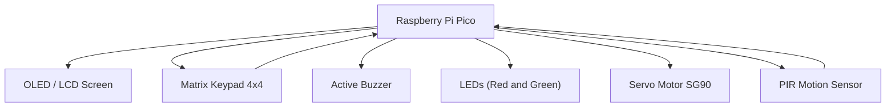
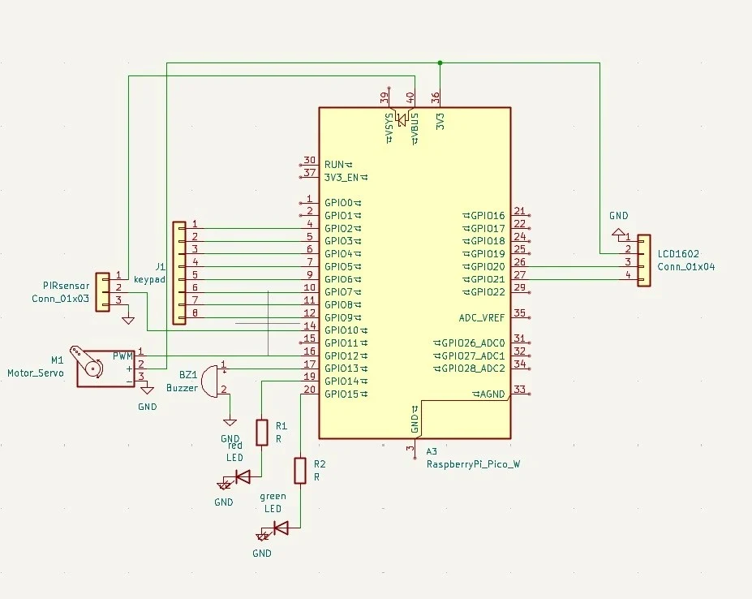

# Security System  
A smart access control system using username and PIN authentication

:::info 

**Author**: Iulia-Elena Giuroiu  \
**GitHub Project Link**: [source code](https://github.com/UPB-PMRust-Students/proiect-IuliaGIE)

:::

## Description

This project implements a smart security system for controlling access to a restricted area. Authentication is based on a 4-character username and a 4-digit PIN entered via a matrix keypad. Only one person is allowed inside at any given time. If motion is detected without valid authentication, an alarm is triggered using a buzzer and flashing red LED.

## Motivation

The motivation behind this project is to combine embedded programming with real-world security applications. It provides a simple but effective way of managing access, detecting unauthorized entries, and signaling alerts.

## Architecture

The system is organized modularly, with each logic component responsible for a distinct functionality. They communicate through events triggered by sensors and shared internal states.

### Main architectural components:

* **Authentication Module** – handles input and validation of username and PIN
* **Access Control** – controls the servo motor that opens or closes the door
* **Alert Module** – detects unauthorized movement and activates the red LED and buzzer
* **Display Module** – shows messages on an OLED or LCD screen
* **State Management** – allows access for only one person at a time

### Flowchart Diagram

## Log

<!-- write your progress here every week -->

### Week 5 - 11 May

### Week 12 - 18 May

### Week 19 - 25 May

## Hardware

The system uses two Raspberry Pi Pico 2W boards. The main board handles authentication, motor control, and alert logic, while the second board is optional for debugging or logging. All components interact via GPIO, PWM, and I²C protocols.

| Hardware Device                                                                                                                                 | Purpose              | Usage                                           |
| ----------------------------------------------------------------------------------------------------------------------------------------------- | -------------------- | ----------------------------------------------- |
| [Raspberry Pi Pico 2W](https://www.optimusdigital.ro/ro/placi-raspberry-pi/13327-raspberry-pi-pico-2-w.html)                                    | Main microcontroller | Controls authentication, logic, and peripherals |
| Raspberry Pi Pico 2W (Debug)                                                                                                                    | Debugging            | UART logging and state tracing                  |
| [Matrix Keypad 4x4](https://www.optimusdigital.ro/ro/senzori-senzori-de-atingere/470-tastatura-matriceala-4x4-cu-conector-pin-de-tip-mama.html) | Input                | User input for username and PIN                 |
| [PIR Motion Sensor HC-SR501](https://www.optimusdigital.ro/ro/senzori-senzori-pir/106-modul-senzor-pir-hc-sr501.html)                           | Detection            | Triggers alert on unauthorized motion           |
| [Micro Servo SG90 180°](https://www.optimusdigital.ro/ro/motoare-servomotoare/2261-micro-servo-motor-sg90-180.html)                             | Actuator             | Controls door movement                          |
| [Buzzer 3V/5V](https://www.optimusdigital.ro/ro/semnalizare-audio-vizuala/1340-buzzer-activ-de-5v.html)                                         | Alert                | Sound alarm on intrusions                       |
| [LEDs (Red, Green)](https://www.optimusdigital.ro/ro/leduri/83-led-rosu-3mm-cu-lentile-difuze.html)                                             | Indicators           | Red = alert, Green = access granted             |
| [LCD 1602 I2C](https://www.optimusdigital.ro/ro/optoelectronice-lcd-uri/62-lcd-1602-cu-interfata-i2c-si-backlight-galben-verde.html)            | Display              | Shows system messages                           |
| [Breadboard (400 & 830 pts)](https://www.optimusdigital.ro/ro/prototipare-breadboard-uri/8-breadboard-830-points.html)                          | Prototyping          | Assembling components                           |
| Resistors (220Ω – 1kΩ)                                                                                                                          | Safety               | Limits LED current                              |
| USB Power Supply                                                                                                                                | Power                | Powers boards and modules                       |

### Schematics

### Bill of Materials

| Product                     | Purpose             | Quantity | Unit Price | Total Price |
| --------------------------- | ------------------- | -------- | ---------- | ----------- |
| PIR Motion Sensor HC-SR501  | Movement detection  | 1        | 5.99 lei   | 5.99 lei    |
| Matrix Keypad 4x4           | User input          | 1        | 6.99 lei   | 6.99 lei    |
| LCD 1602 I2C (Yellow-Green) | Display             | 1        | 14.99 lei  | 14.99 lei   |
| Buzzer 3V                   | Audio signal        | 1        | 0.99 lei   | 0.99 lei    |
| Breadboard HQ 400pts        | Assembly            | 1        | 4.56 lei   | 4.56 lei    |
| Breadboard HQ 830pts        | Expanded assembly   | 1        | 9.98 lei   | 9.98 lei    |
| Raspberry Pi Pico 2W        | Main + debug boards | 2        | 39.66 lei  | 79.32 lei   |
| Green LED 3mm               | Visual indicator    | 3        | 0.39 lei   | 1.17 lei    |
| Red LED 3mm                 | Visual alert        | 3        | 0.39 lei   | 1.17 lei    |
| SG90 Servo                  | Door control        | 1        | 11.99 lei  | 11.99 lei   |

## Software

The firmware is written in Rust using an asynchronous multitasking model powered by Embassy.

### Core features

* **Async architecture** with no RTOS required
* **Rust embedded**: fully safe, low-level control over peripherals
* **Efficient resource usage** on the RP2040 dual-core microcontroller

### Tasks

* **Authentication Task**: Reads input from the keypad, validates username and PIN
* **Access Task**: Controls the door via the servo motor and manages door state logic
* **Alert Task**: Listens for motion events from the PIR sensor and activates the buzzer and red LED if motion is detected without authentication
* **Display Task**: Shows real-time messages and system prompts via the LCD1602 using I²C

### Peripheral Handling

* **GPIO**: Used for keypad input, LED control, and buzzer signal
* **PWM**: Drives the buzzer and smoothly dims LEDs
* **I²C**: Communication with the LCD display
* **Task synchronization**: Performed using Embassy's async/await runtime, avoiding blocking calls and ensuring responsive behavior

## Links

1. [RP2040 Documentation](https://www.raspberrypi.com/documentation/microcontrollers/)
2. [SSD1306 Rust driver](https://github.com/jamwaffles/ssd1306)
3. [rp-hal examples](https://github.com/rp-rs/rp-hal/tree/main/examples)
4. [PIR sensor datasheet](https://components101.com/sensors/hc-sr501-pir-sensor)