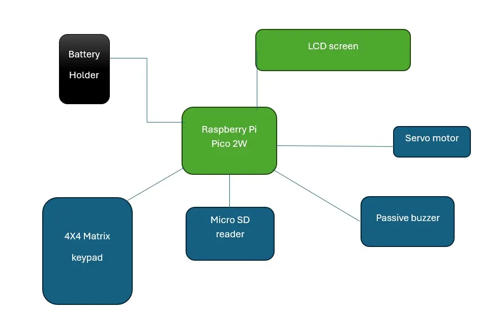
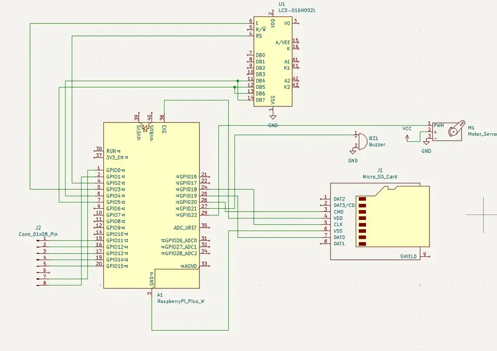

# Battery Safe Box
A battery-powered electronic safe box.

:::info 

**Author**: John-Roberto Nau \
**GitHub Project Link**: https://github.com/UPB-PMRust-Students/proiect-JohnRobertoNau

:::

## Description

This project implements an electronic safe that opens only after entering a valid PIN code. The user inputs the PIN using a 4x4 matrix keypad. Visual feedback is provided on an LCD display, while audio feedback is generated using a passive buzzer. The unlocking mechanism is controlled by a servo motor. The device is battery-powered and includes a MicroSD card module to log access attempts.

## Motivation

I chose this project because I wanted to have a useful device to use in my daily life, knowing that is built by me. I wanted to combine practical embedded Rust programming with hardware interaction. It will be a challenge to work with GPIOs, I2C, PWM, and SPI for developping the this safe box.

## Architecture 

A schematic diagram is provided to illustrate the connections and layout of the components.



## Log

<!-- write your progress here every week -->

### Week 5 - 11 May

### Week 12 - 18 May

### Week 19 - 25 May

## Hardware

- Raspberry Pi Pico 2W: the main microcontroller
- 4x4 Matrix Keypad: used to securely enter the PIN code to unlock the safe
- LCD 1602 with I2C and yellow-green backlight: provides visual feedback
- Passive buzzer: provides audio feedback
- Micro Servo Motor SG90: physically locks or unlocks the safe mechanism
- SPI microSD card reader module: 
- Kit Breadboard HQ830 + jumper wires: used for prototyping and connecting all components
- Female-to-male and male-to-male jumper wires: used to connect components like the keypad, LCD, and sensors to the microcontroller
- Battery holder for 4x R6 (AA) batteries: powers the entire system
- Pin headers (2.54 mm, 40p): used to connect the components with the breadboard

### Schematics

A KiCad schematic is provided:



### Bill of Materials

<!-- Fill out this table with all the hardware components that you might need.

The format is 
```
| [Device](link://to/device) | This is used ... | [price](link://to/store) |

```

-->

| Device | Usage | Price |
|--------|--------|-------|
| [Raspberry Pi Pico 2W](https://www.raspberrypi.com/documentation/microcontrollers/pico-series.html) | The microcontroller | [2 X 35 RON](https://www.optimusdigital.ro/en/raspberry-pi-boards/12394-raspberry-pi-pico-w.html) |
| [Matrix Keypad 4x4] | Pin input | [6.99 RON](https://www.optimusdigital.ro/ro/senzori-senzori-de-atingere/470-tastatura-matriceala-4x4-cu-conector-pin-de-tip-mama.html?search_query=tastatura+matriceala+4x4&results=2) |
| [LCD 1602 with I2C] | Display | [14.99 RON](https://www.optimusdigital.ro/ro/optoelectronice-lcd-uri/62-lcd-1602-cu-interfata-i2c-si-backlight-galben-verde.html?search_query=lcd+1602+i2c&results=4) |
| [Passive Buzzer Module] | Audio feedback | [2.99 RON](https://www.bitmi.ro/electronica/modul-buzzer-pasiv-ky-006-10678.html) |
| [Micro Servo Motor SG90](https://www.raspberrypi.com/documentation/microcontrollers/pico-series.html) | Lock mechanism | [13.99 RON](https://www.optimusdigital.ro/ro/motoare-servomotoare/26-micro-servomotor-sg90.html?search_query=micro+servo+motor&results=39) |
| [MicroSD SPI Reader Module] | Logging access attempts | [3.99 RON](https://www.bitmi.ro/electronica/modul-citire-card-microsd-compatibil-arduino-10384.html) |
| [Breadboard HQ830 + Wires] | Prototyping and wiring | [22 RON](https://www.optimusdigital.ro/ro/kituri/2222-kit-breadboard-hq-830-p.html?search_query=kit+breadboard&results=35) |
| [Female-to-male jumper wires] | Wiring keypad, LCD, etc. | [7.99 RON](https://www.optimusdigital.ro/ro/toate-produsele/877-set-fire-mama-tata-40p-15-cm.html?search_query=fire+mama+tata&results=35) |
| [Male-to-male jumper wires] | General conections | [4.99 RON](https://www.optimusdigital.ro/ro/fire-fire-mufate/884-set-fire-tata-tata-40p-10-cm.html?search_query=fire+tata+tata&results=73) |
| [Battery Holder (4x R6 AA)] | Power supply | [4.86 RON](https://www.optimusdigital.ro/ro/suporturi-de-baterii/12375-suport-baterii-4-x-aa.html?search_query=suport+baterii&results=59) |
| [4 X Red Pin Headers (2.54 mm, 40p)] | Connecting components on breadboard | [4 X 0.99 RON](https://www.optimusdigital.ro/en/pin-headers/464-colored-40p-254-mm-pitch-male-pin-header-red.html) |


## Software

| Library | Description | Usage |
|---------|-------------|-------|
| [embassy-rs](https://github.com/embassy-rs/embassy) | HAL support for Raspberry | Access to GPIO, PWM, I2C, SP |
| [defmt](https://defmt.ferrous-systems.com/) | Lightweight logging framework | For printing debug via probe-rs |
| [probe-rs](https://probe.rs/) | Debugging and flashing | Used for debugging on Raspberry |
| [heapless](https://probe.rs/) | Fixed-capacity buffers | For handling user input |

## Links

<!-- Add a few links that inspired you and that you think you will use for your project -->

1. 

...
