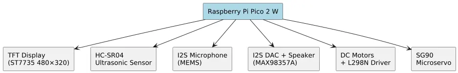
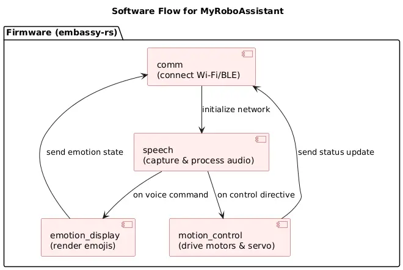

# MyRoboAssistant
Listen. Respond. Connect.

:::info
**Student:** Savchuk Kostiantyn \
**GitHub Repository:** [proiect-st-savciucc](https://github.com/UPB-PMRust-Students/proiect-st-savciucc.git)
:::

## Description
MyRoboAssistant is a mid-sized (approx. 140 cm × 80 cm) mobile robot focused on natural voice interaction and emotional feedback. It suggests useful tips, shows animated emotions on a TFT screen, and can be extended via a companion mobile app.

## Motivation
This project combines my passion for robotics with safe, high-performance embedded Rust. Rust (via the embassy-rs framework) guarantees memory-safe firmware, while the Raspberry Pi Pico 2 W provides built-in Wi-Fi/BLE for easy connectivity.

## Architecture

### Hardware Blocks

#### Raspberry Pi Pico 2 W
**Role:** Central microcontroller, manages I/O and overall device logic  
**Connections:**  
- TFT display (SPI)  
- Ultrasonic sensors (GPIO trigger/echo)  
- I2S microphone (I2S data/clk)  
- Speaker via I2S DAC  
- DC motors + L298N driver (GPIO + PWM)  
- SG90 servo (PWM)  

#### TFT Display (ST7735 480×320)
**Interface:** SPI  
**Connections:**  
- SDA (MOSI) → Pico SPI MOSI pin  
- SCL (SCK) → Pico SPI SCK pin  
- DC, RST, CS → separate GPIOs  
**Role:** Shows emotions, status, and menu  

#### DC Motors + Wheels
**Interface:** Powered via L298N driver  
**Connections:**  
- IN1–IN4 → Pico GPIO for direction  
- EN1–EN2 → Pico PWM for speed  
**Role:** Locomotion  

#### L298N Dual Motor Driver
**Interface:** GPIO + PWM  
**Connections:**  
- VCC, GND → battery/charger  
- IN1–IN4, EN1–EN2 → Pico  
- OUT1–OUT4 → motors  
**Role:** Drives the DC motors  

#### SG90 Micro Servo
**Interface:** PWM  
**Connections:**  
- Control → Pico PWM pin  
- Power → 5 V + GND  
**Role:** Arm gesture  

#### Ultrasonic Sensors (HC-SR04)
**Interface:** GPIO  
**Connections:**  
- Trigger → Pico GPIO  
- Echo → Pico GPIO  
**Role:** Proximity detection  

#### I2S Microphone
**Interface:** I2S  
**Connections:**  
- WS, CK, SD → Pico I2S pins  
**Role:** Voice input  

#### I2S DAC (MAX98357A) + Speaker
**Interface:** I2S  
**Connections:**  
- BCLK, LRCLK, DIN → Pico I2S pins  
- Speaker → output of MAX98357A  
**Role:** High-quality audio output  

---

## Weekly Log

| Period          | Status  |
|-----------------|---------|
| Week 5 – 11 May | WIP…    |
| Week 12 – 18 May| WIP…    |
| Week 19 – 25 May| WIP…    |

---

## Bill of Materials (BOM)

| Component                                                                                                                 | Qty     | Price (RON) |
|---------------------------------------------------------------------------------------------------------------------------|---------|-------------|
| [Raspberry Pi Pico 2 W](https://www.optimusdigital.ro/en/raspberry-pi-boards/13327-raspberry-pi-pico-2-w.html?search_query=5056561803975&results=1) | 1       | 40          |
| [Pb-acid 6 V 12 Ah battery + charger](https://www.optimusdigital.ro/en/lead-acid-batteries/10190-lead-acid-battery-6-v-12a.html)            | 1       | 34          |
| [Micro metal DC gear-motor](https://www.optimusdigital.ro/en/micro-gearmotors/10348-10001-micro-metal-gearmotor-hpcb-6v.html?search_query=DC+motor&results=1033) | 2       | 159         |
| [L298N dual motor driver](https://www.optimusdigital.ro/en/brushed-motor-drivers/145-l298n-dual-motor-driver.html?search_query=L298N+motor%C2%A0driver&results=4)    | 1       | 10          |
| [SG90 micro servo](https://www.optimusdigital.ro/en/servomotors/2261-micro-servo-motor-sg90-180.html?search_query=Servo%C2%A0SG90&results=11)                      | 4       | 12          |
| [3.5″ TFT 480 × 320 touchscreen](https://www.optimusdigital.ro/en/lcds/3333-tft-35-480-x-320-adafruit-display-with-touchscreen-for-raspberry-pi.html?search_query=1.8%E2%80%B0%C2%A0TFT&results=66) | 1 | 309 |
| [HC-SR04 ultrasonic sensor](https://www.optimusdigital.ro/en/ultrasonic-sensors/2328-senzor-ultrasonic-de-distana-hc-sr04-compatibil-33-v-i-5-v.html?search_query=HC-SR04&results=20)          | 2       | 15          |
| [PDM MEMS microphone (I2S-capable)](https://www.optimusdigital.ro/en/others/4774-modul-microfon-pdm-mems-adafruit.html?search_query=I2S+MEMS&results=6)                                 | 1       | 44          |
| [Mini speaker + AMP](https://www.optimusdigital.ro/en/small-speakers/8685-minimu-speaker.html?search_query=Mini+speaker&results=34)                                          | 1       | 70          |
| Consumables (buttons, potentiometers, wires, etc.)                                                                        | Various | 50          |

---

## Software Design

| Library / Crate                                | Description                            | Usage                                    |
|------------------------------------------------|----------------------------------------|------------------------------------------|
| [embassy](https://crates.io/crates/embassy) / [embassy-net](https://crates.io/crates/embassy-net) | Asynchronous runtime & networking     | Core framework for async tasks & Wi-Fi/BLE |
| [embedded-hal](https://crates.io/crates/embedded-hal)               | Hardware abstraction layer             | Standardized traits for MCU peripherals  |
| [heapless](https://crates.io/crates/heapless)                       | Fixed-size data structures             | Queues, Vec, String without heap use     |
| [serde](https://crates.io/crates/serde) / [serde_json](https://crates.io/crates/serde_json)     | Serialization                          | Config data & message encoding/decoding  |
| [embedded-graphics](https://crates.io/crates/embedded-graphics)     | 2D graphics on TFT                     | Rendering emojis & UI                    |
| [rust-voice](https://crates.io/crates/rust-voice)                   | Speech recognition                     | Keyword spotting & voice command handling |

---

### Main Firmware Tasks
- **comm** – Wi-Fi/BLE connect & messaging  
- **emotion_display** – emoji animation on TFT  
- **motion_control** – motor & servo control  
- **speech** – audio capture & keyword spotting  

---

## Links
- [Raspberry Pi Pico 2 W product page](https://www.raspberrypi.com/products/raspberry-pi-pico-2-w/) – official specifications and documentation  
- [MyRoboAssistant GitHub](https://github.com/UPB-PMRust-Students/proiect-st-savciucc.git) – source code and README
---
