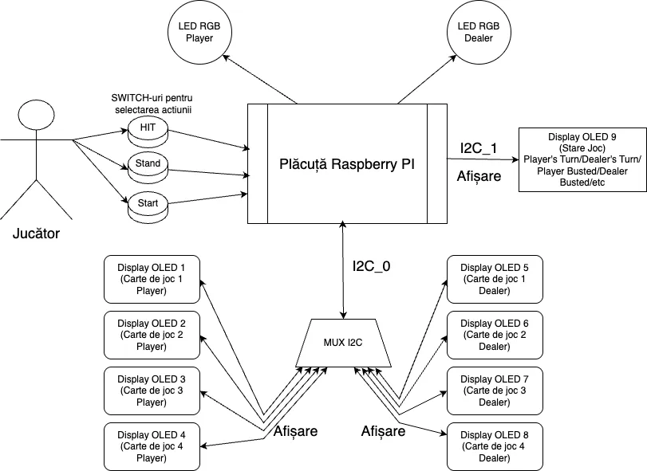

# BlackJack Machine
A singleplayer card game powered by a Raspberry Pi Pico 2 and Rust.

:::info

**Author**: Stavăr Laurențiu-Cristian  
**GitHub Project Link**: https://github.com/UPB-PMRust-Students/proiect-StavarLaurentiu

:::

## Description
A fully interactive BlackJack game machine built on a **Raspberry Pi Pico 2 - RP2350A**, using the **Rust** programming language and Embassy async framework.

### Features:
+ Uses three buttons for game actions: **HIT**, **STAND** and **START GAME**.
+ Displays dealer and player cards across **8 OLED 0.96" screens**.
+ Includes **1 OLED 0.96" display** dedicated to real-time game state messages.
+ Uses **2 RGB LEDs** to indicate turns and round outcomes.
+ Utilizes a **TCA9548A I2C multiplexer** to manage identical OLED addresses.
+ Executes full BlackJack logic: card drawing, user input, dealer logic, and win conditions.

## Motivation
This project combines microcontroller programming, real-time interaction, and game logic design. My goal was to build something fun and visually interactive, while pushing the limits of what I learned in embedded systems and Rust. The integration of I2C multiplexing, OLED control, and user inputs made this an ideal project to consolidate theory into a challenging and rewarding practical application.

## Architecture
The **Raspberry Pi Pico 2 - RP2350A** acts as the central unit, managing peripherals and orchestrating the game flow.

- **Buttons** (GPIO): detect user input (HIT / STAND / START GAME).
- **RGB LEDs** (PWM): blink or hold to indicate whose turn or the round outcome.
- **9 OLED Display 0.96"s** (I2C): show player/dealer cards and the game state.
- **TCA9548A I2C MUX**: used to route communication between the Pico and the OLEDs sharing the same I2C address.

### Game Flow Summary:
1. **Startup**: OLED instructs user to press START.
2. **Dealer draws 2 cards** – LED blinks – game state updates.
3. **Player draws 2 cards** – LED blinks – game state updates.
4. **Player phase**: can HIT (get card) or STAND (end turn).
5. **If player busts**: game ends.
6. **Else**: dealer draws to at least 17.
7. **Compare scores**: show result and reset after 5 seconds.

### LED & OLED Usage
- Blinking LEDs indicate **active turn**.
- Solid yellow LED indicates **winner** or **draw**.
- OLEDs visually show each card and game progress.

### Block Scheme

## Log

### Week 5 – 11 May

TO DO

### Week 12 – 18 May

TO DO

### Week 19 – 25 May

TO DO

## Hardware

1. **Raspberry Pi Pico 2 - RP2350A**  
   - Main microcontroller; handles game logic, I2C communication, and peripheral control.

2. **2 Push Buttons (HIT & STAND)**  
   - User input; GPIO with pull-ups.

3. **2 RGB LEDs**  
   - Visual indicators for player/dealer turn and result status.

4. **9 OLED 0.96" Displays (128x64)**  
   - Display game content (cards and messages). All share the same I2C address.

5. **TCA9548A I2C Multiplexer**  
   - Routes signals to individual OLEDs as they can't share the bus directly.

## Schematics

## Bill of Materials

| Device | Usage | Price |
|--------|--------|-------|
| [Raspberry Pi Pico 2](https://www.optimusdigital.ro/en/raspberry-pi-boards/13327-raspberry-pi-pico-2-w.html?search_query=raspberry+pi+pico+2&results=36) | Microcontroller | 40 RON x 2 |
| [TCA9548A I2C Mux](https://www.optimusdigital.ro/en/power-multiplexers/1692-tca9548a-i2c-multiplexer-module.html?search_query=Modul+Multiplexor+I2C+TCA9548A&results=1) | OLED Routing | 20 RON |
| [OLED 128x64 Displays](https://www.bitmi.ro/componente-electronice/ecran-oled-0-96-cu-interfata-iic-i2c-10488.html) ×9 | Visual display | 19 RON ×9 |
| [RGB LED](https://www.bitmi.ro/module-electronice/modul-led-rgb-3-culori-10401.html) ×2 | Player/Dealer Indicators | 2 RON ×2 |
| [Push Buttons](https://www.optimusdigital.ro/en/buttons-and-switches/1115-white-button-with-round-cover.html?search_query=buttons&results=259) ×3 | Game Inputs | 2 RON ×3 |
| [Breadboard](https://www.optimusdigital.ro/en/breadboards/8-breadboard-hq-830-points.html?search_query=breadboard&results=363) | Connectivity | 10 RON |
| [Jumpers](https://www.bitmi.ro/componente-electronice/40-fire-dupont-tata-mama-30cm-10504.html) | Connectivity | 8 RON |

TOTAL: ~300 RON

## Software

| Library | Description | Usage |
|--------|-------------|--------|
| [embassy-rp](https://github.com/embassy-rs/embassy) | RP2040 HAL | Async device and timer management |
| [embedded-hal-async](https://github.com/rust-embedded/embedded-hal) | HAL Traits | I2C abstraction |
| [ssd1306](https://docs.rs/ssd1306/latest/ssd1306/) | OLED Driver | Display game cards/state |
| [heapless](https://github.com/rust-embedded/heapless) | Fixed capacity collections | Buffer text messages for OLEDs |
| [defmt](https://github.com/knurling-rs/defmt) + [defmt-rtt](https://github.com/knurling-rs/defmt) | Logging Framework | Used for real-time debug output over RTT, ideal for embedded logging |
| [panic-probe](https://github.com/knurling-rs/panic-probe) | Panic Handler | Provides panic messages compatible with defmt |

## Links
1. [BlackJack rules](https://bicyclecards.com/how-to-play/blackjack/)
2. [Raspberry Pi Pico Tutorial - SSD1306 I2C OLED DISPLAY](https://www.youtube.com/watch?v=Ts9JXbMvfTQ&t=443s)
3. [Playing cards images](https://www.freepik.com/free-vector/complete-deck-playing-cards_414486592.htm#fromView=keyword&page=1&position=11&uuid=d15e84b6-c2e6-40ef-9b00-a3c1ec8341eb&query=Playing+Card)
4. [Using I2C MUX with OLEDs](https://www.youtube.com/watch?v=wqyHbQvcoWw)
