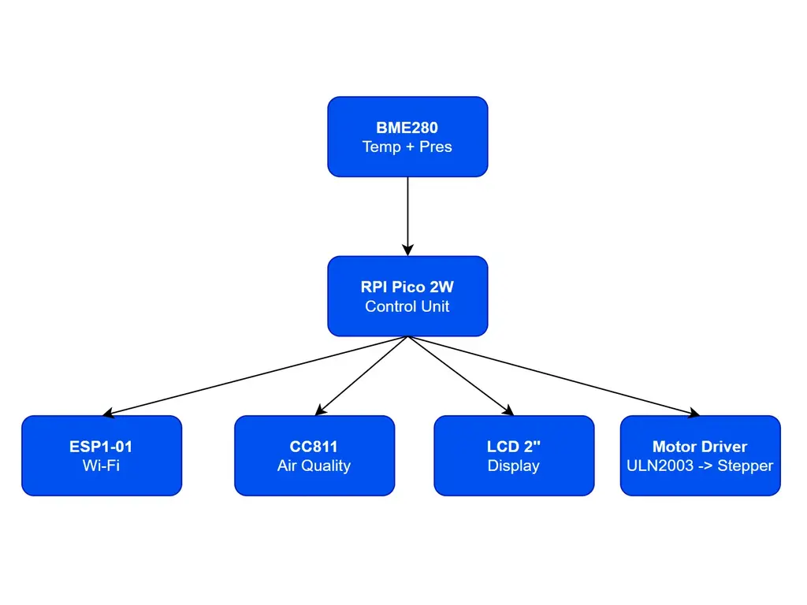
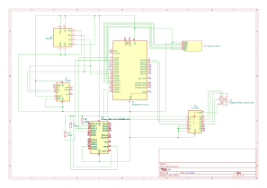

# Weather Window
A smart window that monitors indoor air quality and external weather conditions, automatically deciding whether to open the window or not.

:::info 

**Author**: Tudor Lavinia \
**GitHub Project Link**: https://github.com/UPB-PMRust-Students/proiect-LaviniaTudor003

:::

## Description

Weather Window is an automatic smart window that constantly monitors indoor temperature, humidity, and air quality (including oxygen level estimation).
It also gathers external weather data — such as temperature, humidity, and approximate rain probability (based on humidity and pressure) — through a battery-powered module that transmits data wirelessly (via Wi-Fi) to the main display unit.
The system automatically determines whether opening the window is necessary to improve indoor conditions.
An interactive display presents real-time indoor and outdoor environmental information and provides personalized user recommendations, such as clothing suggestions ("It's cold — dress warmly") or alerts ("It might rain — take an umbrella").
The project also aims to integrate renewable energy sources, such as a solar panel, to increase overall system autonomy.

## Motivation

"Weather Window" was first imagined during a high school project, inspired by the idea of creating a living environment that adjusts itself for better comfort and health.
Today, with the opportunity to work with real technologies, I am determined to turn that early vision into reality.
This project is not just a technical challenge, but also a personal dream to contribute to smarter, healthier, and more sustainable homes.

## Architecture 


The system is based on a Raspberry Pi Pico 2W, connected to environmental sensors (BME280, CCS811) via I2C, an LCD display via SPI, and a stepper motor driver (ULN2003) via GPIO. A Wi-Fi module (ESP8266) provides external weather data. The Pico collects indoor and outdoor data, displays it, and controls the window motor automatically based on the conditions.

## Log

<!-- write your progress here every week -->

### Week 21 - 27 April

- Selected the main components for the project.
- Discussed the project architecture.
- Started component research (sensors, motor, controller).

### Week 28 April - 4 May

- Ordered the required components.
- Started writing the project documentation.
- Created the full electronic schematic in KiCad.

### Week 5 - 11 May

### Week 12 - 18 May

### Week 19 - 25 May

## Hardware

- **Raspberry Pi Pico 2W** – Main controller responsible for data processing and motor control.
- **BME280 Sensor** – Measures temperature, humidity, and atmospheric pressure.
- **CCS811 Sensor** – Measures indoor air quality, including CO₂ and VOC levels.
- **ESP8266 Wi-Fi Module** – Connects the system to external weather data sources.
- **Stepper Motor (28BYJ-48)** – Controls the opening and closing of the window.
- **ULN2003 Driver Board** – Drives the stepper motor based on control signals.
- **2" LCD SPI Display** – Shows real-time indoor and outdoor conditions and recommendations.
- **Breadboard and Jumper Wires** – Used for prototyping and connecting components.
- **Passive Components (Capacitors and Resistors)** – Used for signal stability and motor protection.
- **Prototyping PCB** – Final assembly of the project after initial testing.


### Schematics



### Bill of Materials

<!-- Fill out this table with all the hardware components that you might need.

The format is 
```
| [Device](link://to/device) | This is used ... | [price](link://to/store) |

```

-->


| Device | Usage | Price |
|:------|:------|:------|
| [Raspberry Pi Pico 2W](https://www.optimusdigital.ro/en/raspberry-pi-boards/13327-raspberry-pi-pico-2-w.html?search_query=Raspberry+Pi+Pico+2W&results=36) | Main controller of the system | 40 RON |
| [BME280 Sensor](https://www.optimusdigital.ro/en/pressure-sensors/5649-bme280-barometric-pressure-sensor-module.html?search_query=%09BME280+Barometric+Pressure+Sensor+Module&results=5) | Measures temperature, humidity, and pressure | 74 RON |
| [CCS811 Sensor](https://www.optimusdigital.ro/en/others/5641-ccs811-usb-to-i2c-converter-module.html?search_query=CCS811+USB+to+I2C+Converter+Module&results=1) | Measures indoor air quality (CO₂, VOC) | 200 RON |
| [BMP280 Sensor](https://www.optimusdigital.ro/en/pressure-sensors/1666-modul-senzor-de-presiune-barometric-bmp280.html?search_query=BMP280+Barometric+Pressure+Sensor+Module&results=3) | Secondary sensor for debugging | 9 RON |
| [ESP8266 Wi-Fi Module](https://sigmanortec.ro/Modul-Wifi-ESP8266-Transreceiver-p134711871) | External data communication | 21 RON |
| [Stepper Motor 28BYJ-48](https://sigmanortec.ro/Motor-pas-cu-pas-5V-28BYJ48-p126284049) | Drives the simulated window | 10 RON |
| [ULN2003 Driver Board](https://sigmanortec.ro/Driver-motor-pas-cu-pas-ULN2003-p126284051) | Stepper motor controller | 5 RON |
| [2" LCD SPI Display](https://www.optimusdigital.ro/en/lcds/12652-240320-general-2inch-ips-lcd-display-module.html?search_query=240%C3%97320%2C+General+2inch+IPS+LCD+Display+Module&results=1) | Displays system info | 70 RON |
| [Breadboard 830 pts](https://www.optimusdigital.ro/en/kits/2222-breadboard-kit-hq-830-p.html?search_query=Breadboard+Kit+HQ+830+p&results=12) | Prototyping platform | 22 RON |
| [Jumper Wires Kit](https://www.optimusdigital.ro/en/wires-with-connectors/12-breadboard-jumper-wire-set.html?search_query=%09Breadboard+Jumper+Wires+Set&results=22) | Wiring connections | 8 RON |
| [Prototyping PCB 7x9cm](https://sigmanortec.ro/Placa-PCB-prototipare-fata-dubla-7x9cm-p125747328) | For permanent assembly | 6 RON |
| [Ceramic Capacitor Kit](https://www.optimusdigital.ro/en/capacitors/12632-ceramic-capacitor-assorted-kit-30-kinds-from-2pf-01uf.html?search_query=Ceramic+Capacitor+Assorted+Kit-+30+Kinds+from+2PF-0.1UF&results=1) | Filtering and stabilization | 20 RON |
| [Resistor Kit](https://www.optimusdigital.ro/en/resistors/10928-250-pcs-plusivo-resistor-kit.html?search_query=Plusivo+Resistor+Kit+250+pcs&results=3) | Signal conditioning | 15 RON |


## Software

| Library | Description | Usage |
|---------|-------------|-------|
| [cortex-m-rt](https://crates.io/crates/cortex-m-rt) | Runtime support for Cortex-M devices | Defines entry point (`entry`) |
| [embassy-time](https://crates.io/crates/embassy-time) | Time and delay handling | Used for timers and delays |
| [embassy-rp](https://crates.io/crates/embassy-rp) | Raspberry Pi Pico peripherals (PWM, I2C) | Used for PWM motor control and I2C communication |
| [embassy-sync](https://crates.io/crates/embassy-sync) | Asynchronous primitives (Signal, PubSub) | Synchronization between tasks |
| [embassy-embedded-hal](https://crates.io/crates/embassy-embedded-hal) | Shared bus abstractions for SPI/I2C | For safe shared bus access |
| [embedded-hal-async](https://crates.io/crates/embedded-hal-async) | Asynchronous traits for embedded devices | Async I2C communication |
| [display-interface-spi](https://crates.io/crates/display-interface-spi) | SPI interface for displays | Used for SPI communication with display |
| [mipidsi](https://crates.io/crates/mipidsi) | Display driver for MIPI-DSI displays (ST7735/7789 etc.) | Used to control the LCD screen |
| [embassy-lab-utils](https://github.com/embassy-rs/embassy-lab-utils) | Helper macros and utilities (init_wifi!) | WiFi initialization support |

## Links

<!-- Add a few links that inspired you and that you think you will use for your project -->

1. [Monitor air quality with a Raspberry Pi](https://www.raspberrypi.com/news/monitor-air-quality-with-a-raspberry-pi/) – A guide from the Raspberry Pi Foundation on how to monitor air quality using a sensor and Python.
2. [Air quality monitoring with Raspberry Pi](https://github.com/StijnGoossens/rpi-airquality) – A GitHub project using a Raspberry Pi for air quality monitoring with BME280 and CCS811 sensors.
3. [Build a Raspberry Pi SUPER Weather Station](https://www.instructables.com/Build-a-Raspberry-Pi-SUPER-Weather-Station/) – Step-by-step instructions for building an advanced weather station with a Raspberry Pi.

