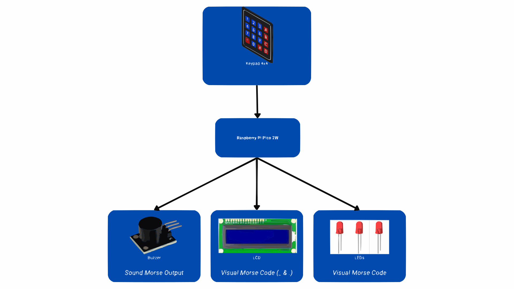

# Morse Coder
Converts typed text into Morse code signals (LEDs, buzzer, LCD).

:::info 

**Author**: Andronache Madalina-Georgiana \
**GitHub Project Link**: [Project Repository](https://github.com/UPB-PMRust-Students/proiect-madalinaandronache.git)

:::

## Description

This project enables the user to input text using a 4x4 matrix keypad, which is then converted into Morse code and transmitted through:

+ **Sound signals** using a buzzer.
+ **Light signals** using LEDs.
+ **Visual display** on an LCD screen, where dots and dashes represent Morse code.

Ultimately, the aim is to integrate all components inside a compact system.

## Motivation

This project was chosen because it combines both hardware and software aspects in a manageable way. Developing a text-to-Morse converter offers an opportunity to better understand:
- GPIO management
- Embedded Rust programming
- Hardware-software interactions

It allows practicing embedded programming without requiring complex electronics knowledge.

## Architecture 

The following diagram shows the system architecture:

The **Raspberry Pi Pico 2W** acts as the brain of the system, coordinating all interactions between input and output components.

- The **4x4 matrix keypad** provides the user input.
- The **Pico** processes the text and converts it into Morse code.
- The **LEDs** and **buzzer** output the corresponding Morse signals.
- The **LCD screen** displays the Morse code in real time using dots (.) and dashes (_).

## Log

## Week 28 - 4 May

Initially, I encountered problems connecting the Raspberry Pi Pico 2W to the debugger.  

**Problem**: Using jumper wires for the SWD connection resulted in an **unstable link** between the Pico and the debugger, causing random disconnections and flashing failures due to loose connections.

**Solution**: I soldered stable male pins onto the Pico board and also reinforced the jumper cable connections by using more secure, stable headers, preventing movement and improving overall connection stability during debugging.

After stabilizing the programming connection, I focused on testing each hardware component individually to understand their behavior and determine the necessary Rust crates for the project.  
This phase involved experimenting with:

- Raspberry Pi Pico 2W setup,
- 4x4 matrix keypad integration,
- LEDs and buzzer control,
- LCD 1602 screen functionality.

While working with the LCD 1602, I initially encountered display issues.  

**Problem**: The display showed no visible characters, and I suspected a software communication error (wrong crate usage or I2C misconfiguration).

**Solution**: After careful troubleshooting, I discovered that the issue was actually **hardware-related**: the **contrast potentiometer** on the back of the LCD module needed adjustment.  

Once the potentiometer was properly tuned, the LCD correctly displayed characters.

During LED testing, another issue occurred.  

**Problem**: I accidentally burned two LEDs. The initially purchased red LEDs were rated for **2.1V–2.4V forward voltage**, but I mistakenly powered them directly without using an appropriate resistor, which led to their failure.

**Solution**: This helped me realize the importance of properly calculating and setting up voltage/current protection for LEDs.

In parallel with the hardware experiments, I also started writing the initial documentation for the project. I structured the project description, architecture, hardware and software components sections, and started outlining the weekly activity logs.

### Week 5 - 11 May

### Week 12 - 18 May

### Week 19 - 25 May

## Hardware

| Component | Purpose | Function |
|:----------|:--------|:---------|
| **Raspberry Pi Pico 2W** | Main controller of the system | Reads input text, processes it, and controls outputs to buzzer, LEDs, and LCD |
| **4x4 Matrix Keypad** | Provides text input | Acts as the input device for entering characters |
| **Active Buzzer** | Outputs Morse code through sound | Emits short and long beeps representing dots and dashes |
| **LEDs** | Visual representation of Morse code signals | - When a dot (.) is detected, only **one LED** lights up (the middle one). - When a dash (_) is detected, **all three LEDs** light up simultaneously. |
| **LCD Display** | Displays the Morse code translation | Shows real-time dot and dash output |
| **Breadboard + Jumper Wires** | Temporary prototyping connections | Connects components to the Raspberry Pi Pico during development |

### Schematics

Place your KiCAD schematics here.

### Bill of Materials

| Device | Usage | Price (RON) | Quantity |
|--------|-------|-------------|----------|
| [Breadboard HQ (830 points)] | Prototyping, connecting components | 9,98 | 1 |
| [Breadboard Jumper Wires Set](https://www.optimusdigital.ro/en/wires-with-connectors/12-breadboard-jumper-wire-set.html?search_query=Breadboard+Jumper+Wires+Set&results=22) | Wiring between breadboard and Pico | 7,99 | 1 |
| [5mm Red LED with Diffused Lens](https://www.optimusdigital.ro/en/leds/29-5-mm-red-led-with-difused-lens.html?search_query=5+mm+Red+LED+with+Diffused+Lens&results=9) | Visual Morse code signaling | 0,39 | 5 |
| [400p HQ Breadboard](https://www.optimusdigital.ro/en/breadboards/44-400p-hq-breadboard.html?search_query=400p+HQ+Breadboard&results=6) | Additional prototyping area | 4,56 | 1 |
| [4x4 Matrix Keypad](https://www.optimusdigital.ro/en/touch-sensors/470-4x4-matrix-keyboard-with-female-pin-connector.html?search_query=4x4+Matrix+Keyboard+with+Female+Pin+Connector&results=1) | Input device for typing text | 6,99 | 1 |
| [1602 LCD with I2C Interface and Blue Backlight](https://www.optimusdigital.ro/en/lcds/2894-1602-lcd-with-i2c-interface-and-blue-backlight.html?search_query=1602+LCD+with+I2C+Interface+and+Blue+Backlight&results=2) | Display Morse translation | 16,34 | 1 |
| [PCB Mounted Active Buzzer Module](hhttps://www.optimusdigital.ro/en/buzzers/12513-pcb-mounted-active-buzzer-module.html?search_query=PCB+Mounted+Active+Buzzer+Module&results=1) | Alternate sound module for Morse | 4,98 | 1 |
| [Raspberry Pi Pico 2W](http://optimusdigital.ro/en/raspberry-pi-boards/13327-raspberry-pi-pico-2-w.html?search_query=Raspberry+Pi+Pico+2W&results=36) | Main microcontroller | 39,66 | 2 |

## Software

| Library | Description | Usage in your code |
|:--------|:------------|:-------------------|
| [embassy-rp](https://github.com/embassy-rs/embassy) | HAL for Raspberry Pi Pico W | Used for I2C interface, peripheral initialization |
| [embassy-executor](https://github.com/embassy-rs/embassy) | Asynchronous task runtime | Used for `#[embassy_executor::main]` and async tasks |
| [embassy-time](https://github.com/embassy-rs/embassy) | Asynchronous timers and delays | Used for `Timer::after()` non-blocking delays |
| [lcd1602_driver](https://crates.io/crates/lcd1602_driver) | Driver for controlling LCD1602 over I2C | Used for initializing and writing text to the LCD |
| [defmt](https://github.com/knurling-rs/defmt) | Lightweight embedded logging | Used for debug prints (`defmt::info!`) |
| [defmt-rtt](https://github.com/knurling-rs/defmt) | RTT transport for `defmt` | Sends logs to the host |
| [panic-probe](https://github.com/knurling-rs/defmt) | Panic handler for embedded targets | Handles panics and sends diagnostic info |
| [embedded-hal](https://github.com/rust-embedded/embedded-hal) | Traits for I2C, GPIO and delays | Used indirectly via `embassy-rp` and `lcd1602_driver` |

## Links

1. [4x4 Matrix Keypad Integration with Raspberry Pi Pico](https://www.instructables.com/Raspberry-Pi-Pico-4x4-Matrix-Keypad-and-1602-LCD-I/)
2. [1602 LCD with I2C Interface with Raspberry Pi Pico](https://www.youtube.com/watch?v=bXLgxEcT1QU&t=2s&ab_channel=NerdCave)
3. [Rust Programming Guide for Raspberry Pi Pico](https://www.alexdwilson.dev/how-to-program-raspberry-pi-pico-with-rust)

...
