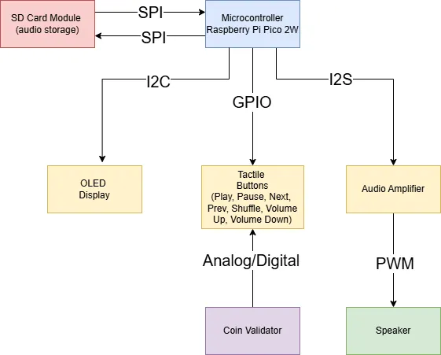
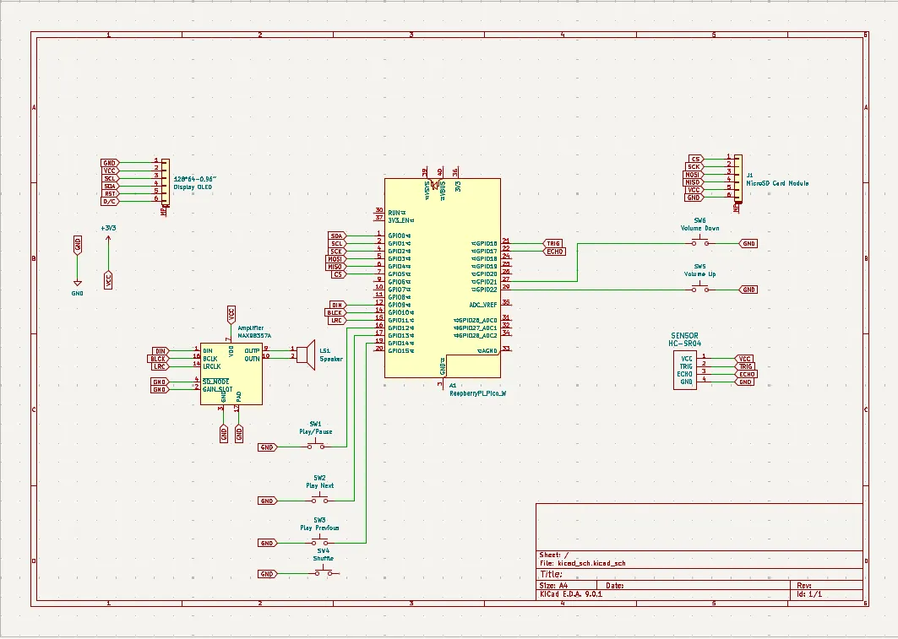

# 2000s Romanian Pop Music Player
A coin-operated music player that plays Romanian pop hits from the 2000s and displays track metadata on an OLED screen.

:::info

**Author**: Maria-Elena Tudor \
**GitHub Project Link**: https://github.com/UPB-PMRust-Students/proiect-mariacthi

:::

## Description

This project combines the nostalgic feel of classic jukeboxes with a curated playlist of Romanian pop music from the 2000s. Users insert a coin to unlock playback; track information (title, artist, duration, release year) is shown on an OLED display. Physical buttons allow play/pause, previous/next, shuffle, and volume control.

## Motivation

At every party I attend, Romanian hits from the 2000s always come on—and I love that era’s pop sound. I’ve also always been fascinated by the jukeboxes featured in movies. Merging these two ideas into a single device seemed like a fun, tangible way to share my favorite decade of music with friends.

## Architecture

  **Microcontroller Raspberry Pi Pico 2W** runs embedded Rust firmware, coordinating all peripherals.
  - **Tasks**:
	- Handles peripheral I/O (SPI, I²C, GPIO, PWM)
	- Manages shuffle queue and metadata parsing
	- Debounces buttons & validates coin input

 **OLED Display** shows metadata over I2C (song title, artist name, duration).

 **Tactile Buttons** read GPIO inputs for user controls.

 **Coin Validator Sensor** detects insertion of a valid coin/token and signals the microcontroller to unlock playback for one track.

 **Audio Amplifier + Speaker** decodes MP3 through I2S and drives speaker via PWM.

 **SD Card Module** stores MP3 files; accessed over SPI.

## Log

### Week 5 - 11 May

### Week 12 - 18 May

### Week 19 - 25 May

## Hardware

The entire system is built around a Raspberry Pi Pico 2 W running embedded Rust, which reads MP3 files off a microSD card, drives a compact SSD1306 OLED screen for track info, and monitors both tactile buttons and a coin‐validator sensor for user input. Audio is streamed digitally to an amplifier and speaker, while everything is powered from a single regulated 5 V source and prototyped on a breadboard for easy iteration.

### Schematics

### Bill of Materials

| Device                                                  | Usage                        | Price                           |
|---------------------------------------------------------|------------------------------|---------------------------------|
| [Raspberry Pi Pico 2W](https://www.raspberrypi.com/documentation/microcontrollers/pico-series.html) | The microcontroller |  [39.66 RON](https://www.optimusdigital.ro/ro/placi-raspberry-pi/13327-raspberry-pi-pico-2-w.html) |
| [Raspberry Pi Pico 2W](https://www.raspberrypi.com/documentation/microcontrollers/pico-series.html) | Debug |  [39.66 RON](https://www.optimusdigital.ro/ro/placi-raspberry-pi/13327-raspberry-pi-pico-2-w.html) |
| [Display OLED 128x64 - 0.96" SPI](https://www.micros.com.pl/mediaserver/OLED12864-0.96-W-2_0001.pdf) | User interface display       | [23.29 RON](https://ardushop.ro/ro/display-uri-si-led-uri/1110-display-oled-128x64-096-spi-6427854015433.html) |
| [MicroSD Card Module](https://github.com/GroundStudio/GroundStudio_MicroSD_module/tree/main/Hardware) | Storage for MP3 files        | [7.14 RON](https://ardushop.ro/ro/module/1553-groundstudio-microsd-module-6427854023056.html) |
| [Card MicroSD 32Gb - clasa 10](https://ardushop.ro/ro/raspberry-pi/636-card-microsd-32gb-clasa-10-6427854007919.html) | Memory Card | [42.89 RON](https://ardushop.ro/ro/raspberry-pi/636-card-microsd-32gb-clasa-10-6427854007919.html) |
| [Amplificator 3W I2S - MAX98357A](https://ardushop.ro/ro/module/1549-amplificator-3w-i2s-max98357a-clasa-d-6427854022967.html)   | Audio output                 | [17.03 RON](https://ardushop.ro/ro/module/1549-amplificator-3w-i2s-max98357a-clasa-d-6427854022967.html) |
| [Difuzor 50mm - 2W - 32ohm](https://ardushop.ro/ro/electronica/1962-difuzor-50mm-2w-32ohm-6427854029898.html)   | Audio output device          | [4.82 RON](https://ardushop.ro/ro/electronica/1962-difuzor-50mm-2w-32ohm-6427854029898.html)  |
| [Modul senzor Ultrasonic - detector distanta HC-SR04](https://ardushop.ro/ro/electronica/2289-modul-senzor-ultrasonic-detector-distanta-hc-sr04-6427854030726.html) | Coin sensor | [9.75 RON](https://ardushop.ro/ro/electronica/2289-modul-senzor-ultrasonic-detector-distanta-hc-sr04-6427854030726.html)
| Electronic components: buttons, wires, pins and Breadboard | Electronic Components | 80 RON |

## Software

| Library | Description | Usage |
|---------|-------------|-------|
| [embassy](https://embassy.dev/) | Async executor and HAL integration for embedded | Provides task scheduling, timers, and async support   |
| [embedded-hal](https://github.com/rust-embedded/embedded-hal) |  Hardware Abstraction Layer for embedded Rust | Unifies SPI, I2C, GPIO and PWM drivers |
| [display-interface](https://docs.rs/display-interface/latest/display_interface/) | Generic display API | Abstracts over SSD1306 driver for easy text & graphics    |
| [ssd1306](https://github.com/rust-embedded-community/ssd1306) |  SSD1306 OLED display driver | Initializes display, draws frames, and manages framebuffer |
| [rand](https://docs.rust-embedded.org/cortex-m-rt/0.6.0/rand/index.html) | Random number generation | Implements shuffle logic for playback queue |
|  [minimp3](https://docs.rs/minimp3/latest/minimp3/)  | Pure-Rust MP3 decoder | Parses MP3 frames and outputs PCM samples |

## Links
