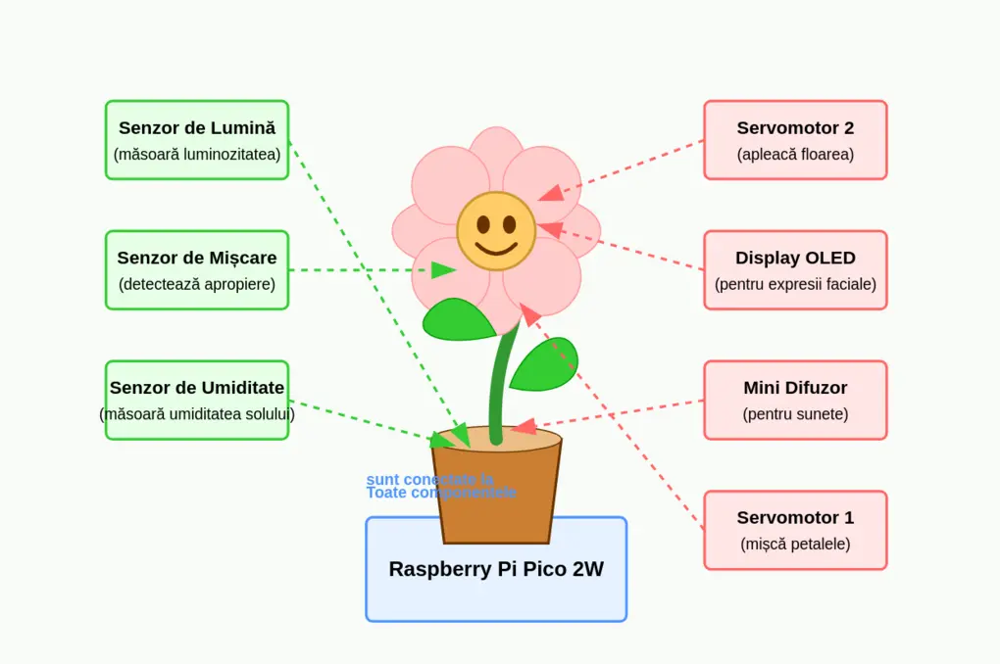
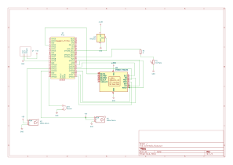

# PlantMood - Interactive Plant with Emotional Feedback

A plant that expresses emotions through movement and sound based on environmental conditions

:::info 

**Author**: Maria Tatiana Dinu  \
**GitHub Project Link**: [link_to_github](https://github.com/UPB-PMRust-Students/proiect-MariaDinu11)

:::

## Description

PlantMood is an interactive plant that monitors and reacts to environmental conditions. Using sensors, it detects soil humidity, light intensity, and human movement near it. This information is processed to determine the plant's "emotional state." Through servomotors, a speaker, and a display showing facial expressions, the plant expresses its "emotions" via specific movements, sounds, and visual feedback, such as dancing when happy, wilting when thirsty, or making sounds when it needs light.

## Motivation

My goal was to create an interactive and fun object that bridges the gap between technology and nature, while applying what I've learned about embedded systems programming in Rust. The challenge of interpreting sensor data as "emotions" and translating them into meaningful movements, sounds, and visual displays provided an excellent opportunity to explore creative applications of hardware and software integration. PlantMood represents both a technical challenge and an artistic expression of how technology can create emotional connections.

## Architecture

**Main Components**

**Raspberry Pi Pico 2W**: Central microcontroller that processes all data and manages the system

**Input Sensors:**

* **Light Sensor**: Monitors brightness levels
* **Motion Sensor**: Detects human presence nearby
* **Humidity Sensor**: Measures soil moisture

**Output Systems:**

* **Servomotor 1**: Controls petal movements
* **Servomotor 2**: Adjusts flower orientation
* **OLED Display**: Shows facial expressions representing emotions
* **Mini Speaker**: Produces responsive sounds

**How PlantMood Works**

Environmental Sensing: Sensors continuously monitor light conditions, soil moisture, and human proximity

Emotion Processing: Raspberry Pi determines the plant's "mood" based on sensor data

Expressive Responses:

* **Happy (good conditions):** Responds to human presence with petals dance and display shows a smile
* **Thirsty (low moisture):** Wilting movement and sad expression
* **Light-seeking:** Specific movements and sounds when light is insufficient

## Log

### Week 5 - 11 May
* will do

### Week 12 - 18 May
* will do

### Week 19 - 25 May
* will do

## Hardware

* The project is built around a **Raspberry Pi Pico 2W** microcontroller
* Sensors are connected to specific GPIO pins:
   * Light sensor (photoresistor) connected to an ADC pin with a voltage divider
   * Capacitive soil moisture sensor connected to an ADC pin
   * PIR motion sensor connected to a digital input pin
* Output devices include:
   * Two SG90 micro servomotors for movement, connected to PWM-capable pins
   * OLED display for facial expressions, connected via I2C
   * Piezoelectric speaker for sound output, connected to a PWM pin
* The physical structure uses aluminum wire for the internal framework, covered with flexible textile material to create the plant appearance
* All components are mounted securely in a decorative pot that houses the electronics

## Schematic

**## Bill of Materials**
| Device | Usage | Price |
|--------|-------|-------|
| [Raspberry Pi Pico 2W](https://datasheets.raspberrypi.com/picow/pico-w-datasheet.pdf) | Main microcontroller | [40 RON](https://www.optimusdigital.ro/ro/placi-raspberry-pi/13327-raspberry-pi-pico-2-w.html) |
| [LCD Screen ST7735](https://www.displayfuture.com/Display/datasheet/controller/ST7735.pdf) | Show the flower's expressions | [27.50 RON](https://www.amazon.de/-/en/gp/aw/d/B0CWN27HVB?psc=1&ref=ppx_pop_mob_b_asin_title) |
| [Fotoresistor](https://components101.com/resistors/ldr-datasheet) | Measures light | [2 RON](https://www.optimusdigital.ro/ro/componente-electronice-altele/28-fotorezistor10-pcs-set.html?search_query=fotorezistor&results=23) |
| [DHT22 Temperature and Humidity Sensor Module](https://cdn.sparkfun.com/assets/f/7/d/9/c/DHT22.pdf) | Detects soil humidity | [23 RON](https://www.optimusdigital.ro/en/temperature-sensors/1449-dht22-temperature-and-humidity-sensor-module.html?srsltid=AfmBOopn3ghr91Q1RkIVdJmc0k0-CDS1_xu-4gzqA__97zFb-uqTCM5j) |
| [HC-SR501 PIR Sensor](https://www.mpja.com/download/31227sc.pdf) | Detects human presence | [6 RON](https://www.optimusdigital.ro/en/pir-sensors/106-pir-hc-sr501.html?srsltid=AfmBOorZI5Tx81YCNwBztwCePfGdYnxJOmEtJQxTIgrIqr90K6c5tCTP) |
| [2 x Micro Servomotor SG90 180°](http://www.ee.ic.ac.uk/pcheung/teaching/DE1_EE/stores/sg90_datasheet.pdf) | Provide movement for emotional expression | [24 RON](https://www.optimusdigital.ro/ro/motoare-servomotoare/2261-micro-servo-motor-sg90-180.html?search_query=sg90&results=11) |
| [Modul Buzzer Pasiv](https://www.handsontec.com/dataspecs/module/passive%20buzzer.pdf) | Produces sounds for emotional expression | [2 RON](https://www.optimusdigital.ro/ro/componente-electronice/12598-modul-buzzer-pasiv.html?gad_source=1&gclid=Cj0KCQjwoNzABhDbARIsALfY8VMoi6H556JZ4T7UA8RZjom6AfKyBbEN-66IqZc9k7q6qC3vH-RFrvYaArAuEALw_wcB) |
| [Breadboard Kit HQ 830 p] | Component connections | [22 RON](https://www.optimusdigital.ro/en/kits/2222-breadboard-kit-hq-830-p.html?search_query=breadboard+kit&results=41) |
| [Resistor Kit](https://www.mouser.com/datasheet/2/447/Yageo_LR_MFR_1-1714151.pdf) | Circuit components | [5 RON](https://www.optimusdigital.ro/ro/componente-electronice-diverse/11-set-de-rezistente.html) |

## Software

**1. Sensor Module**

* Light Sensing: ADC input processing from photoresistor
* Moisture Detection: DHT22 sensor communication
* Motion Detection: Digital input handling from PIR sensor

**2. Emotion Engine**

* State Management: Defines emotional states based on sensor thresholds
* Transition Logic: Smooth transitions between emotional states
* Emotion Mapping: Converts sensor data combinations to appropriate emotions

**3. Expression Controller**

* Movement System: PWM signal generation for servo control
* Visual Feedback: Display interface for facial animations
* Audio Generation: Sound pattern creation via PWM

| Library | Description | Usage |
|---------|-------------|-------|
| embassy-rs | Embedded async runtime | Core framework |
| embassy-time | Time management functions | Timing control |
| embassy-rp | Hardware abstraction | Raspberry Pi Pico support |
| embedded-hal | Hardware abstraction layer | Device interfaces |
| embedded-hal-async | Asynchronous interface versions | Async communication |
| rp-pico | HAL for Raspberry Pi Pico | Hardware control |
| dht-sensor | DHT22 sensor communication | Humidity reading |
| defmt | Logging and debugging | Development support |
| embedded-graphics | Graphics library | Display support |

## Links

1. [Embassy-rs Documentation](https://embassy.dev/)
2. [Raspberry Pi Pico Documentation](https://www.raspberrypi.com/documentation/microcontrollers/raspberry-pi-pico.html)
3. [DHT22 Sensor Guide](https://learn.adafruit.com/dht)
4. [Servo Motor Control Tutorial](https://learn.sparkfun.com/tutorials/hobby-servo-tutorial/all)