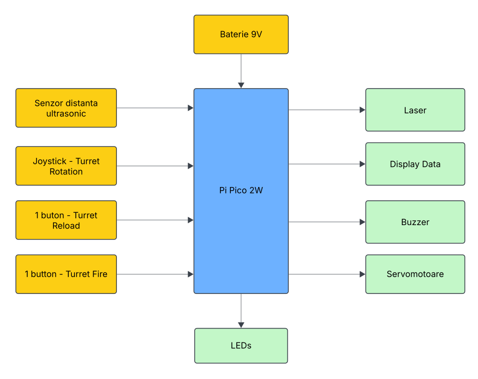

# Laser Turret
This project rekindles the nostalgic thrill of manually aiming and firing, delivering a classic targeting experience through an intuitive laser turret interface.
:::info 

**Author**: Neagoe Mario-Alexandru \
**GitHub Project Link**:  [Laser Turret - Repository](https://github.com/UPB-PMRust-Students/proiect-Neagoe-Mario-Alexandru) 

:::

## Description

Laser Turret is an interactive system that uses a Raspberry Pi Pico 2W, allowing users to manually control a laser-firing turret through a joystick and button interface, with real-time feedback provided via an LCD display, LEDs, and a buzzer. The turret incorporates servomotors for two-axis movement, a laser module, and an ultrasonic sensor for distance measurement, all integrated using Rust and the Embassy async framework. Some laboratories I found relevent for the project I am implementing, are: 
- Lab 2: GPIO
- Lab 3: PWM & ADC
- Lab 5: Interfacing SPI devices

## Motivation

My interest in robotics and embedded systems sparked the idea for this laser turret project. It’s a fun and challenging way to bring together my technical skills and curiosity about interactive hardware. I’ve always been drawn to projects that involve physical movement and precise control, and building a turret that tracks and fires offers exactly that. Beyond the technical learning, there's a certain nostalgic appeal to manually aiming and firing, reminiscent of classic arcade games and sci-fi interfaces. Creating this turret gives me a meaningful opportunity to deepen my understanding of real-time systems and hardware-software integration.

## Architecture

### Schematic Diagram

A schematic diagram is provided to illustrate the connections and layout of the components. 

 
  **Raspberry Pi Pico 2W**
  - **Role**: Acts as the central controller for all functions.
  - **Connections**:
    - Interfaces with the LCD Display, Ultrasonic Distance Sensor, Servomotors, Buzzer, Laser, LEDs, Buttons and Joystick.

 **LCD Display**
  - **Interface**: SPI
  - **Connections**:
  - **Role**: Displays distance and 'ammunition' left.

 **Servomotors**
  - **Interface**: PWM
  - **Role**: Move the turret on two axis.

 **Laser**
  - **Interface**: GPIO
  - **Role**: Allow user input for firing the turret.

 **Buttons and Joystick**
  - **Interface**: GPIO
  - **Connections**:
    - Connected to various GPIO pins for different controls (e.g., move controls, laser).
  - **Role**: Allow user input for controlling the turret and the reload mechanism.

 **LEDs and Buzzer**
  - **Interface**: PWM
  - **Role**: Provide visual and audio feedback during operation (e.g., sound for shooting, LEDs that display ammo left or the need for reload).

 **Ultrasonic Distance Sensor**
  - **Interface**: GPIO
  - **Role**: Provide visual and audio feedback during operation (e.g., sound for shooting, LEDs that display ammo left or the need for reload).

## Log

<!-- write every week your progress here -->

### Week 6 - 12 May

### Week 7 - 19 May

### Week 20 - 26 May

   

## Hardware

The Raspberry Pi Pico 2W serves as the central controller for the laser turret system. The Pico 2W interfaces with a wide range of peripherals such as an SPI LCD display, ultrasonic distance sensor, servomotors for turret movement, a laser firing system, input controls, and both visual and audio feedback components.

The LCD Display connects via SPI and is responsible for displaying key information such as the measured distance to target and remaining ammunition, providing the user with real-time operational feedback.

The servomotors, controlled through PWM, allow precise two-axis movement of the turret, enabling accurate manual or semi-automated aiming.

The laser, activated via a GPIO pin, represents the firing mechanism and responds directly to user input through buttons.

A set of buttons and a joystick, connected to general GPIO pins, form the primary input system. These controls allow the user to move the turret, fire the laser, and trigger reload actions.

LEDs and a buzzer, driven using PWM, offer immersive visual and audio feedback during operation. They signal events such as firing, reload status, and ammo count.

The ultrasonic distance sensor, connected via GPIO, enables the turret to measure the distance to a potential target. This data is used for display purposes and in a real scenario it could be extended for safety or targeting logic in future iterations.

### Schematics

### Bill of Materials

| Device                                                  | Usage                        | Price                           |
|---------------------------------------------------------|------------------------------|---------------------------------|
| [Raspberry Pi Pico 2W](https://www.raspberrypi.com/documentation/microcontrollers/pico-series.html#raspberry-pi-pico-2-w) | The microcontroller         | [40 RON x 2](https://www.optimusdigital.ro/ro/placi-raspberry-pi/13327-raspberry-pi-pico-2-w.html?search_query=pi+pico+2w&results=33) |
| [Kit Pan/Tilt + Servomotors](https://www.raspberrypi.com/documentation/microcontrollers/pico-series.html#raspberry-pi-pico-2-w) | System for moving on 2 axis         | [50 RON](https://learn.sparkfun.com/tutorials/setting-up-the-pi-zero-wireless-pan-tilt-camera?_ga=2.138993136.2135399251.1535353993-424151284.1534403760#hardware-assembly) |
| Ultrasonic Distance Sensor HC-SR04+ | Distance to target       | [15 RON](https://www.optimusdigital.ro/ro/senzori-senzori-ultrasonici/2328-senzor-ultrasonic-de-distana-hc-sr04-compatibil-33-v-i-5-v.html?search_query=ultrasonic&results=47) |
| [Modul LCD 1.44'' (128x128 px)](https://www.optimusdigital.ro/ro/optoelectronice-lcd-uri/870-modul-lcd-144.html?search_query=+%09Modul+LCD+de+1.44%27%27+%28128x128+px%29+Rosu+&results=1) | Data display       | [28 RON](https://www.optimusdigital.ro/ro/optoelectronice-lcd-uri/870-modul-lcd-144.html?search_query=+%09Modul+LCD+de+1.44%27%27+%28128x128+px%29+Rosu+&results=1) |
| [KY-008 Laser Module](https://arduinomodules.info/ky-008-laser-transmitter-module/) | Laser for the turret        | [4 RON](https://www.robofun.ro/laser/ky-008-650nm-laser-sensor-module-6mm.html) |
| Electronic components: LEDs, buttons, wires resistors, buzzer | Electronic Components | 25 RON |

## Software

| Library | Description | Usage |
|---------|-------------|-------|
| [embedded-hal](https://github.com/rust-embedded/embedded-hal) | Hardware Abstraction Layer for embedded systems | Used for SPI, GPIO and PWM control |
| [embassy-rp](https://github.com/golemparts/rppal) | Embassy HAL for Raspberry Pi Pico (RP2040) | Provides support for GPIO, PWM, SPI, and more on Pico 2W |
| [embassy](https://github.com/embassy-rs/embassy) | Modern, lightweight, and safe async framework for embedded systems | Used for async task scheduling, timers, and peripheral drivers |
| [st7735-lcd](https://crates.io/crates/st7735-lcd) | Driver for ST7735 LCD displays | Used to control the SPI LCD screen |
| [embedded-graphics](https://github.com/embedded-graphics/embedded-graphics) | 2D graphics library for embedded systems | Used for rendering text on display |
| [log](https://github.com/rust-lang/log) | Logging facade for Rust | Used for logging debug and informational messages |
| [panic-probe](https://crates.io/crates/panic-probe/) | A panic handler for embedded systems | Used for handling panics and debugging |
| [static-cell](https://github.com/embassy-rs/static-celll) | Provides safe, static storage for data that outlives the main function | Used for managing static data |
| [fixed](https://crates.io/crates/fixed) | Fixed-point arithmetic library | Used for precise timing calculations |

## Links

<!-- Add a few links that inspired you and that you think you will use for your project -->