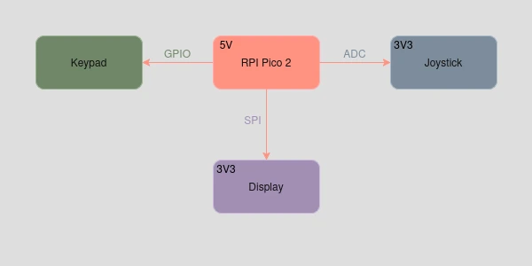

# PicoSudoku
A microcontroller-powered Sudoku game, designed for the Raspberry Pi Pico 2

:::info

**Author**: Ionescu Mihai-Cosmin \
**GitHub Project Link**: https://github.com/UPB-PMRust-Students/proiect-COSSS02

:::

## Description

This project aims to provide a simple and engaging way to play the classic logic game Sudoku,
featuring three difficulty levels. The game grid is displayed on an LCD screen connected to a
Raspberry Pi Pico 2 microcontroller. The user can interact with the game using intuitive
hardware controls: a joystick for navigating between cells and a keypad for number input.
The system includes input validation to ensure correct moves.

## Motivation

This project combines my passion for logic puzzles with the challenge of creating a clean,
self-contained implementation. Sudoku's structured nature makes it an ideal candidate for
an embedded environment project.

## Architecture



<!-- ## Log -->

<!-- write your progress here every week -->

<!-- ### Week 5 - 11 May

### Week 12 - 18 May

### Week 19 - 25 May -->

## Hardware

The project uses four main hardware components: a Raspberry Pi Pico 2 as the microcontroller,
a 2.8-inch ST7789 SPI TFT LCD to display the Sudoku grid, a 3x4 matrix keypad for number input,
and a dual-axis XY joystick for navigating between cells.

<!-- ### Schematics

Place your KiCAD schematics here. -->

### Bill of Materials

<!-- Fill out this table with all the hardware components that you might need.

The format is
```
| [Device](link://to/device) | This is used ... | [price](link://to/store) |

```

-->

| Device | Usage | Price |
|--------|--------|-------|
| [Raspberry Pi Pico 2](https://www.raspberrypi.com/documentation/microcontrollers/pico-series.html) | The microcontroller | [42 RON](https://www.aliexpress.com/item/1005007660023339.html) |
| [2.8 Inch ST7789 LCD](https://www.buydisplay.com/download/ic/ST7789.pdf) | The display | [38 RON](https://www.aliexpress.com/item/1005006175220737.html) |
| [3X4 Matrix Switch Keypad](https://mm.digikey.com/Volume0/opasdata/d220001/medias/docus/794/3845_Web.pdf) | The keypad | [12 RON](https://www.aliexpress.com/item/4000873237364.html) |
| [Dual-axis XY Joystick Module](https://naylampmechatronics.com/img/cms/Datasheets/000036%20-%20datasheet%20KY-023-Joy-IT.pdf) | The joystick | [8 RON](https://www.aliexpress.com/item/1005007403082994.html) |

## Software

| Library | Description | Usage |
|---------|-------------|-------|
| [embassy-rp](https://github.com/embassy-rs/embassy/tree/main/embassy-rp) | Raspberry Pi Pico HAL | GPIO, SPI, ADC setup |
| [embassy-sync](https://github.com/embassy-rs/embassy/tree/main/embassy-sync) | Synchronization primitives | Mutex for SPI bus |
| [embassy-time](https://github.com/embassy-rs/embassy/tree/main/embassy-time) | Time handling mechanisms | Measure Game Runtime |
| [mipidsi](https://github.com/almindor/mipidsi) | Crate for generic display drivers | Display driver for ST7789 |
| [embedded-graphics](https://github.com/embedded-graphics/embedded-graphics) | 2D graphics library | Drawing primitives to the display |

<!-- ## Links -->

<!-- Add a few links that inspired you and that you think you will use for your project -->

<!-- 1. [link](https://example.com)
2. [link](https://example3.com) -->
