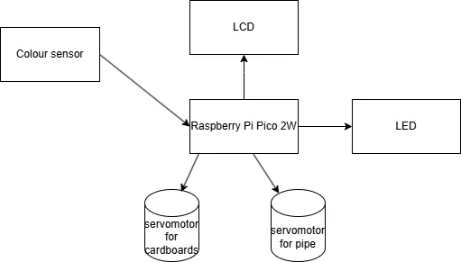
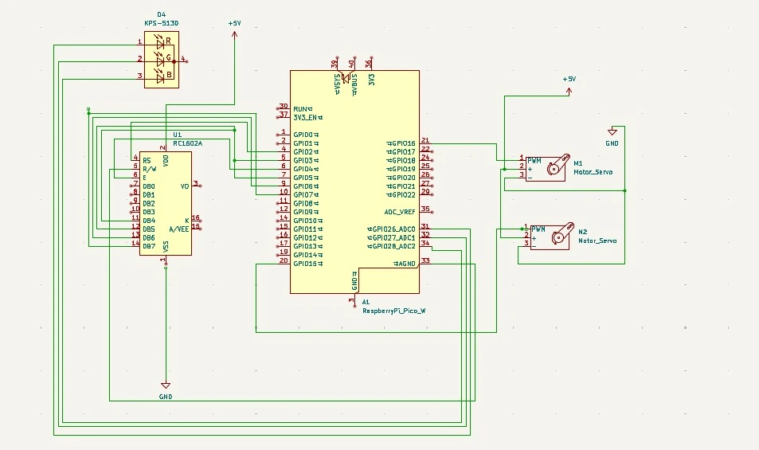

# Candy sorter
Sorts candies based on their colour.

:::info 

**Author**: Sândulache Mihnea-Ștefan \
**GitHub Project Link**: https://github.com/UPB-PMRust-Students/proiect-mihneasandulache

:::

## Description

A device which uses a colour sensor in order to sort
candies based on their colours. The identified colour
is then displayed on a LCD screen and a LED is turned on
corresponding with the respective colour.


+ The system utilizes a sensor to identify colour of the candy.

+ A servomotor then rotates the candy above a pipe.

+ The pipe is rotated to a pre-calculated angle, based on the colour of the candy so it drops in a special glass.

+ The LCD screen showcases the colour of the candy.

+ An LED is then turned on based on the colour.

+ Both servomotors rotated back to their initial state and another candy is ready to be dropped.


## Motivation

**This project** reflects my desire to dive deeper into embedded programming using a new language — **Rust**. I chose Rust for its performance and safety, and because it's becoming a strong player in the embedded world.

As a kid, I was fascinated by M&M’s candy dispensers and often imagined building one that could **sort candies by flavour or color**. That idea stuck with me and inspired this project.

While planning the system, from sensors to microcontrollers,  I realized it’s more than just code. It’s also about designing and building the physical device, something that taps into my love for **arts and crafts**.

## Architecture 
The **Raspberry Pi Pico 2W** serves as the central control unit, directing and managing all other components utilized within the project.

The **LCD** serves as an interface for showcasing the colour of the candy, it is connected to the Pico through I2C

The **servomotors** are responsible for rotating the candy and the pipe, ensuring that the candy is dropped into the correct glass.

The **LED** lights up in the corresponding colour of the candy, providing a visual indication of the detected colour. 

The **colour sensor** identifies the colour of the candy and sends the data to the Pico for processing.

The **pipe** is rotated to a pre-calculated angle based on the colour of the candy, ensuring it drops into the correct glass.

The **two cardboard disks** are used to create a makeshift arm, which is rotated by the servomotor. This arm is responsible for holding the candy and dropping it into the correct glass.




## Log

<!-- write every week your progress here -->

### Week 5 - 11 May


### Week 12 - 18 May


### Week 19 - 25 May
 

## Hardware

1. **Raspberry Pi Pico 2W**:
- **Purpose**: Controls all components.
- **Function**: Acts as the main controller, coordinating the operations of sensors, motors, buzzers, and the LCD display.

2. **Colour Sensor**:
- **Purpose**: Detects the colour of the candy.
- **Function**: Identifies the colour of the candy and sends the data to the Raspberry Pi Pico for processing.

3. **LCD Display**:
- **Purpose**: Displays the detected colour of the candy.
- **Function**: Provides a visual interface for the user, showing the colour of the candy detected by the sensor.

4. **Servomotor**:
- **Purpose**: Rotates the candy and the pipe.
- **Function**: Controls the movement of the candy and the pipe, ensuring that the candy is dropped into the correct glass.

5. **LED**:
- **Purpose**: Provides a visual indication of the detected colour.
- **Function**: Lights up in the corresponding colour of the candy, providing a visual indication of the detected colour.

### Hardware Overview:
- The **Raspberry Pi Pico** controls and coordinates all components.
- The **LCD** displays the detected colour of the candy.
- The **servomotors** rotate the candy and the pipe, ensuring that the candy is dropped into the correct glass.
- The **LED** lights up in the corresponding colour of the candy.
- The **colour sensor** identifies the colour of the candy and sends the data to the Pico for processing.


### Schematics


### Bill of Materials

<!-- Fill out this table with all the hardware components that you might need.

The format is 
```
| [Device](link://to/device) | This is used ... | [price](link://to/store) |

```

-->

| Device | Usage | Price |
|--------|--------|-------|
| [Rapspberry Pi Pico 2W](https://datasheets.raspberrypi.com/picow/pico-2-w-datasheet.pdf) | The microcontroller | [39,66 RON](https://www.optimusdigital.ro/en/raspberry-pi-boards/13327-raspberry-pi-pico-2-w.html?search_query=raspberry+pi+pico+2&results=36) |
| [TCS230](https://www.alldatasheet.com/view.jsp?Searchword=Tcs230%20datasheet&gad_source=1&gbraid=0AAAAADcdDU8NxuHbP0cnjgnaxxW8mVMPq&gclid=Cj0KCQjw2ZfABhDBARIsAHFTxGz_agIuGAL-wwwaZPnvfzuuriu4R4DTv64Wi2Bz9ikCXMJKSeYdvh4aAvbREALw_wcB) | Colour Sensor| [38,99 RON](https://www.optimusdigital.ro/en/optical-sensors/111-tcs230-color-sensor-module.html) |
| [LCD Display](https://www.waveshare.com/datasheet/LCD_en_PDF/LCD1602.pdf) | LCD Display| [14 RON](https://www.bitmi.ro/electronica/display-lcd1602-hd44780-albastru-iluminat-10486.html) |
| [Servomotor](https://datasheetspdf.com/datasheet/SG90.html) | Servomotor | [14 RON](https://www.optimusdigital.ro/ro/motoare-servomotoare/26-micro-servomotor-sg90.html?search_query=servomotor&results=119) |


## Software

| Library | Description | Usage |
|---------|-------------|-------|
| [embassy-rp](https://github.com/embassy-rs/embassy/tree/main/embassy-rp) | RP2350 Peripherals | Used for accessing the peripherals|
| [esp-idf-servo](https://crates.io/crates/esp-idf-servo) | Servo control | Used for controlling the servomotor|
| [embedded-hal](https://crates.io/crates/embedded-hal) | Embedded Hardware Abstraction Layer | Used for accessing the hardware|
| [ag-lcd](https://github.com/mjhouse/ag-lcd) | LCD display | Used for controlling the LCD display|
| [cortex-m](https://github.com/rust-embedded/cortex-m) | Provides low-level APIs for ARM Cortex-M processors | Interrupt handling and system control|
| [embassy-executor](https://github.com/embassy-rs/embassy/tree/main/embassy-executor) | Asynchronous executor for embedded systems | Used for managing tasks and scheduling|

## Links

<!-- Add a few links that inspired you and that you think you will use for your project -->
