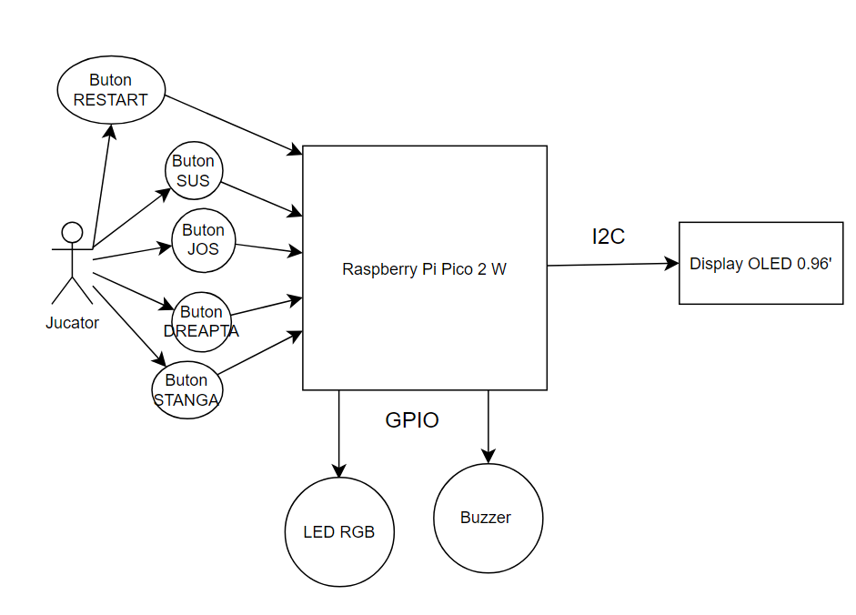
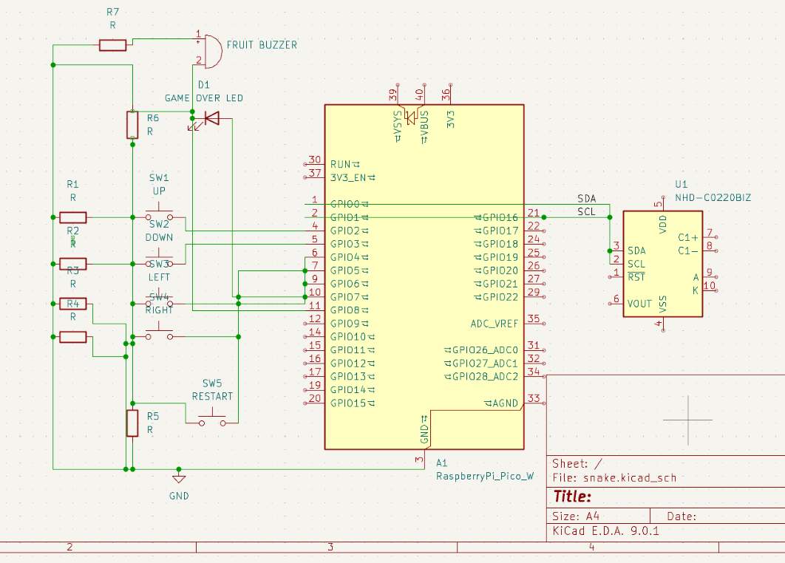

# Snake

Snake game on a display, controlled by buttons.

:::info

**Author**: Nicolae Dragu \
**GitHub Project Link**: https://github.com/UPB-PMRust-Students/proiect-nicolaedragu

:::

## Description

Players control a growing snake to consume food, displayed on a screen. The game signals its conclusion with a dedicated red LED illuminating upon the snake's death, when he collides with itself.

## Motivation

I was inspired to create this classic game because of its nostalgic value to me, as I used to play it on my old Nokia phone. I wanted to recreate that experience in this project, as it is an engaging way to learn more about the technologies I am using.

## Architecture 

+ The Raspberry Pi Pico serves as the main controller, running the game logic and handling all input/output operations.
+ OLED Display 0.96": Renders the Snake game in real time, showing the snake and the fruits.
+ Directional Buttons (GPIO): Allow the player to control the snake's movement (UP / DOWN / LEFT / RIGHT).
+ Red LED (GPIO): Lights up when the player loses (collision with itself or wall).
+ Buzzer (PWM/GPIO): Emits a short sound whenever the snake eats a fruit.

### Game Flow:

- Startup: The OLED shows the welcome screen and waits for a button press to start the game.
- Gameplay: The snake moves continuously; button presses update its direction.
- Fruit Collected: The buzzer plays a sound and the snake grows.
- Game Over: Collision triggers the red LED and halts the game until reset.
- Restart: A button press resets the game state and restarts the loop.

Here is the block scheme and how the components are all conected:

## Log

### Week 5 - 11 May

### Week 12 - 18 May

### Week 19 - 25 May

## Hardware

1. 1x Raspberry Pi Pico 2W: acts as the primary processing unit.
2. 1x OLED Display, 0.96 inch: Continuously displays the game.
3. 5x Buttons: Provide real-time directional control of the snake and the restart game function.
4. 1x LED: Indicates game-over condition.
5. 1x Buzzer: Adds auditory feedback on successful fruit collection.

### Schematics

### Bill of Materials

| Device | Usage | Price |
|--------|--------|-------|
| [Rapspberry Pi Pico W] | The microcontroller | [35 RON x 2] |
| [LED] | The LED | [0.2 RON] |
| [Buzzer] | The Buzzer | [4 RON] |
| [OLED Display] | The OLED Display | [40 RON] |
| [Buttons] | The Buttons | [0.5 RON x 5] |

## Software

| Library | Description | Usage |
|---------|-------------|-------|
| [embassy](https://github.com/embassy-rs/embassy) | Embassy | An asynchronous executor and Hardware Abstraction Layer (HAL) designed for constructing embedded applications in Rust. |
| [embassy-executor](https://docs.embassy.dev/embassy-executor/git/std/index.html)|Embassy Executor | Used for task scheduling and asynchronous programming|
|[embassy-rp](https://docs.embassy.dev/embassy-rp/git/rp2040/index.html)| Embassy RP | Used for initializing and interacting with peripherals |
|[gpio](https://docs.embassy.dev/embassy-stm32/git/stm32c011d6/gpio/index.html)|GPIO |Used for interacting with GPIO pins |
|[embedded-hal](https://docs.rs/embedded-hal/latest/embedded_hal/index.html)|Embedded HAL | A set of traits for embedded hardware abstraction |
|[defmt](https://docs.rs/defmt/latest/defmt/index.html)|Defmt | A logging framework for embedded systems |

## Links

1. [Science Buddies](https://www.youtube.com/@Science.Buddies)
2. [Pico-series Microcontrollers Documentation](https://www.raspberrypi.com/documentation/microcontrollers/pico-series.html)
3. [Free Code Camp - Rust tutorials](https://www.freecodecamp.org/news/tag/rust/)