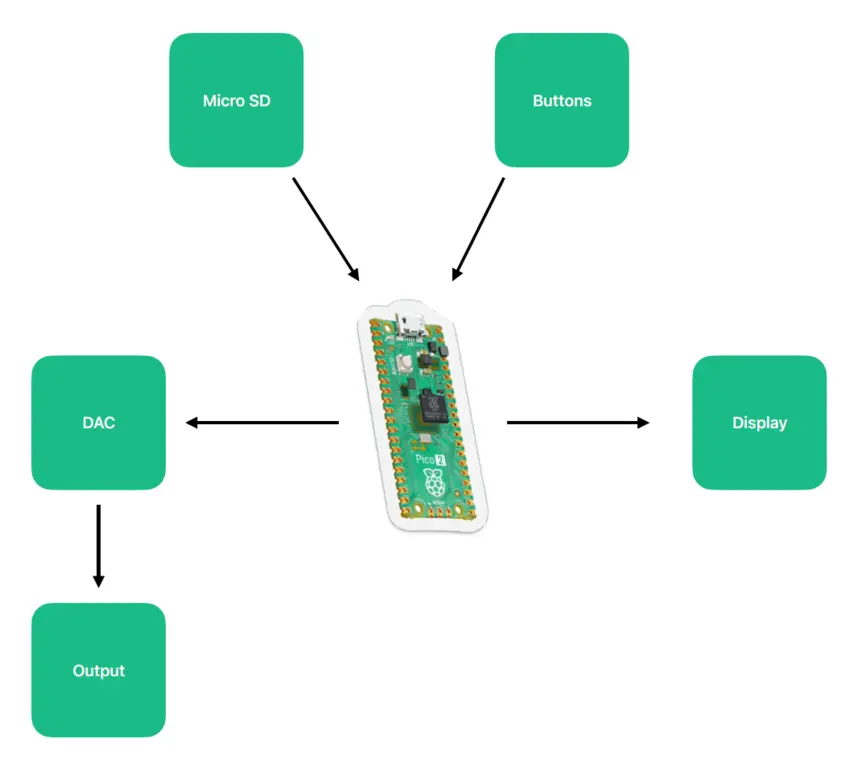
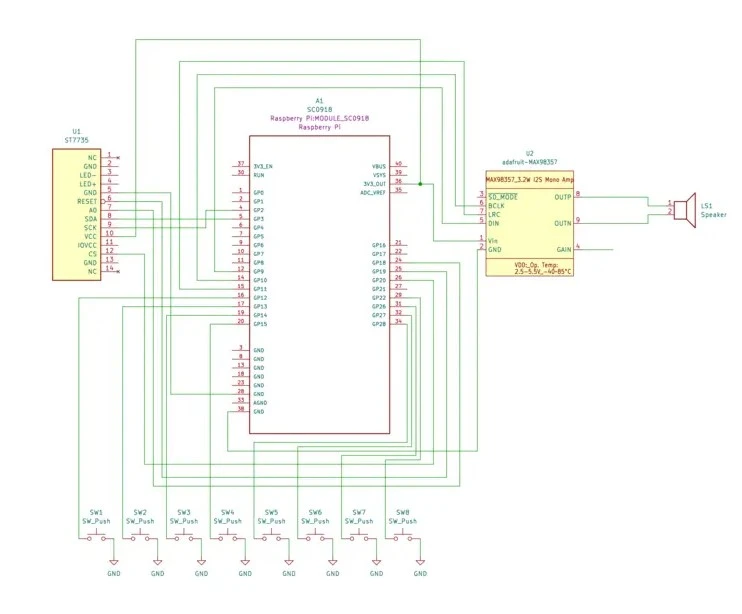

# CrateDigger
Dig. Chop. Loop. Repeat.

:::info

**Author**: Popa Nicolae \
**GitHub Project Link**: https://github.com/UPB-PMRust-Students/proiect-nicupopa

:::

## Description
CrateDigger is a portable sampler built around a Raspberry Pi Pico 2 and programmed using the Embassy framework in Rust. The device allows users to sample audio, playback predefined samples, and perform beat-making using a 16-step sequencer. It features a user interface with tactile buttons, a TFT screen with animations, and high-quality audio output via DAC and an integrated speaker. Ideal for music producers looking for a portable sampler/sequencer.

## Motivation
I have always been passionate about music and beat-making equipment. When the opportunity to pick this project came up, I knew it was the perfect opportunity to blend the two things I'm passionate about. 
My goal is to create a compact, DIY sampler and sequencer that allows musicians and hobbyists to experiment with sounds, create beats, and take their creativity anywhere.  
This project is not only a technical challenge but also a personal mission to create a fun tool that I might use in the future.

## Architecture

### Raspberry Pi Pico 2

**Role:** Central microcontroller, manages audio processing, input/output control, and overall device logic.

**Connections:**  
Display, Micro SD Card Module, DAC, Buttons, and Output components.

---

### Display (ST7735R)

**Interface:** SPI  
**Connections:**  
- SDA (Data Line) connected to Raspberry Pi Pico 2 SPI pins  
- SCL (Clock Line) connected to Raspberry Pi Pico 2 SPI pins

**Role:** Displays user interface, sequencing steps and device status.

---

### Buttons

**Interface:** GPIO 
**Connections:**  
- Connected to GPIO pins for controls (playback, recording, navigation, sequencing)

**Role:** Allows user input for sampling, playback, sequence control, and settings.

---

### Micro SD Card Module

**Interface:** SPI  
**Connections:**  
- SCK (Serial Clock) connected to Pico SPI pin  
- MOSI (Master Out Slave In) connected to Pico SPI pin  
- MISO (Master In Slave Out) connected to Pico SPI pin  
- CS (Chip Select) connected to Pico GPIO pin

**Role:** Stores audio samples, sequences, presets, and configuration data.

---

### DAC (MAX98357A)

**Interface:** I2S  
**Connections:**  
- Connected via I2S interface pins on the Raspberry Pi Pico 2

**Role:** Converts digital audio signals to high-quality analog audio for speaker output.

---

### Output (Speaker)

**Role:** Outputs audio signal from the DAC to provide sound playback.

---

## Log
- **Week 5 - 11 May**:  
  WIP...
- **Week 12 - 18 May**:  
  WIP...
- **Week 19 - 25 May**:  
  WIP...

## Hardware
- Raspberry Pi Pico 2 (RP2350): Main microcontroller handling audio processing and system logic.
- I2S DAC – MAX98357A: Converts digital audio signals to analog for high-quality speaker output.
- ST7735R display: Colored screen for animations.
- Speaker: Outputs audio playback.
- Two potentiometers: For adjustable controls (volume/effects).
- Buttons: Input for interraction with the device.

## Schematics

## Bill of Materials

| Device | Usage | Price |
|:------:|:-----:|:-----:|
| [2x Raspberry Pi Pico 2 W](https://www.optimusdigital.ro/en/raspberry-pi-boards/13327-raspberry-pi-pico-2-w.html?search_query=5056561803975&results=1) | The microcontroller | 80 RON |
| [ST7735R Display](https://www.optimusdigital.ro/en/lcds/1311-modul-lcd-spi-de-18-128x160.html?search_query=0104110000012661&results=1) | OLED visual interface | 29 RON |
| [MAX98357 I2S DAC](https://www.emag.ro/amplificator-audio-max98357-i2s-compatibil-cu-esp32-si-raspberry-pi-emg238/pd/DVYJWJYBM/?ref=history-shopping_418527241_221614_1) | Audio output module | 24 RON |
| [4 Ohm Speaker](https://www.emag.ro/difuzor-mini-arduino-3w-4-ohm-40mm-diametru-z001351/pd/DX2RLHYBM/?ref=history-shopping_418528639_187129_1) | Sound playback | 40 RON |
| Consumables (buttons, potentiometers, wires, etc.) | Various components | 50 RON |

## Software

| Library | Description | Usage |
|:-------:|:-----------:|:-----:|
| [embassy](https://embassy.dev/) | Asynchronous embedded framework for Rust | Core framework for running async tasks on the Raspberry Pi Pico 2 |
| [embassy-rp](https://embassy.dev/) | Embassy HAL for RP2040 | Hardware abstraction layer for the Raspberry Pi Pico 2 |
| [embedded-hal](https://github.com/rust-embedded/embedded-hal) | Hardware Abstraction Layer (HAL) traits | Provides unified interfaces for hardware drivers |
| [embedded-graphics](https://github.com/embedded-graphics/embedded-graphics) | 2D graphics library | Used for drawing to the ST7735R display |
| [st7735-lcd](https://github.com/almindor/st7735-lcd) | Rust driver for ST7735 display | Controls the ST7735R display |

## Links
- [link1](https://example.com)
- [link2](https://example.com)

