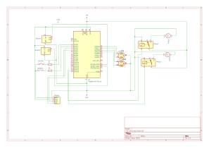

# WaterBerry

Automatic irrigation system for more plant pots simultaneously.

:::info 

**Author**: Diaconu Oana-Ruxandra \
**GitHub Project Link**: https://github.com/UPB-PMRust-Students/proiect-ruxandradiaconu

:::

## Description

WaterBerry – Plant Feeder is an automated watering system for two plant pots, based on soil moisture measurements.  The Raspberry Pi Pico 2W controls two water pumps connected through relay modules, decides pump activation based on sensor readings, and displays the moisture level on an LCD screen. 2 RGB leds provide visual feedback and 2 buttons are there for manual control of the system.

## Motivation

This idea seemed like a suitable one for me, as a person that sometimes forgets that my plants also need to be healthy and fed, so I wanted to create a project that would be useful for me even after this semester. This automated device would be very helful for people who don't know how to really take care of house plants or are too busy for them, as it does the most important part of caring for a pot.

## Architecture

- **Raspberry Pi Pico 2W** : acts as the main controller of the system, it reads the sensor data, makes decisions based on soil moisture levels, controls the water pumps through relay modules, updates the LCD, and manages LED indications and manual watering buttons

 - **Soil Moisture Sensors** : continuously measure the moisture levels in the soil of each plant pot, in order to determine if the soil is too dry or moist enough

 - **Water Pumps**: physically water the plants when the soil is detected to be too dry, ensuring individualized watering control

- **Distance Sensor** : measures the distance between the top of the water tank until it reaches with an echo the water level and helps measuring how much water is still left for watering

- **Relay Modules**: they allow the Pico to turn the pumps on/off without being directly exposed to the high current needed by the pumps

- **LCD Display**: displays real-time data about the soil moisture levels of each plant

 - **RG LED**: indicates the soil moisture status: green if the soil is moist, red otherwise

 - **Push Buttons**: allow the user to manually do watering for each plant, regardless of the soil moisture level

 - **Power Supply** (PowerBank 5V/2A) : ensures power for both the Raspberry Pi Pico and the water pumps, providing enough current

## Log

### Week 5 - 11 May
### Week 12 - 18 May
### Week 19 - 25 May

## Hardware

- 2x Raspberry Pi Pico 2W: controls the components, reads data from the soil moisture sensors, processes the information, controls the relays and pumps, updates the display, and manages LED indicators and button inputs; The second Pico is used for debugging 
- 2x Soil moisture sensors: measure the moisture level in the soil
- 2x Water pumps: deliver water to the plants when the system detects that the soil is too dry
- Distance sensor: measures the distance from the top of the water tank to the level of water, measuring the distance between them
- 2x Relay modules: electronic switches used to safely control the pumps
- LCD display with I2C module: text display used to show the real-time moisture readings of the two plants and how much water is in the water tank
- 2x Red-green LED: shows the status of the soil moisture to be visible by the user
- 2x Push buttons: allows the user to manually control the watering to whenever is wanted
- PowerBank 5V/2A for power supply: provides stable voltage and sufficient current to power the Raspberry Pi Pico and the peripherals
- Breadboard and jumper wires: used to connect all the components together

## Schematics

## Bill of Materials

| Device | Usage | Price |
|--------|-------|-------|
| [Raspberry Pi Pico 2W](https://www.optimusdigital.ro/ro/placi-raspberry-pi/13327-raspberry-pi-pico-2-w.html?search_query=Raspberry+Pi+Pico+2W&results=26) | Main microcontroller & debugger | 40 RON |
| [Soil Moisture Sensor](https://www.optimusdigital.ro/ro/senzori-senzori-de-umiditate/73-senzor-de-umiditate-a-solului.html?search_query=Modul+cu+Senzor+de+umiditate+a+solului&results=1) | Measuring soil moisture | 4 RON * 2 |
| [Relay Module](https://www.optimusdigital.ro/ro/relee/1897-modul-releu-1-canal-5v.html) | Controlling pumps | 5 RON * 2 |
| [LCD 1602 Display with I2C](https://www.optimusdigital.ro/ro/optoelectronice-lcd-uri/2894-lcd-cu-interfata-i2c-si-backlight-albastru.html?search_query=LCD+1602+cu+Interfata+I2C+si+Backlight+Albastru&results=2) | Displaying sensor values | 16 RON |
| [Red-Green LED](https://www.optimusdigital.ro/ro/optoelectronice-led-uri/704-led-bicolor-de-3-mm-rosu-si-verde-cu-catod-comun.html) | Visual status indication | 1 RON * 2 |
| [Push buttons](https://www.optimusdigital.ro/ro/butoane-i-comutatoare/1115-buton-cu-capac-rotund-alb.html?search_query=buton&results=213) | Manual watering control | 2 RON * 2 |
| [Distance sensor](https://www.optimusdigital.ro/ro/senzori-senzori-de-distanta/8150-senzor-de-distana-ultrasonic-hc-sr04p-3-55-v.html?search_query=senzor+distanta&results=180) | Measure left water in tank | 7 RON |
| Water pump | Deliver water | ~10 RON|
| [Jumper wires](https://www.optimusdigital.ro/ro/fire-fire-mufate/12-set-de-cabluri-pentru-breadboard.html?search_query=Set+Fire+pentru+Breadboard&results=37) | Connections | 8 RON |
| [Breadboard](https://www.optimusdigital.ro/ro/prototipare-breadboard-uri/44-breadboard-400-points.html?search_query=Breadboard+HQ+%28400+Points%29&results=1) | Connections | 5 RON | 

## Software

| Library | Description | Usage |
|---------|-------------|-------|
|embassy-rp | peripherals access | initialization and interaction with peripherals|

## Links