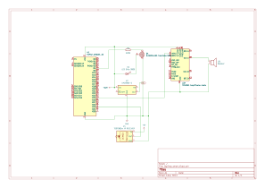

# Smart Mirror

:::info

**Author**: Patricia-Elena Crăciun \
**GitHub Project Link:** https://github.com/UPB-PMRust-Students/proiect-patriciacraciun

:::

### Description

The idea of the project is to build a smart mirror that can play music over Bluetooth and has LED lighting with adjustable brightness. The mirror can be controlled using an IR remote and a mobile phone. All functionality is implemented on an ESP32 board, programmed entirely in Rust.

## Motivation

I chose this project because I've always wanted a smart mirror, especially because I'm really passionate about makeup. Having good lighting and music while getting ready is something I’ve always dreamed of. This project lets me combine something I’d actually use every day with the skills I learned this semester.

## Architecture

**Main components:**
- **User** – interacts using an IR remote or a phone (Bluetooth)
- **IR Receiver** – sends commands to the ESP32
- **ESP32** – controls the whole system (LED brightness, Bluetooth, audio)
- **LED Strip** – controlled via PWM from ESP32
- **Bluetooth Audio** – receives audio from phone
- **Amplifier** – amplifies signal for the speakers
- **Speakers** – play the music
- **Power Supply** – powers everything with 12V and a step-down to 5V for ESP32

## Log

### Week 5 – 11 May
Connecting the hardware components

### Week 12 – 18 May

### Week 19 – 25 May

## Hardware

The smart mirror uses an ESP32 development board, a TPA3116D2 amplifier module, an IR receiver, a 12V LED strip, and a pair of speakers. The system is powered by a 12V/5A adapter and uses an LM2596 step-down converter to supply 5V to the ESP32 and other components.

### Schematics

## Bill of Materials

<!-- Fill out this table with all the hardware components that you might need.

The format is

| [Device](link://to/device) | This is used ... | [price](link://to/store) |

-->

| Device | Usage | Price |
|--------|--------|-------|
|[ESP32 DevKit](https://www.optimusdigital.ro/ro/placi-cu-bluetooth/4371-placa-de-dezvoltare-esp32-cu-wifi-i-bluetooth-42.html?search_query=Placa+de+Dezvoltare+ESP32+cu+WiFi+și+Bluetooth+4.2&results=8)| Microcontroller| 35 RON |
|[TPA3116D2 Amplifier](https://www.optimusdigital.ro/ro/audio-amplificatoare-audio/8400-modul-amplificator-audio-tpa3116d2-2-x-50-w.html?search_query=0104110000055316&results=1)| Drives speakers | 53 RON |
|[2x Speakers (60W, 4Ω)](https://www.emag.ro/difuzor-6-5-60w-4-8-ohmi-wf-cx601/pd/DXK6M23BM/)| Play music| 60 RON |
|[LED Strip 2835 12V](https://ardushop.ro/ro/electronica/302-rola-leduri-2835-smd-alb-rece-5m-120led-m-6427854003232.html?fbclid=IwZXh0bgNhZW0CMTAAYnJpZBExc0R1SjFVZzhWaXNaQjBtcAEevXM7TnZaVJs3LQRWX69XkjuWwAEKng6YS_Uj3TpZJPhU0tvWLA8aUbETKhk_aem_yTHRgAgcLwEvLEGkbdyftg) | Mirror lighting | 37 RON |
|[LM2596 Step-down Converter](https://www.optimusdigital.ro/ro/surse-coboratoare-reglabile/13130-modul-dc-dc-step-down-lm2596hvs.html?search_query=0104110000089281&results=1)| Power ESP32 | 13 RON |
|[12V 5A Power Adapter](https://www.emag.ro/sursa-de-alimentare-profesionala-12v-5a-100-240v-50-60hz-valabil-si-pentru-internet-modem-mv5a12v/pd/DCZX48YBM/?ref=graph_profiled_similar_fallback_1_2&provider=rec&recid=rec_49_cff0c0a4224255d3ac2d5014a022128ed814a0b7cf67716a9ec4940aa9285fdf_1746290122&scenario_ID=49) | Main power | 32 RON |
|[IR Remote + Receiver](https://ardushop.ro/ro/comunicatie/2358-kit-ir-telecomanda-receptor-cablu-6427854032461.html) | Remote control | 11 RON |
|[MOSFET IRFZ44N](https://www.optimusdigital.ro/ro/componente-electronice-tranzistoare/11869-tranzistor-mosfet-irfz34n.html?search_query=mosfet+irfz&results=1) | Controls LED brightness | 5 RON  |
|[2x Breadboard + Jumper Wires](https://www.optimusdigital.ro/ro/kituri/2222-kit-breadboard-hq-830-p.html?search_query=breadboard+830&results=14) | Prototypig | 44 RON |

## Software

| Library | Description | Usage |
|---------|-------------|-------|
|`esp-idf-hal`| Hardware interface for ESP32 | This is used for controlling GPIOs, PWM, and other peripherals on the ESP32. |
|`embedded-hal`| Embedded abstraction layer | This is used to provide a standard interface for embedded hardware components. |
|`infrared`| Decode IR remote input | This is used to decode signals from the IR remote control.|
|`smart-leds`| LED strip control | This is used to manage the brightness of the LED strip. |
|`heapless`| Data structures without heap | This is used to manage data without dynamic memory allocation. |
|`esp-idf-svc`| Bluetooth A2DP profile support | This is used to handle Bluetooth audio streaming and other services. |
|`panic-halt`| Panic handler | This is used to halt the system in case of a panic, useful for debugging. |

## Links

<!-- Add a few links that inspired you and that you think you will use for your project -->

- [Lab 02 - GPIO](https://pmrust.pages.upb.ro/docs/acs_cc/lab/02)
- [Lab 03 - PWM & ADC](https://pmrust.pages.upb.ro/docs/acs_cc/lab/03)
- [Lab 04 - Asynchronous Development](https://pmrust.pages.upb.ro/docs/acs_cc/lab/04)

