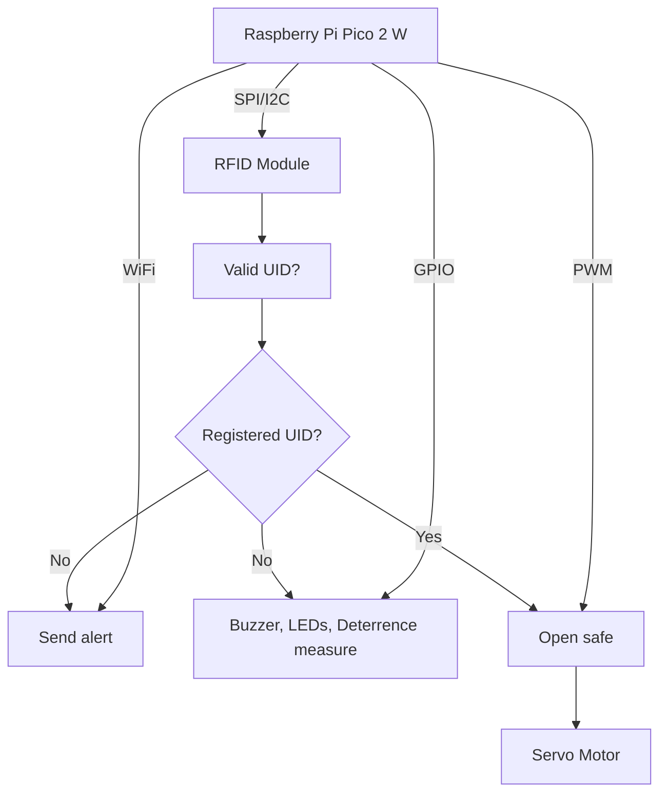

# SafePi
A smart and secure mini-safe that unlocks with RFID and fights back against intruders.

:::info 

**Author**: Nămoianu Petre \
**GitHub Project Link**: https://github.com/UPB-PMRust-Students/proiect-PetreNamo

:::

## Description

SafePi is a compact, smart security safe controlled via RFID authentication.
It is designed to be unlocked using authorized RFID cards or a smartphone.
When an unauthorized access attempt is detected, the system triggers a loud audible alarm,
sends a notification to the user's smartphone, and activates a physical deterrent mechanism
that launches small projectiles to discourage tampering.

## Motivation

The motivation behind SafePi is to enhance personal security with an accessible and affordable system.
It not only alerts you instantly via phone notification, but also discourages and delays access through physical deterrents.

## Architecture

- **Main Controller (Raspberry Pi Pico 2W):**  
  Acts as the central unit managing all inputs and outputs
  and sends notifications to your phone.

- **RFID Module:**  
  Reads the tag of the person attempting to open the safe.

- **Servo Motors:**  
  One opens the door when told by the controller,
  the others launch small objects if an intruder is trying to open the safe.

- **LEDs, Buzzer:**  
  Used as a visible and audible alarm.



## Log

<!-- write your progress here every week -->

### Week 5 - 11 May

### Week 12 - 18 May

### Week 19 - 25 May

## Hardware


### Schematics


### Bill of Materials

<!-- Fill out this table with all the hardware components that you might need.

The format is 
```
| [Device](link://to/device) | This is used ... | [price](link://to/store) |

```

-->

| Device | Usage | Price |
|--------|--------|-------|
| [Raspberry Pi Pico 2W](https://www.raspberrypi.com/documentation/microcontrollers/raspberry-pi-pico.html) | The microcontroller | [40 RON](https://www.optimusdigital.ro/en/raspberry-pi-boards/13327-raspberry-pi-pico-2-w.html) |
| Red LED | Blinking when the alarm goes off | [0.39 RON](https://www.optimusdigital.ro/ro/optoelectronice-led-uri/696-led-rou-de-3-mm-cu-lentile-difuze.html) |
| Blue LED | Blinking when the alarm goes off | [0.29 RON](https://www.optimusdigital.ro/ro/optoelectronice-led-uri/12237-led-albastru-de-5-mm.html) |
| Buzzer | Used when the alarm goes off | 1 RON |
| PN532 RFID Module | Used for  opening the safe | 30 RON |

\*Not Final


## Software

| Library | Description | Usage |
|---------|-------------|-------|
| [embassy](https://github.com/embassy-rs/embassy) | Async embedded framework for Rust | Main framework for handling async tasks |
| [embassy-rp](https://github.com/embassy-rs/embassy) | RP2350 support for Embassy | Provides access to GPIO, I2C, and timers for Raspberry Pi Pico 2 |
| [defmt](https://github.com/knurling-rs/defmt) | Logging framework for embedded Rust | Debugging tool |

\*Not Final


## Links

<!-- Add a few links that inspired you and that you think you will use for your project -->

