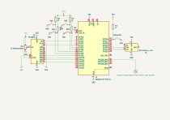

# Rusty Musician
Sound processor for electric musical instruments

:::info 

**Author**: Petru-Cristian NANIA \
**GitHub Project Link**: [repository](https://github.com/UPB-PMRust-Students/proiect-PetruCristian)

:::

## Description

The device can be connected between an electric musical instrument and an amplifier. \
It can apply sound effects to the signal generated by the instrument. \
It can also function as a looping station (it records sequences of sound and plays them back repeatedly).

## Motivation

I have a passion for music and I've always wanted such a device. \
I think it's more fun to make it myself than to buy one. \
I also don't always have and entire musical band with me when I want to entertain my friends and a looping station would be awesome.

## Architecture 

## Log

### Week 5 - 11 May

### Week 12 - 18 May

### Week 19 - 25 May

## Hardware

An electric guitar pickup is just a coil with magnets (the magnetized strings) vibrating around it.
These vibrations induce in the coil an electrical current which is normally conducted though an audio cable to an amplifier.

In my project, the aim is to take that current, send it to Rusty Musician device, and do funky stuff with it before sending it to the amplifier.

First of all, the input is be preprocessed with a passive low-pass filter that has a threshold as high as the highest note on the guitar.
This ensures the signal is as clean as possible before sending it to the ADC on the Raspberry Pi Pico 2 and processing it using software written in Rust for the RP2350 MCU.

Multiple buttons (with pull-up resistors) are used to select options from the menu (cycle between live effects or select the loop station function).
The options are shown on an LCD screen.

For certain effects and for looping, storage space is needed.
This is achieved by using an external microSD module and an external non-volatile memory.

The processed signal is sent to an external DAC module, filtered again, and ultimately sent to the amplifier.

### Schematics

### Bill of Materials

| Device | Usage | Price |
|--------|--------|-------|
| [Raspberry Pi Pico 2W](https://datasheets.raspberrypi.com/rp2350/rp2350-datasheet.pdf) | The microcontroller | [39.66 RON](https://www.optimusdigital.ro/ro/placi-raspberry-pi/13327-raspberry-pi-pico-2-w.html) |
| [A second Raspberry Pi Pico 2W](https://datasheets.raspberrypi.com/rp2350/rp2350-datasheet.pdf) | The debugger | [39.66 RON](https://www.optimusdigital.ro/ro/placi-raspberry-pi/13327-raspberry-pi-pico-2-w.html) |
| [MCP4725 with I2C interface](https://ww1.microchip.com/downloads/aemDocuments/documents/MSLD/ProductDocuments/DataSheets/MCP4725-Data-Sheet-20002039E.pdf) | DAC module for generating the output signal | [24.99 RON](https://www.optimusdigital.ro/ro/altele/1327-modul-dac-mcp4725-cu-interfaa-i2c.html) |
| LCD 1602A | For the effects menu | [9.82 RON](https://www.optimusdigital.ro/ro/optoelectronice-lcd-uri/867-modul-lcd-1602-cu-backlight-galben-verde-de-5v.html) |
| Three pin headers - 2.54mm with 40 pins | For the two dev boards and the LCD | 3 × [0.99 RON](https://www.optimusdigital.ro/ro/componente-electronice-headere-de-pini/464-header-de-pini-rosu-254-mm-40p.html) |
| At least two MF1401 6.3mm jack sockets | Connecting the instrument and the amplifier tot the Rusty Musician device | 2 × [2.00 RON](https://electroniclight.ro/mf1401-jack-mama-63mm-mono/2907.html) |
| Audio cable | An extra one is needed to connect the Rusty Musician device and the amp |  |
| Buttons | To select options from the menu | 4 × [0.36 RON](https://www.optimusdigital.ro/ro/senzori-senzori-de-atingere/742-modul-joystick-ps2-biaxial-negru-cu-5-pini.html) |
| Potentiometer | Change LCD contrast | [1.49 RON](https://www.optimusdigital.ro/ro/componente-electronice-potentiometre/1885-potentiometru-mono-50k.html) |
| Breadboard + Jump wires + Stabilized power source | Mounting, connecting and powering everything | [22.00 RON](https://www.optimusdigital.ro/ro/kituri/2222-kit-breadboard-hq-830-p.html) |
| Micro USB cable | Powering the dev board and uploading the code | [3.99 RON](https://www.optimusdigital.ro/ro/cabluri-cabluri-usb/11939-cablu-negru-micro-usb-1-m.html) |
| [W25Q32 module with SPI interface](https://electronperdido.com/wp-content/uploads/2022/12/FLASH-w25q32-datasheet.pdf) | Fast non-volatile memory for real-time effects | [5.48 RON](https://www.optimusdigital.ro/ro/altele/5711-modul-memorie-nevolatila-de-32-mbii-cu-interfaa-spi.html) |
| [MicroSD card module with SPI interface](https://sigmanortec.ro/Modul-MicroSD-p126079625?SubmitCurrency=1&id_currency=2&gad_source=1&gbraid=0AAAAAC3W72O583Lr5l62Wu-ikqzQMfuL2&gclid=Cj0KCQjw2tHABhCiARIsANZzDWrlsAY6TVOV6OsCqmh9uFbf-u8zYH7SExosl4_2Qs3X1Pkyj0U9nsAaAhsEEALw_wcB) | Loop recording and playback | [4.39 RON](https://www.optimusdigital.ro/ro/memorii/1516-modul-slot-card-microsd.html?search_query=card+SD&results=191) |
| Soundking AL 103 Footswitch | Starting and stopping loop recording/playback | [11.90 RON](https://www.muziker.ro/soundking-al-103?gad_source=1&gbraid=0AAAAADdcsprwsrtO0GaPnRNnnX49fcVSd&gclid=Cj0KCQjw_JzABhC2ARIsAPe3yno-_9jVy8plRFpghh77IrSKaBIFcNDLurl8_neTuTrRFzz4REu6CQcaApXwEALw_wcB) |
| Total | - | 171.79 RON |

## Software

| Library | Description | Usage |
|---------|-------------|-------|
| [embassy-rp](https://embassy.dev/) | Rust + async ❤️ embedded | Next-generation framework for embedded applications |
| [lcd1602-rs](https://crates.io/crates/lcd1602-rs) | Driver for 1602 LCD via an embedded-hal implementation | Show menu on LCD screen |
| [micromath](https://crates.io/crates/micromath) | Embedded-friendly math library | Fast floating-point math |
| [arrayvec](https://crates.io/crates/arrayvec) | A vector with fixed capacity, backed by an array (it can be stored on the stack too) | Storing samples of the signal on the stack |
| [fixed](https://crates.io/crates/fixed) | Fixed-point numbers | Faster arithmetic |
| [biquad](https://crates.io/crates/biquad) | A library for digital second order IIR filtrers | Signal processing |

## Links

<!-- Add a few links that inspired you and that you think you will use for your project -->

1. [Inspiration: Ed Sheeran](https://www.youtube.com/watch?v=HFvPftwNcSY)
2. [1602A LCD connected to Pico](https://www.youtube.com/watch?v=Xq0bt-0kbBk)
3. [Looper for Linux written in Rust](https://github.com/mwylde/loopers)
4. [PWM & ADC lab](https://pmrust.pages.upb.ro/docs/acs_cc/lab/03)
5. [SPI lab](https://pmrust.pages.upb.ro/docs/acs_cc/lab/05)
6. [I2C lab](https://pmrust.pages.upb.ro/docs/acs_cc/lab/06)
