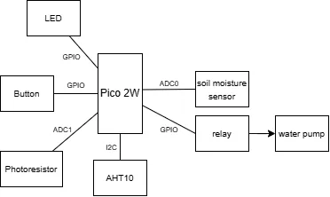
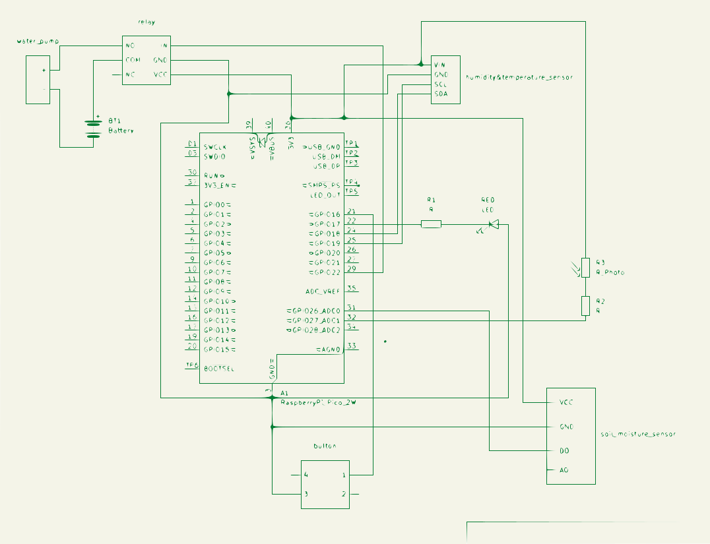

# Plant Friend

This project is about taking care of your plants (even if you sometimes forget about them). It has quite a lot of sensors, monitoring aspects about temperature, humidity, light, and soil moisture, and it can water the plant when needed.

:::info

**Author**: Ionescu Petru-Vlad \
**Github Project Link**: https://github.com/UPB-PMRust-Students/proiect-vladiouz

:::

## Description

The project is using a Raspberry Pi Pico 2W board, which is connected to the sensors and the water pump. Based on all the data collected, the project can determine if the plant needs to be watered or not. Additionally, the user can turn off the auto-watering functionality by a press of a button. In critical conditions, a red LED will start flashing. Using Wi-Fi, the project can send the data to a web server, where the user can see the data in real time.

## Motivation

I have quite a few plants at home and I often forget wattering them, which is quite a shame (basically I wanted to create something that I would really use). My grandma also loves flowers and I think this project will make her happy.

## Arhitecture

The following components were used:

- **soil moisture sensor**, that provides both digital and analog output. I will use the analog output to get good precision. For this, the sensor will be connected to an ADC capable pin of the board, namely pin 31.
- **water pump**, which will be put under water and will be connected to a relay in order to be controlled.
- **one-channel relay**, connected with the water pump and a GPIO pin of the board. I will choose pin 29 for this.
- **AHT10 humidity and temperature sensor**, which is I2C capable. I will connect it to pins 24 and 25 of the board.
- **photoresistor**, which will send data about light intensity. I will connect it to pin 32 of the board, being an ADC capable pin.
- **button** for toggling auto-watering mode. I will connect it to pin 21 of the board.
- **red LED** for signaling a critical state of the plant. I will connect it to pin 22 of the board.
- **Raspberry Pi Pico 2W board**, which will be the main component of the project. It is connected directly to (almost) all the other components and will also be used for its Wi-Fi capabilities.

## Weekly Log

### Week 24 April - 1 May

Wrote project documentation, including all components and connections needed. Finalized the hardware scheme in KiCad.

### Week 1 May - 8 May

to happen

## Hardware design

**Description of hardware used**: The Raspberry Pi Pico 2W is the central component of the project. It is connected to all the sensors and the water pump (indirectly). The sensors where chosen based on pricing and performance, so measurements would be accurate and useful. The water pump is used to water the plant when needed, and the relay is used to control it. The red LED is used to signal a critical state of the plant, while the button is used to toggle the auto-watering functionality.

### Schematics

### Bill of materials

All the **hardware** has been purchased from [Optimus Digital](https://www.optimusdigital.ro/):

| **Description**                                              | **Quantity** | **Unit Price (RON)** | **Total Price (RON)** |
| ------------------------------------------------------------ | ------------ | -------------------- | --------------------- |
| Raspberry Pi Pico 2W                                         | 1            | 39,66                | 39,66                 |
| AHT10 High-Precision Digital Humidity and Temperature Sensor | 1            | 14,99                | 14,99                 |
| 0.25W 10KΩ Resistor                                          | 3            | 0,10                 | 0,30                  |
| 0.25W 4.7KΩ Resistor                                         | 2            | 0,10                 | 0,20                  |
| Soil Humidity Sensor Module                                  | 2            | 3,99                 | 7,98                  |
| Photoresistor (5528 type)                                    | 2            | 1,49                 | 2,98                  |
| 6x6x6 Button                                                 | 1            | 0,36                 | 0,36                  |
| HQ Breadboard (400 Points)                                   | 1            | 4,56                 | 4,56                  |
| Fire Set for Breadboard                                      | 1            | 7,99                 | 7,99                  |
| 5V Single-Channel Relay Module                               | 1            | 4,99                 | 4,99                  |
| Mini Submersible Water Pump                                  | 1            | 9,99                 | 9,99                  |
| Colored Wires Male-Female (10p) 10 cm                        | 1            | 2,99                 | 2,99                  |
| Red 5mm LED                                                  | 1            | 0,39                 | 0,39                  |
| 0.25W 220Ω Resistor                                          | 1            | 0,10                 | 0,10                  |
| Black Micro USB Cable 1m                                     | 1            | 3,99                 | 3,99                  |
| Green 2.54mm Pin Header (40p)                                | 1            | 0,99                 | 0,99                  |
| Colored Female-Female Wires (40p) 10 cm                      | 1            | 6,99                 | 6,99                  |
| **Total**                                                    |              |                      | **109,45**            |

## Software design

The program will periodically check the sensors values and will determine if the plant needs to be watered or not. It will use an algorithm based on soil moisture, temperature, light and air humidity. The user will also get a notification if needed. Toggling the button will change the auto-watering functionality, so the relay will or will not activate the water pump. More will come when the software part will be finished.

Regarding the **software** libraries:

| **Library**    | **Description**                                                   | **Usage**                                                                             |
| -------------- | ----------------------------------------------------------------- | ------------------------------------------------------------------------------------- |
| `embassy-rp`   | Embassy support for Raspberry Pi Pico.                            | Includes GPIO, ADC, I2C, and other peripherals for Raspberry Pi Pico.                 |
| `embassy-wifi` | Wi-Fi driver for supported chips like ESP8266, ESP32, and RP2040. | Enables Wi-Fi connectivity.                                                           |
| `defmt`        | Efficient logging framework for embedded systems in Rust.         | Used for logging with minimal overhead, useful for debugging in embedded projects.    |
| `defmt-rtt`    | Real-Time Trace (RTT) support for `defmt`.                        | Enables logging output over RTT for easier debugging with minimal performance impact. |
