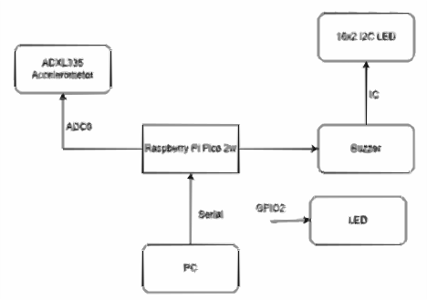

# Eq-Detector
An earthquake detector with real-time seismic graph visualization.

:::info 

**Author**: Mitran Ramona Luminita \
**GitHub Project Link**: https://github.com/UPB-PMRust-Students/proiect-mnoramona

:::

## Description

Eq-Detector is an earthquake detector built using a Raspberry Pi Pico 2W and an ADXL335 accelerometer. It monitors 3-axis vibration levels in real time and triggers alerts when exceeding a predefined threshold. The project also includes a Python-based visualization component that plots seismic data live via serial communication.

The embedded software is written in **Rust**, using the `rp2040-hal` crate for hardware abstraction and `embedded-hal` for peripheral control. LCD communication is done via I2C, and accelerometer data is acquired using ADC pins.

## Motivation

Earthquakes pose a serious risk, especially in areas with poor infrastructure. This project aims to offer a low-cost, accessible, and educational way of building a basic seismic alert system. It merges electronics with real-time data visualization to provide a hands-on learning experience.

## Architecture 

The architecture of the Eq-Detector system is centered around the Raspberry Pi Pico 2W microcontroller, which interfaces with multiple peripheral devices to detect and respond to seismic activity.

An ADXL335 accelerometer is connected to the Pico via its ADC0 pin, providing analog data about vibrations across one or more axes. The Pico processes this data in real time.

If the detected vibration exceeds a predefined threshold, the Pico triggers two output signals:

A buzzer for an audible alert.

An LED connected via GPIO2 for a visual alert.

The system also includes a 16x2 I2C LCD display, which receives data through the I2C interface, showing real-time information such as vibration intensity or alert status.

Additionally, the Pico sends data via serial connection to a PC, where a Python application using Matplotlib can graphically visualize the vibration levels over time.

## Log
### Week 5 - 11 May
TBC

### Week 12 - 18 May
TBC

### Week 19 - 25 May
TBC

## Hardware

- **Microcontroller:** Raspberry Pi Pico 2W (RP2040-based)
- **Sensor:** ADXL335 (X, Y, Z analog output)
- **Output Devices:** 16x2 I2C LCD, buzzer, red LED
- **Other:** Breadboard, jumper wires, USB cable

### Schematics

- ADXL335 to GP26-GP28 (ADC0-ADC2)
- LCD to GP0 (SDA) and GP1 (SCL)
- Buzzer to GP2 (digital out)
- LED to GP3 (digital out)

### Bill of Materials

| Device | Usage | Price |
|--------|--------|-------|
| [Raspberry Pi Pico 2W](https://www.raspberrypi.com/products/raspberry-pi-pico-2/)   | Rust-capable MCU              | [~40 RON](https://www.optimusdigital.ro/ro/placi-raspberry-pi/13327-raspberry-pi-pico-2-w.html?search_query=raspberry+pi+pico+2w&results=26)  |
| [ADXL335 Accelerometer](https://www.analog.com/en/products/adxl335.html)  | Vibration sensor              | [~13 RON](https://www.optimusdigital.ro/ro/senzori-senzori-inertiali/97-modul-accelerometru-cu-3-axe-adxl345.html?search_query=Modul+accelerometru+3+axe+I2C/SPI+ADXL345&results=2)  |
| 16x2 I2C LCD           | Display output                | [~17 RON](https://www.optimusdigital.ro/ro/optoelectronice-lcd-uri/2894-lcd-cu-interfata-i2c-si-backlight-albastru.html?gad_source=1&gad_campaignid=20868596392&gclid=Cj0KCQjw_dbABhC5ARIsAAh2Z-Rt1ZinLQ3VelBRdn2Qz-2a6QBfN8UXfIORv22csIZS3gs_NsfPR34aAgZaEALw_wcB)  |
| Buzzer                 | Audible alarm                 | [~2 RON](https://www.optimusdigital.ro/ro/audio-buzzere/634-buzzer-pasiv-de-5-v.html?search_query=buzzer&results=63)   |
| Red LED                | Visual indicator              | [~0.50 RON](https://www.optimusdigital.ro/ro/optoelectronice-led-uri/696-led-rou-de-3-mm-cu-lentile-difuze.html?search_query=led&results=779) |
| readboard             | Prototyping                   | [~4 RON](https://www.optimusdigital.ro/ro/prototipare-breadboard-uri/13249-breadboard-300-puncte.html?search_query=breadboard&results=127)   |
| Jumper Wires (M-M)     | Wiring                        | [~4 RON](https://www.optimusdigital.ro/ro/fire-fire-mufate/91-fire-colorate-mama-mama-10p.html)   |

## Software

| Library | Description | Usage |
|---------|-------------|-------|
| [rp2040-hal](https://github.com/UPB-PMRust-Students/proiect-mnoramona)         | RP2040 Hardware Abstraction Layer  | Used for peripheral control (ADC, GPIO, I2C) |
| [embedded-hal](https://github.com/UPB-PMRust-Students/proiect-mnoramona)       | Hardware abstraction traits        | Trait-based drivers for Rust embedded |
| [lcd1602-rs](https://github.com/UPB-PMRust-Students/proiect-mnoramona)         | LCD I2C display library            | Used for displaying sensor values  |
| [defmt + panic-probe](https://github.com/UPB-PMRust-Students/proiect-mnoramona) | Debug logging and panic handling   | Used for debugging on embedded target |
| [pyserial (Python)](https://github.com/UPB-PMRust-Students/proiect-mnoramona)  | Serial communication               | Reads data from Pico in Python     |
| [matplotlib (Python)](https://github.com/UPB-PMRust-Students/proiect-mnoramona)| Graph plotting                     | Real-time visualization of X/Y/Z axes |

## Links

1. [About Raspberry Pi Pico 2w](https://projects.raspberrypi.org/en/projects/getting-started-with-the-pico)
2. [About Rust](https://docs.rust-embedded.org/book/)
3. [Arduino Project, for inspiration only](https://how2electronics.com/arduino-earthquake-detector-accelerometer)
4. [ADXL335 Datasheet](https://www.analog.com/media/en/technical-documentation/data-sheets/ADXL335.pdf)
...
