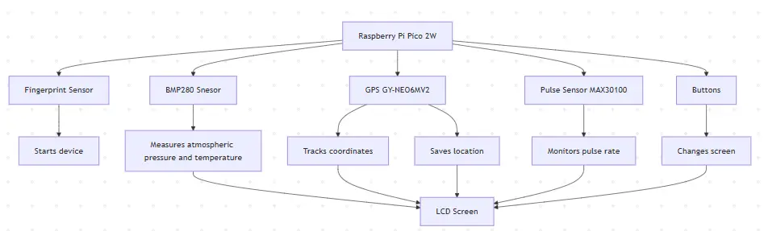

# Pip-Boy 2000

Wrist-mounted device that displays various info on a screen.

:::info

**Author**: Matei Rareș-Andrei \
**GitHub Project Link**: [Pip-Boy 2000](https://github.com/UPB-PMRust-Students/proiect-raresmatei2003)

:::

## Description

Pip-Boy 2000 is a device that is mounted on someone's wrist and contains various sensors and modules
in order to track the wearer's well being and the surrounding environment. The recorded data is displayed
on a LCD screen and the wearer can cycle through it by pressing buttons on the device. To ensure
the device's safety, to be used it needs to scan the wearer's fingerprint when mounted.

## Motivation

I always wanted to try tech from games I played or that fascinated me and the Fallout universe is
one of the most interesting worlds in gaming fiction, so I thought that I should try to
build something from it and the Pip-Boy 2000 seemed the obvious choice.

## Architecture

## Log

*Week 5 - 11 May*

Docs week

*Week 12 - 18 May*

Hardware week

*Week 19 - 25 May*

Software week

## Hardware

1. **Raspberry Pi Pico 2W**
- Processes the data recieved from the sensors and sends it to the screen
- Stores GPS coordinates that the wearer wants saved
2. **Barometric Pressure Sensor BMP280 GY**
- Measures atmosferic pressure and temperature
3. **GPS GY-NEO6MV2 with antenna**
- Uses radio waves and satelite navigation to determine coordinates
4. **Pulse Sensor MAX30100**
- Measures the wearers pulse
5. **Optic Fingerprint Sensor**
- Used to start the device, only reacts to wearer's fingerprint
6. **LCD Screen 1.44 inch diag (128x128 px)**
- Displays data from the sensors, can cycle through multiple screens
7. **Step-up Module MT3608**
- Used to amplify the tension for the fingerprint sensor
8. **Other stuff**
- Batteries, wires, breadboard, resistors, buttons

## Schematics

## Bill of Materials

| Device | Usage | Price |
|--------|--------|-------|
| [Raspberry Pi Pico 2W](https://www.raspberrypi.com/documentation/microcontrollers/pico-series.html) | Processing power | [39.66 RON](https://www.optimusdigital.ro/ro/placi-raspberry-pi/13327-raspberry-pi-pico-2-w.html) |
| [Barometric Pressure Sensor BMP280 GY](https://www.bosch-sensortec.com/media/boschsensortec/downloads/datasheets/bst-bmp280-ds001.pdf) | Pressure and temperature sensor | [8.49 RON](https://www.optimusdigital.ro/ro/senzori-senzori-de-presiune/1666-modul-senzor-de-presiune-barometric-bmp280.html) |
| [GPS GY-NEO6MV2 with antenna](https://content.u-blox.com/sites/default/files/products/documents/NEO-6_DataSheet_%28GPS.G6-HW-09005%29.pdf) | Tracks GPS coordinates | [44.95 RON](https://www.optimusdigital.ro/ro/gps/105-modul-gps-gy-neo6mv2.html) |
| [Pulse Sensor MAX30100](https://www.analog.com/media/en/technical-documentation/data-sheets/max30100.pdf) | Monitors wearer's pulse | [24.99 RON](https://www.optimusdigital.ro/ro/senzori-altele/2166-modul-senzor-puls-max30100-rcwl-0530.html) |
| [Optic Fingerprint Sensor](https://cdn-learn.adafruit.com/downloads/pdf/adafruit-optical-fingerprint-sensor.pdf) | Scans wearer's fingerprint to start the device | [149.99 RON](https://www.optimusdigital.ro/ro/senzori-senzori-optici/1276-senzor-optic-de-amprenta.html) |
| [1.44'' LCD Screen](http://www.lcdwiki.com/res/MSP1443/1.44inch_SPI_Module_MSP1443_User_Manual_EN.pdf) | Displays data from the sensors | [27.99 RON](https://www.optimusdigital.ro/ro/optoelectronice-lcd-uri/870-modul-lcd-144.html) |
| [Step-up Module MT3608](https://www.olimex.com/Products/Breadboarding/BB-PWR-3608/resources/MT3608.pdf) | Raise voltage for fingerprint sensor | [3.70 RON](https://sigmanortec.ro/Modul-ridicator-tensiune-cu-micro-USB-2-24V-MT3608-p136286152) |
| Other stuff (breadboard, wires, battery, resistors, buttons) | Used to assemble the device | 40 RON |
| Total | - | 299.77 RON |

## Software
| Library | Description | Usage |
|---------|-------------|-------|
| [embassy-rp](https://crates.io/crates/embassy-rp) | HAL implementation to not use registers directly | Gives access to GPIO, I2C, SPI ports |
| [bmp280](https://crates.io/crates/bme280) | Driver for the Bosch BMP280 temperature and atmospheric pressure sensor | Tracks temperature and atmospheric pressure |
| [ublox](https://crates.io/crates/ublox) | Library for uBlox GPS devices | Tracks GPS coordinates |
| [max3010x](https://docs.rs/max3010x/latest/max3010x/) | Driver for the MAX3010x sensor based on embedded-hal traits | Tracks wearer's pulse |
| [st7735-lcd](https://crates.io/crates/st7735-lcd) | Library for displays using ST7735 driver with embedded_graphics and embedded_hal support | Displays data on screen |
| [fingerprint-sensor](https://crates.io/crates/fingerprint-sensor) | Library for interfacing with fingerprint sensors | Allows use of fingerprint to start the device |

## Links
1. [PM Labs](https://pmrust.pages.upb.ro/docs/acs_cc/category/lab)
2. [Ideea](https://fallout.fandom.com/wiki/Pip-Boy_2000)
3. [Another product](https://www.thewandcompany.com/pip-boy-kit/)
4. [Ebay Product](https://www.ebay.com/p/20037191863)