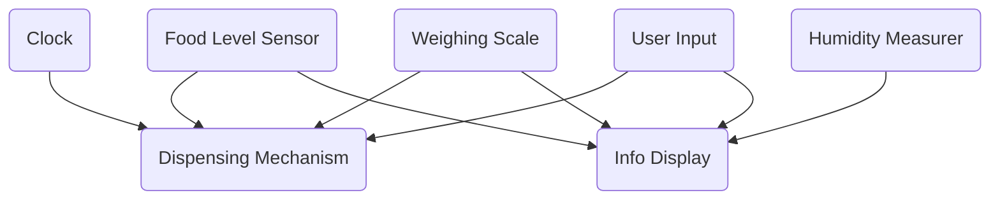

# Cat Feeder
An automatic cat food dispenser with humidity sensors and smart display.

:::info 

**Author**: Clinci Rareș-Mihail \
**GitHub Project Link**: [Link Github](https://github.com/UPB-PMRust-Students/proiect-RaresClinci)

:::

## Description

The project is an automatic cat feeder, capable of dispensing food portions according to a preset schedule. The user can set the feeding interval and the amount of food the pet should receive. Sensors will detect whether the cat has eaten, the amount of food available (and alert when it's empty), and the weight of the tray (to account for the food already present before dispensing more). Red LEDs will indicate when the food compartment is empty or if the humidity level is too high. An electronically controlled mechanism will handle food distribution. The system will also include a display showing information such as when the cat last ate, how much food it receives, and at what intervals.

## Motivation

Being a cat owner and having spoken with friends who own such devices, it was easy for me to identify the most important functionalities for a user, which helped me design and pitch the project.

## Architecture 

### Components
  
| Components | Purpose |
|--------|--------|
| Dispensing mechanism | Dispenses the food into the cat bowl |
| Weighing scale | Measures the amount of food in the bowl |
| Info display | Displays info from the sensors |
| User input | Lets user change the food quantity and dispensing intervals |
| Food level sensor | Measures whether the container has any food |
| Humidity measurer | Measures the humidity of the container |
| Clock | Measures time |

### Interconnection
- The Food Level Sensor and Clock determine when the dispensing mechanism gets fired
- The User Input and Weighing Scale determine for how long the Dispensing Mechanism stays fired
- Info Display receives info about:
  - the amount of food the cat has eaten from the Weighing Scale
  - whether the food container is empty from the Food Level Sensor
  - the humidity level in the food container from the Humidity Measurer
  - the variables set by the user from User Input

### Diagram



## Log

<!-- write your progress here every week -->

### Week 5 - 11 May

### Week 12 - 18 May

### Week 19 - 25 May

## Hardware

Hardware used:
- Raspberry Pi Pico 2W
- Micro Servomotor
- Real Time Clock PCF8563
- LCD Screen SPI 128x160 ST7735S
- Load Cell 2kg
- HX711 ADC
- Photoelectric Sensor TCRT5000
- Humidity Sensor HR202 
- 2 Red LEDs
- 4 buttons
- breadboard and wires

### Schematics

<!-- TODO: Place your KiCAD schematics here. -->

### Bill of Materials

<!-- Fill out this table with all the hardware components that you might need.

The format is 
```
| [Device](link://to/device) | This is used ... | [price](link://to/store) |

```

-->

| Device | Usage | Quantity | Price |
|--------|--------|-------| -------|
| [Raspberry Pi Pico 2W](https://www.raspberrypi.com/documentation/microcontrollers/raspberry-pi-pico.html) | The microcontroller | 1 | [39.66 RON](https://www.optimusdigital.ro/ro/placi-raspberry-pi/13327-raspberry-pi-pico-2-w.html?search_query=pico+2w&results=33) |
| Micro Servomotor | Dispensing food | 1 | [13.99 RON](https://www.optimusdigital.ro/ro/motoare-servomotoare/26-micro-servomotor-sg90.html) |
| Real Time Clock | Measuring time intervals | 1 | [5.77 RON](https://www.optimusdigital.ro/ro/altele/12286-modul-ceas-in-timp-real-rtc-pcf8563.html?search_query=rtc&results=149) |
| LCD Screen | Displaying info | 1 | [43.58 RON](https://ardushop.ro/ro/electronica/2124-modul-lcd-spi-128x160-6427854032546.html) |
| Load Cell | Measuring the food's weight | 1 | [23.99 RON](https://www.emag.ro/celula-de-sarcina-pentru-masurarea-greutatilor-elektroweb-5-12-v-np-071/pd/D3LR35MBM/) |
| HX711 Module | Sending load cell info to the board | 1 | [13.39 RON](https://www.emag.ro/modul-de-cantarire-hx711-elektroweb-24-biti-2-6-5-5-v-2-a-015/pd/D3RC35MBM/?ref=graph_profiled_similar_fallback_1_1&provider=rec&recid=rec_49_8d6e082ea6b74ffb10e7a843ba7ffb11555222752e69c036611a4fd4b113d7b3_1746196248&scenario_ID=49) |
| Photoelectric Sensor | Detecting if the food container is empty | 1 | [1.49 RON](https://www.optimusdigital.ro/ro/senzori-senzori-optici/42-senzor-fotoelectric-reflectiv-tcrt5000.html?search_query=senzor+infrarosu&results=116) |
| Humidity Sensor | Detecting the humidity in the food container | 1 | [9.99 RON](https://www.optimusdigital.ro/ro/senzori-senzori-de-umiditate/2492-modul-senzor-de-umiditate-hr202.html?search_query=umiditate&results=165) |
| Red LEDs | Displaying info | 2 | [0.39 RON](https://www.optimusdigital.ro/ro/optoelectronice-led-uri/696-led-rou-de-3-mm-cu-lentile-difuze.html) |
| Buttons | Setting dispensing period and food quantity | 4 | [1.99 RON](https://www.optimusdigital.ro/ro/butoane-i-comutatoare/1115-buton-cu-capac-rotund-alb.html) |
| Breadboard | Connecting components | 2 | 9.89 RON |
| Wires | Connecting components | 1 | [7.99 RON](https://www.optimusdigital.ro/ro/fire-fire-mufate/12-set-de-cabluri-pentru-breadboard.html?search_query=Set+Fire+pentru+Breadboard&results=37) |
| Rigid Wires | Connecting components | 1 | [12.49 RON](https://www.optimusdigital.ro/ro/fire-fire-nemufate/899-set-de-fire-pentru-breadboard-rigide.html?search_query=%09Set+de+fire+Rigide+pentru+Breadboard&results=1) |
| Male Header | Connecting microcontroller | 2 | [0.99 RON](https://www.optimusdigital.ro/ro/componente-electronice-headere-de-pini/1268-header-de-pini-verde-254-mm-40p.html?search_query=Header+de+pini+verde+2.54+mm+%2840p%29&results=1) |
| Female Header | Connecting microcontroller | 2 | [2.56 RON](https://www.optimusdigital.ro/ro/componente-electronice-headere-de-pini/1285-header-de-pini-mama-40p-254-mm-separabil.html?search_query=%09Header+de+Pini+Mama+40p+2.54+mm+Separabil&results=1) |


## Software

| Library | Description | Usage |
|--------|-------------|-------|
| [embassy](https://github.com/embassy-rs/embassy) | Async embedded framework | Core runtime for async tasks and peripherals |
| [embassy-rp](https://github.com/embassy-rs/embassy) | HAL for Raspberry Pi Pico (RP2040) | Controls GPIOs, SPI, I2S, etc. |
| [embedded-graphics](https://github.com/embedded-graphics/embedded-graphics) | 2D graphics library | Used for drawing text and shapes on LCD |
| [display-interface-spi](https://github.com/almindor/display-interface) | SPI display abstraction | Connects the embedded-graphics to SPI-based displays |
| [embedded-hal](https://github.com/rust-embedded/embedded-hal) | Traits for embedded devices | Base for SPI, I2C, ADC, GPIO, etc. |
| [defmt](https://github.com/knurling-rs/defmt) | Logging crate for embedded | For debugging and structured logs |
| [pcf8563](https://github.com/nebelgrau77/pcf8563-rs) | RTC library | Interacting with the real time clock |
| [hx711](https://github.com/jonas-hagen/hx711) | Load Cell Library | Reading the data from the load cell |

## Links

<!-- Add a few links that inspired you and that you think you will use for your project -->


