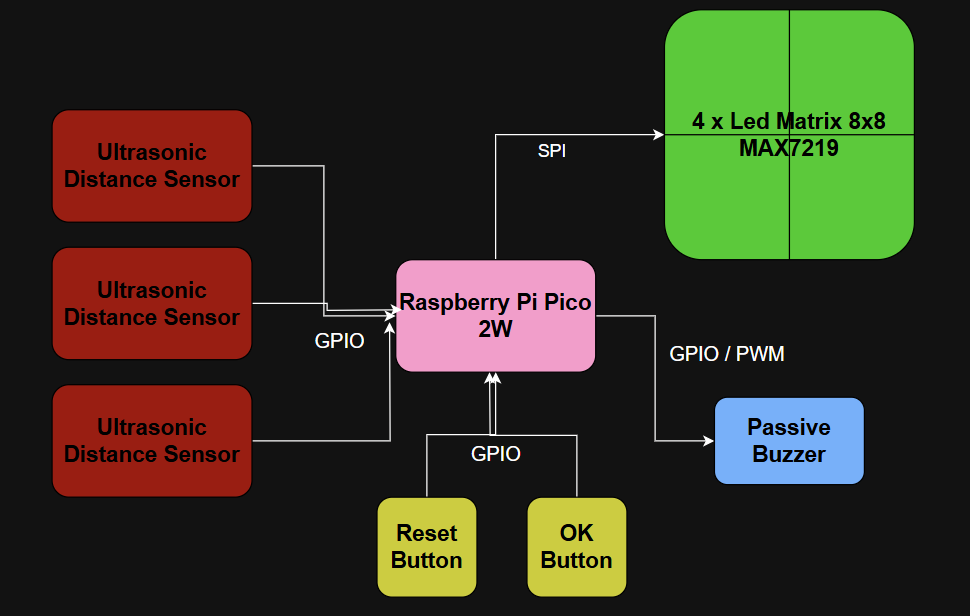

# Tic-Tac-Toe Contactless Game

This project brings the timeless fun of Tic-Tac-Toe to life with a touchless, futuristic twist, letting you play the classic game using your bare hands.

:::info 

**Author**: Visan Rares-Stefan \
**GitHub Project Link**: https://github.com/UPB-PMRust-Students/proiect-raresvizan.git

:::

## Description

This project implements a physical Tic-Tac-Toe (X and O) game using a 16x16 LED matrix display driven by a Raspberry Pi Pico 2W. Players interact with the game using ultrasonic distance sensors, pointing with their hands to select grid positions. A passive buzzer provides audio feedback, and two physical buttons are used for confirming moves and resetting the game.

## Motivation

The motivation behind this project is:
- To explore human–machine interaction through non-traditional interfaces.
- To create interactive and fun embedded system for the boring old game of Tic-Tac-Toe played by everyone during classes.
- To try an unique way of choosing the desired cell. No basic buttons, no Playstation type joysticks from 2003...DISTANCE SENSORS & BARE HANDS.

## 3. Architecture

The system has the following layers:
- **Input Layer**:
  - 2x/3x Ultrasonic distance sensors (for selecting grid positions using finger)
  - 2x Push-buttons (confirm, reset, etc.)
- **Processing Layer**:
  - Raspberry Pi Pico 2W
  - Game logic engine written in Rust
- **Output Layer**:
  - 4x MAX7219-controlled 8x8 LED matrices
  - 1x Passive buzzer for sound feedback

Communication is done using:

| Component           | Interface | Connection Notes                |
|---------------------|-----------|---------------------------------|
| LED Matrix (4x)     | SPI       | DIN, CLK, CS to SPI bus         |
| Ultrasonic Sensors  | GPIO      | Each sensor uses TRIG + ECHO    |
| Buzzer              | GPIO      | Simple digital on/off control   |
| Push Buttons        | GPIO      | Connected to GPIO with pull-ups |

### Diagram

## Log

### Week 5 - 11 May
### Week 12 - 18 May
### Week 19 - 25 May

## Hardware

The Raspberry Pi Pico 2W is the central microcontroller for the Contactless Tic-Tac-Toe Game. With its dual-core ARM Cortex-M0+ processor, Wi-Fi capability, and abundant GPIO pins, it provides all the required interfacing power to run the system efficiently.

It reads input from three HC-SR04P ultrasonic sensors to detect hand proximity, allowing players to choose the row and column of the cell without touching anything. The 4x MAX7219 8x8 LED Matrix modules are chained together to form a large 16x16 display grid, visually representing the game board in real time. Two tactile push buttons are used to confirm actions and reset the game. A passive buzzer generates sound effects, enhancing user feedback and engagement.

### Schematics
TODO

### Bill of Materials

| Device | Usage | Price |
|--------|--------|-------|
| [Raspberry Pi Pico 2W](https://www.optimusdigital.ro/en/raspberry-pi-boards/13327-raspberry-pi-pico-2-w.html) | The microcontroller | [40 RON](https://www.optimusdigital.ro/en/raspberry-pi-boards/13327-raspberry-pi-pico-2-w.html) |
| [MAX7219 LED Matrix](https://www.optimusdigital.ro/en/led-matrices/118-max7219-led-dot-matrix-module.html) | Displaying the game (Output Device) | [4 x 17.5 RON](https://www.optimusdigital.ro/en/led-matrices/118-max7219-led-dot-matrix-module.html) |
| [HC-SR04P Ultrasonic](https://www.optimusdigital.ro/en/distance-sensors/8150-hc-sr04p-ultrasonic-distance-sensor-3-55-v.html) | Selecting the cell by hand (Input Device) | [3 x 7 RON](https://www.optimusdigital.ro/en/distance-sensors/8150-hc-sr04p-ultrasonic-distance-sensor-3-55-v.html) |
| [Passive Buzzer](https://www.optimusdigital.ro/en/buzzers/12247-3-v-or-33v-passive-buzzer.html) | Selecting the cell by hand (Input Device) | [1 RON](https://www.optimusdigital.ro/en/buzzers/12247-3-v-or-33v-passive-buzzer.html) |
| [Push Button](https://www.optimusdigital.ro/en/buttons-and-switches/1114-red-button-with-round-cover.html) | Confirm move / Reset Game | [2 x 2 RON](https://www.optimusdigital.ro/en/buttons-and-switches/1114-red-button-with-round-cover.html) |
| [Breadboard](https://www.optimusdigital.ro/en/breadboards/44-400p-hq-breadboard.html) | Testing the connections | [5 RON](https://www.optimusdigital.ro/en/breadboards/44-400p-hq-breadboard.html) |
| [Jumper wires](https://www.optimusdigital.ro/en/wires-with-connectors/885-wires-male-male-10p-10cm.html) | Connecting the components | [4 x 3 RON](https://www.optimusdigital.ro/en/wires-with-connectors/885-wires-male-male-10p-10cm.html) |
| **Total**             |          | **152 RON**     |

## Software

| Library                                                                 | Description                                             | Usage                                                             |
|-------------------------------------------------------------------------|---------------------------------------------------------|-------------------------------------------------------------------|
| [`embedded-hal`](https://github.com/rust-embedded/embedded-hal)        | Hardware Abstraction Layer for embedded systems         | Abstracts SPI and GPIO interfaces for peripherals like sensors |
| [`embassy`](https://github.com/embassy-rs/embassy)                     | Async framework for embedded Rust                       | Manages async tasks for input polling, game logic, and display update      |
| [`embedded-graphics`](https://github.com/embedded-graphics/embedded-graphics) | 2D graphics library for embedded devices                | Used to render the Tic Tac Toe grid and player markers (X/O) on the LED matrix |
| [`max7219`](https://github.com/almindor/max7219)                       | Rust driver for MAX7219 LED matrix controller           | Controls the 8x8 LED matrices over SPI                                    |
| [`hc-sr04`](https://github.com/dbrgn/hc-sr04-rs)           | HC-SR04 ultrasonic sensor driver (if using precise timing via pulse input) | Reads distance data from gesture sensors                                 |
| [`log`](https://github.com/rust-lang/log)                              | Logging facade for Rust                                 | Provides internal logging for debugging                                 |
| [`panic-probe`](https://github.com/probe-rs/probe-rs)                  | Panic handler for embedded systems                      | Helps diagnose runtime panics                                            |
| [`static-cell`](https://github.com/embassy-rs/static-cell)             | Safe static storage                                     | For safely storing peripherals and shared resources in async context      |

## Links

- [Using Ultrasonic Sensors for Gesture Control](https://circuitdigest.com/microcontroller-projects/gesture-controlled-wireless-home-automation-using-ultrasonic-sensor)  

- [MAX7219 LED Matrix Tutorial for Raspberry Pi Pico](https://pico.dev/tutorials/max7219-led-matrix)  

- [embedded-graphics + MAX7219 Rust Driver](https://github.com/almindor/max7219)  

- [Embassy: Async Framework for Embedded Rust](https://embassy.dev/)  