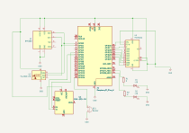

# Fire Prevention & Alarm System
Prevent wildfires by measuring relevant data and notifying authorities

:::info 

**Author**: Răzvan-Ștefan Costea \
**GitHub Project Link**: https://github.com/UPB-PMRust-Students/proiect-RazvanDire

:::

## Description

A system that takes periodic measurements of atmospheric pressure, temperature, humidity and light intensity levels. When a certain combination of parameters is reached, based on accepted scientific research, local authorities are notified and an alarm is started.

The system is intended to be used in areas that are arid and/or prone to wildfires. As such, the system runs on batteries and has a GPS module, so it can be located.

- two different sensors take the measurements
- the latest measurements are displayed on an LCD screen for passersby
- the Wi-Fi module allows the system to broadcast its coordinates, provided by the GPS module
- the audible-visual alarm is provided by a buzzer and flashing LEDs

## Motivation

One of the biggest environmental threats that the modern world faces is global warming. The increase in temperatures and decrease in rainfall that result can cause massive wildfires, as we saw in California in January 2025. These wildfires destroy natural habitats and endanger thousands, which only exacerbates the problem further. The goal of my project is to identify conditions that might lead to wildfires and take preventive action, so we stop them before they happen. Furthermore, all the money and effort that would've gone towards putting out those fires and relocating people can be used to "cure" the root problem, global warming, instead of just "treating the symptoms".

## Architecture 


## Log

<!-- write your progress here every week -->

### Week 5 - 11 May

### Week 12 - 18 May

### Week 19 - 25 May

## Hardware

1. Raspberry Pi Pico 2W:
- the microcontroller
- reads data from the sensors and activates the buzzer and the LEDs when certain parameters are reached
- sends the measurements to the LCD screen and the coordinates from the GPS via Wi-Fi
2. BME280:
- pressure, temperature and humidity sensor
- takes periodic measurements and sends the data to the MCU
3. TSL2561:
- light intensity sensor
- measures visible and infrared light intensity
- takes periodic measurements and sends the data to the MCU
4. GY-NEO6MV2:
- GPS module
- provides the GPS coordinates of the system
5. LCD screen:
- displays the data measured by the sensors for passersby
6. Buzzer & LEDs:
- the audible-visual alarm: when certain parameters are reached, the alarm is triggered

### Schematics



### Bill of Materials

<!-- Fill out this table with all the hardware components that you might need.

The format is 
```
| [Device](link://to/device) | This is used ... | [price](link://to/store) |

```

-->

| Device | Usage | Price |
|--------|--------|-------|
| [Raspberry Pi Pico 2W](https://www.raspberrypi.com/documentation/microcontrollers/pico-series.html#pico2w-technical-specification) | The microcontroller and debugger | [39.66 RON × 2](https://www.optimusdigital.ro/ro/placi-raspberry-pi/13327-raspberry-pi-pico-2-w.html) |
| [BME280](https://bme280.readthedocs.io/en/latest/) | Pressure, temperature and humidity sensor | [73.99 RON](https://www.optimusdigital.ro/en/pressure-sensors/5649-bme280-barometric-pressure-sensor-module.html) |
| [TSL2561](https://cdn-learn.adafruit.com/downloads/pdf/tsl2561.pdf) | Light intensity sensor | [22.99 RON](https://www.optimusdigital.ro/en/optical-sensors/137-tsl2561-light-intensity-sensor-module.html) |
| [GY-NEO6MV2](https://www.mantech.co.za/datasheets/products/GY-NEO6MV2.pdf?srsltid=AfmBOopLKLqdQ1J7A7ymF9OSc_P0oyHDmRPk4yhrHdXcxkb17nsCUqgT) | GPS Module | [44.95 RON](https://www.optimusdigital.ro/en/gps/105-gy-neo6mv2-gps-module.html) |
| Breadboard | Connect all the components | [9.98 RON](https://www.optimusdigital.ro/en/breadboards/8-breadboard-hq-830-points.html) |
| LCD screen | Display the sensors' measurements | [16.34 RON](https://www.optimusdigital.ro/en/lcds/2894-1602-lcd-with-i2c-interface-and-blue-backlight.html) |
| Buzzer | Audio alarm | [1.40 RON](https://www.optimusdigital.ro/en/buzzers/634-5v-passive-buzzer.html) |
| LED | Visual alarm | [0.39 RON × 2](https://www.optimusdigital.ro/en/leds/29-5-mm-red-led-with-difused-lens.html) |
| Pin header | Connect components to the breadboard | [0.99 RON × 3](https://www.optimusdigital.ro/en/pin-headers/464-colored-40p-254-mm-pitch-male-pin-header-red.html) |
| Battery holder | Power the circuit | [3.95 RON](https://www.optimusdigital.ro/en/battery-holders/1090-3-x-r6-battery-holder.html) |
| Total | - | 256.67 RON |


## Software

| Library | Description | Usage |
|---------|-------------|-------|
| [embassy-rp](https://crates.io/crates/embassy-rp) | HAL targeting the RP2350 | Access to the peripherals |
| [embassy-time](https://crates.io/crates/embassy-time) | Timekeeping, delays and timeouts | Create timers |
| [embassy-net](https://crates.io/crates/embassy-net) | Async network stack | Send messages over Wi-Fi |
| [embassy-executor](https://crates.io/crates/embassy-executor) | An async/await executor | Create different tasks |
| [lcd1602-rs](https://crates.io/crates/lcd1602-rs) | Display library | Used for my 16 characters on 2 lines LCD screen |
| [heapless](https://crates.io/crates/heapless) | Statically allocated data | Used to write strings for my LCD |


## Links

<!-- Add a few links that inspired you and that you think you will use for your project -->

1. [Lab 03 - PWM & ADC](https://pmrust.pages.upb.ro/docs/acs_cc/lab/03)
2. [Lab 04 - Asynchronous Development](https://pmrust.pages.upb.ro/docs/acs_cc/lab/04)
3. [Lab 06 - Inter-Integrated Circuit](https://pmrust.pages.upb.ro/docs/acs_cc/lab/06)
4. [Lab 07 - Wi-Fi](https://pmrust.pages.upb.ro/docs/acs_cc/lab/07)
5. [How to connect LCD without I2C](https://www.youtube.com/watch?v=Xq0bt-0kbBk)
