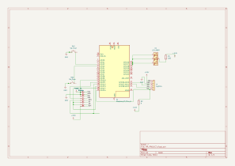

# PiSweeper

A Minesweeper game controlled via buttons and a joystick, displayed on an LCD screen
:::info 

**Author**: Robert-Ionut Barbu \
**GitHub Project Link**: https://github.com/UPB-PMRust-Students/proiect-robertbarbu27

:::

## Description

A portable Minesweeper game system that runs on a Raspberry Pi Pico W, featuring user interaction through a joystick and multiple buttons. The current game state is rendered on a color LCD screen, offering a compact yet fully playable experience of the classic logic puzzle.

* A joystick is used for cursor movement across the grid
* Two buttons allow the player to reveal a tile or place/remove a flag
* A status LED indicates the current mode: red for flagging, green for reveal
* The LCD screen displays the entire Minesweeper board in real time

## Motivation

I chose this project because I used to play Minesweeper a lot when I was younger, and I’ve always enjoyed the logical thinking and strategy it involves. Recreating it on a microcontroller gave me the opportunity to combine that nostalgic interest with my passion for embedded systems. Using embedded Rust added an extra layer of complexity, requiring precise control over hardware components like the joystick, buttons, LEDs, and LCD display. The challenge of managing real-time input, rendering a dynamic game interface, and handling game logic efficiently made it a perfect project to deepen my understanding of embedded development.

## Architecture

The system is organized into several core components that interact in a modular and efficient way, enabling a responsive and playable Minesweeper experience on embedded hardware. The architecture is structured as follows:

### Main Components

* **Input Handler**: Reads input from the joystick and buttons, translates raw signals into high-level game actions (e.g., move cursor, reveal tile, place flag).
* **Game Engine**: Contains the core Minesweeper logic: grid generation, mine placement, flagging, flood fill for empty tiles, win/loss detection, and game state tracking.
* **Display Renderer**: Responsible for drawing the game board, cursor, flags, and mines to the LCD screen using `embedded-graphics` and the `st7789` driver.
* **State Manager**: Maintains the current game state (e.g., in-progress, won, lost, flag mode/reveal mode) and handles transitions based on user input and game logic.
* **Feedback Controller**: Controls the status LED to reflect the current mode (e.g., red for flag, green for reveal), and optionally a buzzer or other indicators for win/loss events.

## Log

### Week 5 - 11 May

### Week 12 - 18 May

### Week 19 - 25 May

## Hardware

1. **Raspberry Pi Pico W**

   * The microcontroller running the game logic and managing hardware interactions
2. **Joystick Module**

   * Used for navigating the cursor across the Minesweeper grid
3. **Button 1 (Reveal)**

   * Used to uncover a tile
4. **Button 2 (Flag)**

   * Used to place or remove a flag on a tile
5. **240x240 SPI LCD Screen (ST7789)**

   * Displays the game board and user interface
6. **Status LED**

   * Indicates the current action mode: green for reveal, red for flag

### Schematics

## Bill of Materials

| Device                                                                                                                                                                 | Usage                               | Price      |
| ---------------------------------------------------------------------------------------------------------------------------------------------------------------------- | ----------------------------------- | ---------- |
| [Raspberry Pi Pico W](https://www.raspberrypi.com/documentation/microcontrollers/raspberry-pi-pico.html)                                                               | The microcontroller                 | 79,32 lei  |
| [Breadboard HQ (830 points)](https://www.optimusdigital.ro/en/kits/2222-breadboard-kit-hq-830-p.html?srsltid=AfmBOoqmQdoFKCDz-NYhFZctY60WcbPrpeWHoEjiewkszxiRaNDan90l) | For prototyping and connections     | 22,00 lei  |
| [10 cm 40p Male-Female Wires](https://www.optimusdigital.ro/en/all-products/876-15-cm-male-female-wires-10p.html?search_query=male+female+wires&results=111)           | General wiring                      | 5,99 lei   |
| [20 cm 40p Male-Female Wires](https://www.optimusdigital.ro/en/wires-with-connectors/879-30-cm-male-female-wires-10p.html?search_query=male-female+wires&results=111)  | General wiring                      | 7,99 lei   |
| [Separated Male-Male Wires 20 cm – 10 pcs](https://www.optimusdigital.ro/en/wires-with-connectors/891-wires-male-male-10p-30cm.html?search_query=wires&results=556)    | Connections between modules         | 11,90 lei  |
| [2.2" 240x320 SPI LCD](https://www.optimusdigital.ro/en/lcds/1260-lcd-spi-22-240x320-px.html?srsltid=AfmBOoqUPztW0x3XOHprhTZvWBV-lTGNL5q5iq6swBzyDqlPzmWf1RWA)         | Displays the Minesweeper grid       | 59,99 lei  |
| [White Button with Round Cover](https://www.optimusdigital.ro/en/buttons-and-switches/1115-white-button-with-round-cover.html?search_query=white+buttons&results=30)   | User input (reveal/flag)            | 3,98 lei   |
| [40p 1.27 mm Male Pin Header](https://www.optimusdigital.ro/en/headers/5852-pini.html)                                                                                 | Soldering and module connections    | 3,84 lei   |
| [Joystick Module](https://www.optimusdigital.ro/en/touch-sensors/742-ps2-joystick-breakout.html?search_query=joystick&results=50)                                      | Controls the cursor                 | \~5,35 lei |
| [LEDs (x2: red & green)](https://www.optimusdigital.ro/en/leds/29-5-mm-red-led-with-difused-lens.html?search_query=red+led&results=1378)                               | Status indicator (flag/reveal mode) | \~1,00 lei |

## Software

| Library                                                                     | Description                              | Usage                                                                      |
| --------------------------------------------------------------------------- | ---------------------------------------- | -------------------------------------------------------------------------- |
| [st7789](https://github.com/almindor/st7789)                                | Display driver for ST7789                | Used to send pixel data to the LCD screen via SPI                          |
| [embedded-graphics](https://github.com/embedded-graphics/embedded-graphics) | 2D graphics library for embedded systems | Used to draw the Minesweeper grid, cursor, and symbols                     |
| [embassy](https://github.com/embassy-rs/embassy)                            | Async runtime for embedded Rust          | Manages concurrency between input polling, display updates, and game logic |
| [embedded-hal](https://github.com/rust-embedded/embedded-hal)               | Hardware Abstraction Layer               | Provides unified interfaces for SPI, GPIO, ADC, etc.                       |
| [rp2040-hal](https://github.com/rp-rs/rp-hal)                               | HAL for the Raspberry Pi Pico (RP2040)   | Controls the Pico W’s hardware peripherals in Rust                         |
| [defmt + defmt-rtt](https://github.com/knurling-rs/defmt)                   | Logging framework for embedded Rust      | Used for debugging over RTT during development                             |

## Links

1. [Minesweeper Game Logic Explained (YouTube - Coding Train)](https://www.youtube.com/watch?v=1b5cD1vGuF4)
2. [Lab 02 – GPIO](https://pmrust.pages.upb.ro/docs/acs_cc/lab/02)
3. [Lab 03 – PWM & ADC](https://pmrust.pages.upb.ro/docs/acs_cc/lab/03/)
4. [Lab 04 – Asynchronous Development](https://pmrust.pages.upb.ro/docs/acs_cc/lab/04/)
5. [Lab 05 – Serial Peripheral Interface (SPI)](https://pmrust.pages.upb.ro/docs/acs_cc/lab/05/)
6. [Lab 06 – Inter-Integrated Circuit (I2C)](https://pmrust.pages.upb.ro/docs/acs_cc/lab/06/)
7. [Lab 07 – Wi-Fi](https://pmrust.pages.upb.ro/docs/acs_cc/lab/07/)
