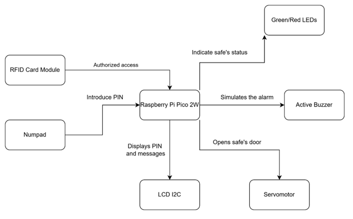
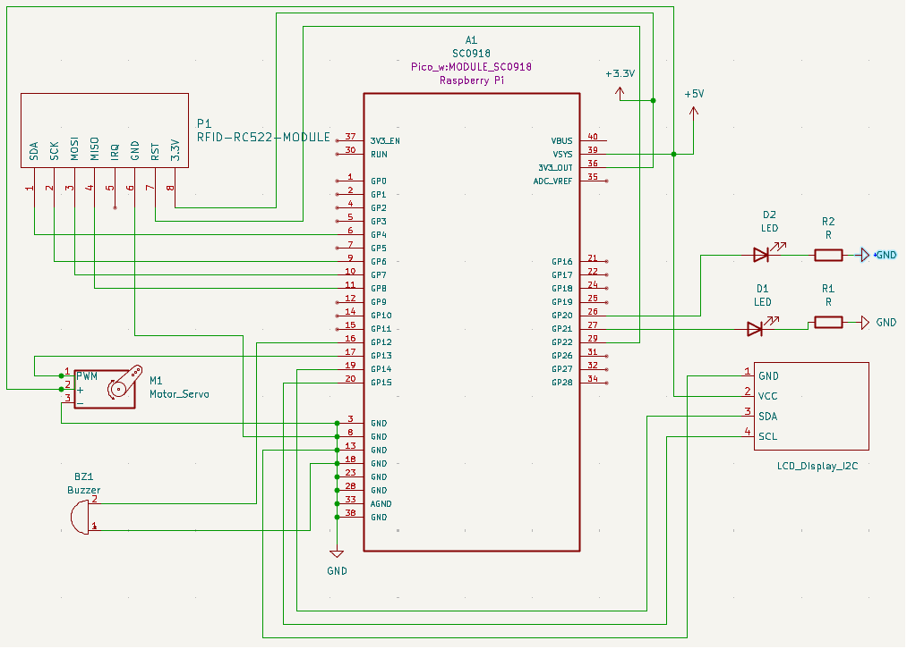

# Secured electronic safe system

Creating a Secured electronic safe system in Rust using a Raspberry Pi Pico 2.

:::info

**Author**: Suga Serban-Ionut\
**GitHub Project Link**: https://github.com/UPB-PMRust-Students/proiect-serbansuga

:::

## Description

The project focuses on building a secure electronic safe system using a Raspberry Pi Pico 2W. Users interact with the system through an external numpad keyboard to input a secret PIN code. The input is displayed real-time on an LCD screen using masked characters (e.g., \*\*\*\*) for security. If the correct PIN is entered, a servomotor automatically unlocks and opens the safe’s door. A red LED remains lighted while the safe is locked, and a green LED indicates when the safe is successfully opened. If the wrong PIN is entered three times consecutively, a buzzer alarm is triggered to simulate a security alert. Following a lockout, the safe can only be unlocked using an RFID contact card for authorized access.

All components, including the display, numpad, LEDs, buzzer, and servo, are integrated inside the safe box and connected through a breadboard hidden inside the box. Only the necessary interfaces (keyboard, display, RFID card, LEDs) are accessible externally for user interaction.

## Motivation

I chose this project because it allows me to apply what I have learned about working with hardware and software in a real example. Creating a safe with a PIN code, RFID access, LEDs, a buzzer, and a servo motor helps me better understand how to connect and control different components. It is a good way to practice reading input from a keypad, showing messages on a display, and controlling a motor to open and close the door. Also, I like that the project has a real-world use, security playing an important role in this case, and it makes the learning process more interesting and practical.

## Architecture

The project has the following architecture:

- **Raspberry Pi Pico 2W**
  - Role: Acts as the central controller for the entire system.
  - Connections: Interfaces with the LCD display, numpad, RFID card module, LEDs, buzzer, and servomotor.
- **LCD Display (I2C)**
  - Interface: I2C
  - Connections:
    - SDA to GPIO pin of Raspberry Pi Pico 2W
    - SCL to GPIO pin of Raspberry Pi Pico 2W
  - Role: Displays the PIN entered and system messages (success, error, lock status).
- **Numpad (Keypad Matrix)**
  - Interface: GPIO (scanning rows and columns)
  - Connections: Connected to multiple GPIO pins on the Pico.
  - Role: Allows the user to enter the PIN code to unlock the safe.
- **RFID Card Module (RC522)**
  - Interface: SPI
  - Connections:
    - MOSI, MISO, SDA connected to SPI GPIO pins.
  - Role: Provides secondary, authorized access after multiple incorrect PIN entries.
- **Green/Red LEDs**
  - Interface: GPIO
  - Connections: Connected to separate GPIO pins on the Pico.
  - Role:
    - Red LED ON when the safe is locked.
    - Green LED ON when the safe is unlocked.
- **Passive Buzzer**
  - Interface: GPIO
  - Connections: Connected to a GPIO pin.
  - Role: Sounds an alarm after three consecutive incorrect PIN entries.
- **Servomotor**
  - Interface: PWM
  - Connections: Connected to a PWM GPIO pin on the Pico.
  - Role: Controls the door locking mechanism, opening or closing the safe when authorized access is granted.

## Log

### Week 5 - 11 May

### Week 12 - 18 May

### Week 19 - 25 May

## Hardware

- **Raspberry Pi Pico 2W**:
  Used as the main controller that connects and manages all components in the system.
- **LCD Display (I2C)**:
  Displays the code entered from the numpad, system messages like "Access Granted" or "Wrong Code".
- **Numpad**:
  Used for PIN code input. It lets the user unlock the safe by entering the correct code.
- **RFID RC522 Module**:
  Provides a second way to unlock the safe when 3 consecutive wrong PINs are introduced, using RFID cards. Only registered cards are accepted.
- **Active Buzzer**:
  Sounds an alarm if multiple wrong PINs are entered, alerting about possible unauthorized access.
- **Green and Red LEDs**:
  Green LED lights up when access is granted and the safe is unlocked.
  Red LED stays ON when the safe is locked or if access is denied.
- **Servomotor**:
  Controls the physical locking mechanism of the safe. It rotates to open or lock the door based on access status.

### Schematics

### Bill of materials

| Device                                                                                                                                                                                                                             | Usage                              | Price   |
| ---------------------------------------------------------------------------------------------------------------------------------------------------------------------------------------------------------------------------------- | ---------------------------------- | ------- |
| [Raspberry Pi Pico](https://www.optimusdigital.ro/ro/placi-raspberry-pi/13327-raspberry-pi-pico-2-w.html?search_query=raspberry+pi+pico&results=26s)                                                                               | The microcontroller                | 40 RON  |
| [LCD I2C](https://www.optimusdigital.ro/ro/optoelectronice-lcd-uri/2894-lcd-cu-interfata-i2c-si-backlight-albastru.html?search_query=lcd+i2c&results=17)                                                                           | LCD Display where PIN is displayed | 16 RON  |
| [RFID RC522 Module](https://www.optimusdigital.ro/ro/wireless-rfid/67-modul-cititor-rfid-mfrc522.html?search_query=rfid&results=37)                                                                                                | Authorized card module             | 10 RON  |
| [4X4 Keypad](https://www.optimusdigital.ro/ro/senzori-senzori-de-atingere/470-tastatura-matriceala-4x4-cu-conector-pin-de-tip-mama.html?search_query=keypad&results=5)                                                             | Numpad where PIN is introduced     | 7 RON   |
| [Servo Motor](https://www.optimusdigital.ro/ro/motoare-servomotoare/26-micro-servomotor-sg90.html?search_query=servo+motor&results=145)                                                                                            | Motor that opens the door          | 14 RON  |
| [Breadboard](https://www.optimusdigital.ro/ro/kituri/2222-kit-breadboard-hq-830-p.html?gad_source=1&gad_campaignid=20868596392&gclid=Cj0KCQjw_dbABhC5ARIsAAh2Z-SHoyOogwNn25FjM30y1kNghGHXfj2Ur6r43BfZdFWxvYv3K2IcLm0aApAPEALw_wcB) | Connects the components            | 10 RON  |
| [Buzzer](https://www.optimusdigital.ro/ro/audio-buzzere/634-buzzer-pasiv-de-5-v.html?search_query=buzzer&results=63)                                                                                                               | The alarm sound                    | 1.5 RON |
| [Female to male wires](https://www.optimusdigital.ro/ro/fire-fire-mufate/879-set-fire-mama-tata-10p-30-cm.html?search_query=fire+mama+tata&results=35)                                                                             | Connections                        | 6 RON   |
| [Male to male wires](https://www.optimusdigital.ro/ro/fire-fire-mufate/890-set-fire-tata-tata-40p-30-cm.html?search_query=fire+tata+tata&results=73)                                                                               | Connections                        | 8 RON   |
| [Green LED](https://www.optimusdigital.ro/ro/optoelectronice-led-uri/697-led-verde-de-3-mm-cu-lentile-difuze.html?search_query=led+verde&results=90)                                                                               | Acces permitted                    | 1 RON   |
| [Red LED](https://www.optimusdigital.ro/ro/optoelectronice-led-uri/696-led-rou-de-3-mm-cu-lentile-difuze.html?search_query=led+rosu&results=166)                                                                                   | Acces refused                      | 1 RON   |
| [100 Ohm resistor](https://www.optimusdigital.ro/ro/componente-electronice-rezistoare/12319-rezistor-3-w-100-.html?search_query=rezistor+100&results=102)                                                                          | Connecting the LED                 | 0.5 RON |

## Software

| LIbrary                                                                          | Description                                     | Usage                                                  |
| -------------------------------------------------------------------------------- | ----------------------------------------------- | ------------------------------------------------------ |
| [embassy-rp](https://docs.embassy.dev/embassy-rp/git/rp2040/index.html)          | Peripheral access library                       | Used for initializing and interacting with peripherals |
| [embassy-time](https://docs.rs/embassy-time/latest/embassy_time/)                | Time management library                         | Used for time-based operations such as timers, delays  |
| [pwm](https://docs.embassy.dev/embassy-nrf/git/nrf52840/pwm/index.html)          | Pulse-width modulation                          | Used for controlling the servo motor and buzzer        |
| [embassy-executor](https://docs.embassy.dev/embassy-executor/git/std/index.html) | Asynchronous executor for Rust embedded systems | Used for task scheduling and asynchronous programming  |
| [gpio](https://docs.embassy.dev/embassy-stm32/git/stm32c011d6/gpio/index.html)   | GPIO manipulation                               | Used for interacting with GPIO pins                    |

## Links
