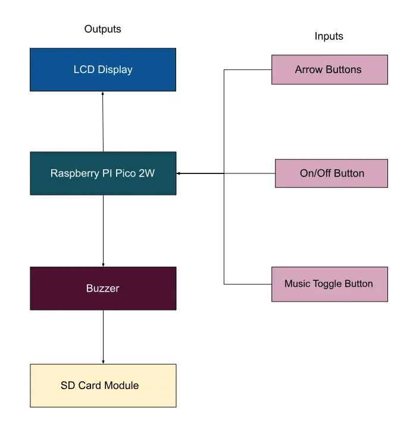
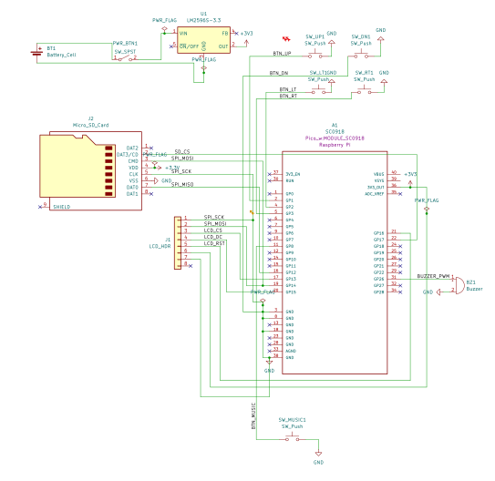

# Gumdrop Mini
A Raspberry Pi Pico‑powered handheld that runs a Rust implementation of a platformer game.

:::info 

**Author**: Caraian Sonia-Adriana \
**GitHub Project Link**: https://github.com/UPB-PMRust-Students/proiect-soniacaraian

:::

## Description

I decided to build a handheld console designed to run a Rust reimplementation of a platformer game I had originally created in a previous project, "Princess Bubblegum Adventure". Inspired by the game's candy-themed world, I named the console Gumdrop Mini.

## Motivation

I chose this project because I had taken a lot of creative freedom when designing "Princess Bubblegum Adventure" — from the gameplay mechanics to the visual assets, all of which I created myself. I wanted to see the game run on real hardware rather than just in a development environment. Because it was inspired by retro games, it only felt natural to run it on a handheld console.

## Architecture 

## Log

### Week 5 - 11 May

### Week 12 - 18 May

### Week 19 - 25 May

## Hardware

The console is built around the Raspberry Pi Pico 2W, and is powered by a 9V battery regulated through a step-down voltage module. User input is handled via push buttons connected on a breadboard, while game audio is played through a buzzer. An LCD display is used for game output.

### Schematics
 

### Bill of Materials

| Device | Usage | Price |
|--------|--------|-------|
| [Raspberry Pi Pico 2W](https://www.raspberrypi.com/documentation/microcontrollers/raspberry-pi-pico.html) | The microcontroller | [39 RON](https://www.optimusdigital.ro/ro/placi-raspberry-pi/13327-raspberry-pi-pico-2-w.html?search_query=pico%202w&results=33) |
| [Modul DC-DC Step Down LM2596S](https://www.optimusdigital.ro/ro/surse-coboratoare-reglabile/1108-modul-dc-dc-step-down-lm2596hv.html) | Voltage regulation from 9V battery to 3.3V/5V | [13 RON](https://www.optimusdigital.ro/ro/surse-coboratoare-reglabile/1108-modul-dc-dc-step-down-lm2596hv.html) |
| [Baterie de 9V Varta Superlife](https://www.optimusdigital.ro/ro/baterii-de-9-v-pp3/7554-baterie-de-9v-varta-superlife-6f22.html?search_query=baterie+9V&results=310) | Power source | [6 RON](https://www.optimusdigital.ro/ro/baterii-de-9-v-pp3/7554-baterie-de-9v-varta-superlife-6f22.html?search_query=baterie+9V&results=310) |
| [Conector pentru baterie 9V](https://www.optimusdigital.ro/ro/suporturi-de-baterii/20-conector-pentru-baterie-de-9-v.html?search_query=conector+baterie+9V&results=34) | Connects battery to power circuit | [1.29 RON](https://www.optimusdigital.ro/ro/suporturi-de-baterii/20-conector-pentru-baterie-de-9-v.html?search_query=conector+baterie+9V&results=34) |
| [Breadboard 175 x 67 mm](https://www.optimusdigital.ro/ro/prototipare-breadboard-uri/13244-breadboard-175-x-67-x-9-mm.html?search_query=breadboard&results=128) | Prototyping and wiring connections | [12 RON](https://www.optimusdigital.ro/ro/prototipare-breadboard-uri/13244-breadboard-175-x-67-x-9-mm.html?search_query=breadboard&results=128) |
| [Modul cititor card SD](https://www.optimusdigital.ro/ro/altele/98-modul-cititor-card-sd.html?search_query=cititor+card&results=25) | External storage access | [6 RON](https://www.optimusdigital.ro/ro/altele/98-modul-cititor-card-sd.html?search_query=cititor+card&results=25) |
| [Set fire M-M 40p, 30 cm](https://www.optimusdigital.ro/ro/fire-fire-mufate/882-set-fire-mama-mama-40p-30-cm.html?search_query=fire&results=429) | Jumper wires for circuit connections | [10 RON](https://www.optimusdigital.ro/ro/fire-fire-mufate/882-set-fire-mama-mama-40p-30-cm.html?search_query=fire&results=429) |
| [Set fire M-F 40p, 30 cm](https://www.optimusdigital.ro/ro/fire-fire-mufate/878-set-fire-mama-tata-40p-30-cm.html?search_query=fire&results=429) | Jumper wires for mixed pin headers | [10 RON](https://www.optimusdigital.ro/ro/fire-fire-mufate/878-set-fire-mama-tata-40p-30-cm.html?search_query=fire&results=429) |
| [Set fire F-F 40p, 10 cm](https://www.optimusdigital.ro/ro/fire-fire-mufate/884-set-fire-tata-tata-40p-10-cm.html?search_query=fire&results=429) | Short jumper wires for compact connections | [5 RON](https://www.optimusdigital.ro/ro/fire-fire-mufate/884-set-fire-tata-tata-40p-10-cm.html?search_query=fire&results=429) |
| [Buzzer pasiv 3V](https://www.optimusdigital.ro/ro/audio-buzzere/12247-buzzer-pasiv-de-33v-sau-3v.html?search_query=buzzer&results=63) | Outputs sound/music using PWM | [1 RON](https://www.optimusdigital.ro/ro/audio-buzzere/12247-buzzer-pasiv-de-33v-sau-3v.html?search_query=buzzer&results=63) |
| [Buton 6x6x6 mm](https://www.optimusdigital.ro/ro/butoane-i-comutatoare/1119-buton-6x6x6.html?search_query=butoane&results=190) | Input controls for the game (e.g., A/B/Start) | [0.36 RON](https://www.optimusdigital.ro/ro/butoane-i-comutatoare/1119-buton-6x6x6.html?search_query=butoane&results=190) |
| [3.5" TFT LCD ILI9486 Display](https://www.aliexpress.com/item/1005006651048414.html) | Large color display with touchscreen, SPI interface | ~43 RON |

## Software

| Library | Description | Usage |
|---------|-------------|-------|
| [embedded-graphics](https://docs.rs/embedded-graphics/latest/embedded_graphics/) | A 2D graphics library for embedded systems without a framebuffer. Supports drawing text, shapes, and images. | Used to render visuals for the game on the LCD screen |
| [ili9486-driver](https://github.com/chrismoos/ili9486-driver) | A Rust driver for ILI9486-based TFT displays over SPI, compatible with embedded-graphics. | Used to control and render graphics on the 3.5" TFT LCD |
| [tinybmp](https://docs.rs/tinybmp/latest/tinybmp/) | A parser for BMP image files with no std dependency, useful for rendering sprites. | Loads and draws bitmap assets onto the display |

## Links

