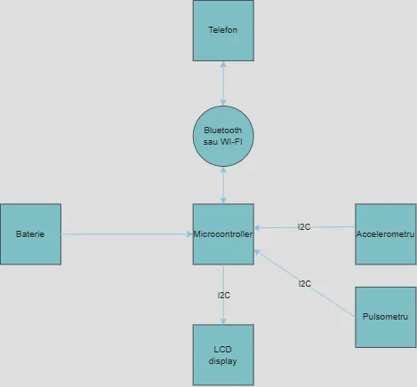

# Fitness Tracker
Un dispozitiv portabil de monitorizare a activității fizice care afișează în timp real pașii și pulsul utilizatorului, oferind notificări și conectivitate Bluetooth pentru o experiență de fitness completă.


:::info

**Author**: Ștefan-Alexandru Mihăilă \
**GitHub Project Link**: https://github.com/UPB-PMRust-Students/proiect-MihailaStefanAlexandru

:::

## Description

Proiectul propus constă într-un dispozitiv de monitorizare a activității fizice, care urmărește în timp real numărul de pași efectuați pe parcursul unei zile și pulsul utilizatorului. Informațiile colectate sunt afișate atât pe un ecran integrat, cât și pe telefon, prin intermediul unei conexiuni Bluetooth (sau WI-FI). În plus, trackerul poate emite notificări după un anumit interval de inactivitate, încurajând utilizatorul să continue activitatea fizică.

## Motivation

Motivația principală a proiectului a fost promovarea unui stil de viață sănătos, într-un context în care sedentarismul devine tot mai frecvent.

1. Monitorizarea pașilor și a pulsului contribuie direct la conștientizarea nivelului de activitate fizică și încurajează mișcarea zilnică, aspect esențial pentru menținerea unei bune condiții fizice.

2. Pornind de la această idee, am considerat că proiectul reprezintă o bază solidă pentru extindere ulterioară, prin adăugarea unor funcționalități precum monitorizarea somnului, urmărirea traseului cu GPS sau integrarea cu aplicații mobile dedicate sănătății.

3. De asemenea, proiectul reflectă o motivație personală, prin integrarea unui mecanism de feedback activ: funcția de notificare bazată pe perioade de inactivitate acționează ca un antrenor digital, reamintind utilizatorului să rămână activ pe parcursul zilei.

## Architecture



## Log

<!-- write your progress here every week -->

### Week 28 April - 4 May

Crearea paginii proiectului pe gitlab. Crearea paginii proiectului pe github. Începerea scrierii documentației pentru proiect. Începerea achiziționării componetelor pentru proiect.

### Week 5 - 11 May

### Week 12 - 18 May

### Week 19 - 25 May

## Hardware

Componentele folosite pentru proiect sunt 2 microcontrollere Raspberry Pi Pico 2W, un ecran LCD 1602 cu suport pentru I2C și SPI și un modul accelerometru cu 3 axe ADXL345.

A fost necesar de un microcontroller Raspberry Pi Pico 2W pentru funcționalitatea de bluetooth (sau wi-fi) și este nevoie de două piese pentru a folosi una din ele pe post de debugger și pentru a folosi bibliotecile software prezentate în cadrul laboratoarelor.

Ecranul LCD a fost ales pentru suportul I2C cu ajutorul căruia se va face comunicarea cu microcontroller-ul.

Modulul de accelerometru a fost ales pentru a îndeplini funcționalitatea de a număra pașii efectuați.

### Schematics

Place your KiCAD schematics here.

### Bill of Materials

<!-- Fill out this table with all the hardware components that you might need.

The format is 
```
| [Device](link://to/device) | This is used ... | [price](link://to/store) |

```

-->

| Device | Usage | Price |
|--------|--------|-------|
| [2* Raspberry Pi Pico 2W](https://www.raspberrypi.com/documentation/microcontrollers/raspberry-pi-pico.html) | The microcontroller | [79,32 RON](https://www.optimusdigital.ro/ro/placi-raspberry-pi/13327-raspberry-pi-pico-2-w.html) |
| [LCD 1602 cu Interfata I2C si Backlight Galben-Verde](https://dfimg.dfrobot.com/nobody/wiki/ee1c5bd150fc6b78f8cb8e8306898ab9.pdf) | The display screen | [14,99 RON](https://www.optimusdigital.ro/en/lcds/62-1602-lcd-with-i2c-interface-and-yellow-green-backlight.html) |
| [ADXL345 digital 3-axis accelerometer](https://www.analog.com/media/en/technical-documentation/data-sheets/adxl345.pdf) | the accelerometer | [12,99 RON](https://www.optimusdigital.ro/en/inertial-sensors/97-adxl345-tripple-axis-accelerometer.html) |

## Software

| Library | Description | Usage |
|---------|-------------|-------|
| [embassy-rs](https://embassy.dev/) | framework for embedded aplications for rust | Used for efficient multitasking in embedded systems |
| [probe-rs](https://probe.rs/docs/overview/about-probe-rs/) | embedded debugging and target interaction toolkit | Used to program and debug microcontrollers via a debug probe |
| [rp235x_hal](https://docs.rs/rp235x-hal/latest/rp235x_hal/index.html) | implementation of the embedded-hal traits for the RP235x microcontrollers | Used for features regarding implemtation of defmt and i2c-write-iter |

## Links

<!-- Add a few links that inspired you and that you think you will use for your project -->

1. [Getting started with Raspberry Pi Pico-series](https://datasheets.raspberrypi.com/pico/getting-started-with-pico.pdf)
2. [Inter-Integrated Circuit](https://pmrust.pages.upb.ro/docs/acs_cc/lab/06)
3. [Inertial Measurement Unit](https://pmrust.pages.upb.ro/docs/acs_cc/lab/05#mpu-6500-inertial-measurement-unit)
4. [Raspberry Pi Ltd, RP2350 Datasheet](https://datasheets.raspberrypi.com/rp2350/rp2350-datasheet.pdf)
