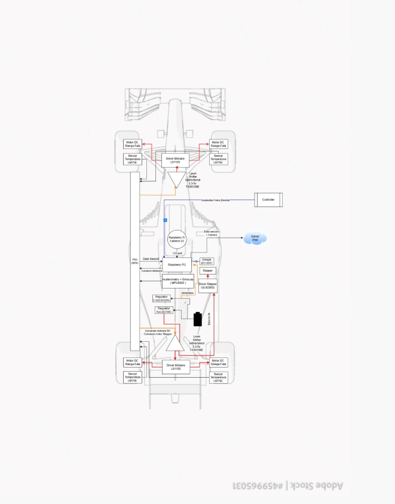

# Formula 1 Miniature Car 

A Bluetooth-controlled Formula 1 miniature car with onboard camera and real-time sensor monitoring via a web server.

:::info INFO
**Author:** Stefania Tudor \
**GitHub Project Link:** 
[https://github.com/UPB-PMRust-Students/proiect-stefaniatudor](https://github.com/UPB-PMRust-Students/proiect-stefaniatudor)
:::

## Description

The Formula 1 Miniature Car project involves the development of a scaled-down Formula 1 car model, remotely controlled via Bluetooth using a gaming controller. The car is equipped with an onboard camera for video transmission and a web server that displays real-time statistics such as speed and wheel temperature.

Key features include:

- **Bluetooth Control:** Enables remote operation of the car using a gaming controller.
- **Onboard Camera:** Provides live video feed from the car's perspective.
- **Sensor Integration:** Monitors speed and wheel temperature in real-time.
- **Web Server:** Displays sensor data through a user-friendly interface.

## Motivation

This project was undertaken to bridge the gap between theoretical knowledge and practical application. It integrates various aspects of embedded systems, including sensor data acquisition, motor control, wireless communication, and real-time data visualization. The goal was to create a comprehensive system that demonstrates the capabilities of embedded Rust programming in a real-world scenario.

## Architecture

The system architecture comprises the following components:

- **Microcontroller:** Raspberry Pi Pico 2 serves as the central processing unit, managing all operations.
- **Sensors:**
  - *LM75B Temperature Sensors (x4):* Monitor the temperature of each wheel.
  - *MPU6050 Accelerometer and Gyroscope:* Track the car's orientation and movement.
- **Actuators:**
  - *DC Motors (x4):* Provide propulsion for the car.
  - *Stepper Motor:* Controls the Drag Reduction System (DRS) mechanism.
- **Drivers:**
  - *L9110S Motor Drivers (x2):* Interface between the microcontroller and DC motors.
  - *ULN2003 Stepper Motor Driver:* Controls the stepper motor for DRS.
- **Camera:** Captures live video feed for real-time monitoring.
- **Web Server:** Hosts the interface displaying sensor data and live video.

## Hardware

The hardware setup includes:

- **Microcontroller:** Raspberry Pi Pico 2
- **Sensors:**
  - LM75B Temperature Sensors (x4)
  - MPU6050 Accelerometer and Gyroscope
- **Actuators:**
  - DC Motors (x4)
  - Stepper Motor
- **Drivers:**
  - L9110S Motor Drivers (x2)
  - ULN2003 Stepper Motor Driver
- **Camera:** Raspberry Pi Camera Module
- **Power Supply:** 9V Batteries (x2)

## Software

The software is developed entirely in Rust, utilizing the `embassy-rs` asynchronous framework for efficient task management. Key functionalities include:

- **Motor Control:** PWM signals generated for precise motor operation.
- **Sensor Data Acquisition:** I2C communication with temperature and motion sensors.
- **Web Server:** Hosts a real-time dashboard displaying sensor data and live video feed.

## Software Libraries

| Library             | Description                                                                 | Usage in Project                                                            |
|---------------------|-----------------------------------------------------------------------------|------------------------------------------------------------------------------|
| `embassy-rs`        | An async embedded framework for Rust, providing task scheduling and HALs.  | Used to create async tasks for motor control, sensor reading, and server.   |
| `embedded-hal`      | A set of standard traits for embedded hardware abstractions in Rust.       | Used as a foundation to write portable drivers for I2C, PWM, and GPIO.      |
| `nb`                | Provides traits for non-blocking operations in embedded systems.            | Ensures sensor reading and UART comms are non-blocking in async tasks.      |
| `mpu6050`           | A driver for the MPU6050 accelerometer and gyroscope sensor.               | Reads orientation data from the MPU6050 via I2C for stability analysis.     |
| `pwm-pio`           | A crate for generating PWM signals on RP2040 using PIO.                     | Generates PWM signals for controlling the speed of the DC motors.           |
| `embassy-net`       | An async TCP/IP network stack for embedded systems written in Rust.         | Implements a web server that exposes sensor data via HTTP.                  |
| `bluetooth-serial`  | Serial communication over classic Bluetooth (RFCOMM).                       | Receives control commands from the gaming controller via Bluetooth.         |
| `defmt`             | Efficient logging framework for embedded systems in Rust.                   | Provides lightweight debugging logs via serial output or RTT.               |

## Links
