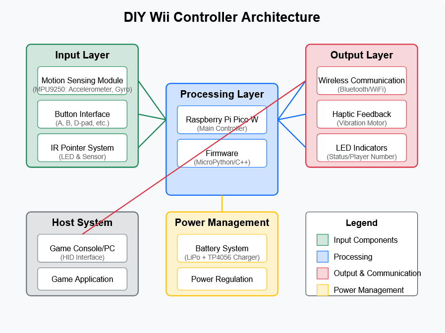

# Wii Controller
Relive Wii memories with a homemade motion controller

:::info 

**Author**: Gila Tiberiu-Florin \
**GitHub Project Link**: https://github.com/UPB-PMRust-Students/proiect-tiberiugila

:::

## Description

The famous gaming controller is back, now implemented on a Raspberry Pi Pico 2

## Motivation

I had a Wii when I was little and spent hours playing tennis on it. Recreating the Wii controller using a Raspberry Pi Pico 2 is a way to bring back that experience while learning more about sensors, motion tracking, wireless communication, and microcontroller programming. It’s a fun way to combine nostalgia with hands-on technical skills.

## Architecture 



## Log

<!-- write your progress here every week -->

### Week 5 - 11 May

### Week 12 - 18 May

### Week 19 - 25 May

## Hardware

### Raspberry Pi Pico W

**Interface:** Central MCU  
**Connections:**  
- Hosts all components via GPIO, I2C, and power lines  
- Powered through USB or TP4056 module  

**Role:** Core microcontroller running firmware, handling inputs, sensor data, and communication.

---

### MPU9250 & BMP280 10DOF Module

**Interface:** I2C  
**Connections:**  
- SDA connected to Pico I2C pin (e.g., GP4)  
- SCL connected to Pico I2C pin (e.g., GP5)  
- VCC connected to 3.3V  
- GND to Ground  

**Role:** Handles motion sensing with accelerometer, gyroscope, magnetometer, and barometer data.

---

### Buttons (A / B / Trigger)

**Interface:** GPIO  
**Connections:**  
- Each button connected to a dedicated GPIO pin with pull-down resistor  
- One side of the button to GPIO, other to GND  

**Role:** User input for control actions such as A, B, and trigger functionality.

---

### TP4056 Micro USB LiPo Charger

**Interface:** Power  
**Connections:**  
- IN+ / IN– connected to USB power source  
- BAT+ / BAT– connected to LiPo battery  
- OUT+ provides power to the Pico (VBUS or via regulator)  

**Role:** Charges LiPo battery and supplies regulated power to the system.

---

### Power Supply (LiPo Battery)

**Interface:** Power  
**Connections:**  
- Connected to TP4056 module (BAT+ / BAT–)  

**Role:** Provides portable power for untethered use.

---

### Breadboard + Wires

**Interface:** Passive connections  
**Connections:**  
- Used for prototyping and connecting all components  

**Role:** Temporary circuit assembly platform during development and testing.

### Schematics

WIP...

### Bill of Materials

<!-- Fill out this table with all the hardware components that you might need.

The format is 
```
| [Device](link://to/device) | This is used ... | [price](link://to/store) |

```

-->

| Device | Usage | Price |
|--------|--------|-------|
| [Raspberry Pi Pico W](https://www.raspberrypi.com/documentation/microcontrollers/raspberry-pi-pico.html) | The microcontroller | [35 RON](https://www.optimusdigital.ro/en/raspberry-pi-boards/12394-raspberry-pi-pico-w.html) |
| [MPU9250 & BMP280 10DOF Module](https://www.optimusdigital.ro/ro/senzori-senzori-inertiali/1671-modul-10dof-mpu9250-i-bmp280-accelerometru-giroscop-magnetometru-i-barometru-digital-gy.html?srsltid=AfmBOoqJ253Dg4teRYb4mZZ9UPzhWdRdtmqk8p6MsRYJEArjlCTZH9Az) | Accelerometer, gyroscope, magnetometer for motion sensing | [55 RON](https://www.optimusdigital.ro/ro/senzori-senzori-inertiali/1671-modul-10dof-mpu9250-i-bmp280-accelerometru-giroscop-magnetometru-i-barometru-digital-gy.html?srsltid=AfmBOoqJ253Dg4teRYb4mZZ9UPzhWdRdtmqk8p6MsRYJEArjlCTZH9Az) |
| [TP4056 Micro USB LiPo Battery Charger](https://www.optimusdigital.ro/ro/electronica-de-putere-incarcatoare/80-incarcator-de-baterii-tp4056-1a.html?search_query=TP4056+Micro+USB+LiPo+Battery+Charger&results=1) | Power management for portable use | [5 RON](https://www.optimusdigital.ro/ro/electronica-de-putere-incarcatoare/80-incarcator-de-baterii-tp4056-1a.html?search_query=TP4056+Micro+USB+LiPo+Battery+Charger&results=1) |
| [Round White Buttons](https://www.optimusdigital.ro/ro/electronica-de-putere-incarcatoare/80-incarcator-de-baterii-tp4056-1a.html?search_query=TP4056+Micro+USB+LiPo+Battery+Charger&results=1) | Input controls (A/B/trigger/etc.) | [2 RON](https://www.optimusdigital.ro/ro/butoane-i-comutatoare/1115-buton-cu-capac-rotund-alb.html?search_query=buton+cu+capac+rotund+alb&results=2) |
| [Breadboard](https://www.optimusdigital.ro/ro/electronica-de-putere-incarcatoare/80-incarcator-de-baterii-tp4056-1a.html?search_query=TP4056+Micro+USB+LiPo+Battery+Charger&results=1) | Prototyping the circuit | [10 RON](https://www.optimusdigital.ro/ro/butoane-i-comutatoare/1115-buton-cu-capac-rotund-alb.html?search_query=buton+cu+capac+rotund+alb&results=2) |
| [Breadboard wire set](https://www.optimusdigital.ro/ro/fire-fire-mufate/12-set-de-cabluri-pentru-breadboard.html?search_query=set+fire+pentru+breadboard&results=37) | Connecting components on the breadboard | [8 RON](https://www.optimusdigital.ro/ro/fire-fire-mufate/12-set-de-cabluri-pentru-breadboard.html?search_query=set+fire+pentru+breadboard&results=37) |
| [Header pins](https://www.optimusdigital.ro/ro/componente-electronice-headere-de-pini/85-header-de-pini.html?search_query=header+de+pini+%2840p%29&results=22) | Connecting components to the Raspberry Pi | [1 RON](https://www.optimusdigital.ro/ro/componente-electronice-headere-de-pini/85-header-de-pini.html?search_query=header+de+pini+%2840p%29&results=22) |

## Software


| Library | Description | Usage |
|---------|-------------|-------|
| [embassy-rs](https://github.com/embassy-rs/embassy) | Async/await runtime for embedded systems | Core framework for the project |
| [embassy-rp](https://crates.io/crates/embassy-rp) | Embassy HAL for RP2040 | Hardware abstraction for Raspberry Pi Pico |
| [mpu9250-driver](https://crates.io/crates/mpu9250-driver) | Driver for MPU9250 sensor | Interfacing with the accelerometer, gyroscope and magnetometer |
| [btleplug](https://crates.io/crates/btleplug) | Bluetooth Low Energy library | Wireless communication interface |
| [embassy-usb](https://crates.io/crates/embassy-usb) | USB stack for Embassy | For USB device emulation (when using as wired controller) |
| [embassy-time](https://crates.io/crates/embassy-time) | Time handling for Embassy | Managing timing and delays |
| [serde](https://crates.io/crates/serde) | Serialization framework | For data formatting and communication protocols |
| [embedded-hal](https://crates.io/crates/embedded-hal) | Hardware Abstraction Layer traits | Standard interface for hardware components |
| [defmt](https://crates.io/crates/defmt) | Debugging and logging | For development and debugging purposes |
| [pid](https://crates.io/crates/pid) | PID controller | For smoothing motion data |

## Links

<!-- Add a few links that inspired you and that you think you will use for your project -->

1. [Wii Remote Disassembly](https://www.youtube.com/watch?v=1zBDcj2ExM0)
2. [How to Connect MPU9250 to Raspberry Pi Pico](https://www.youtube.com/watch?v=Kzjnu8bGVYo)
3. [Lab 04 - Asynchronous Development](https://pmrust.pages.upb.ro/docs/acs_cc/lab/04)
4. [Lab 07 - Wi-fi](https://pmrust.pages.upb.ro/docs/acs_cc/lab/07)\
...
