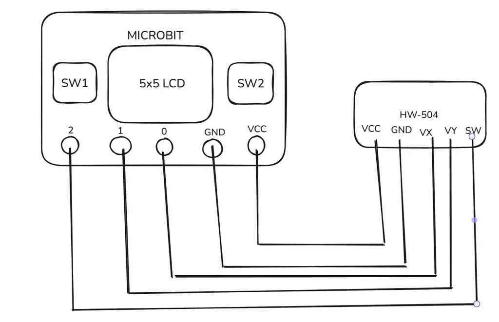
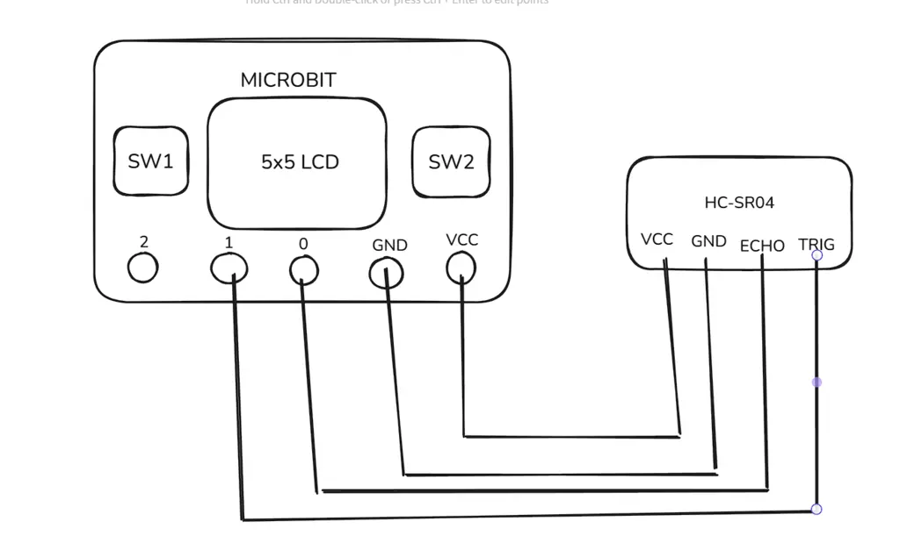
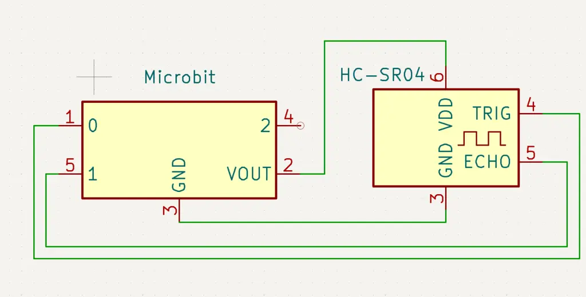
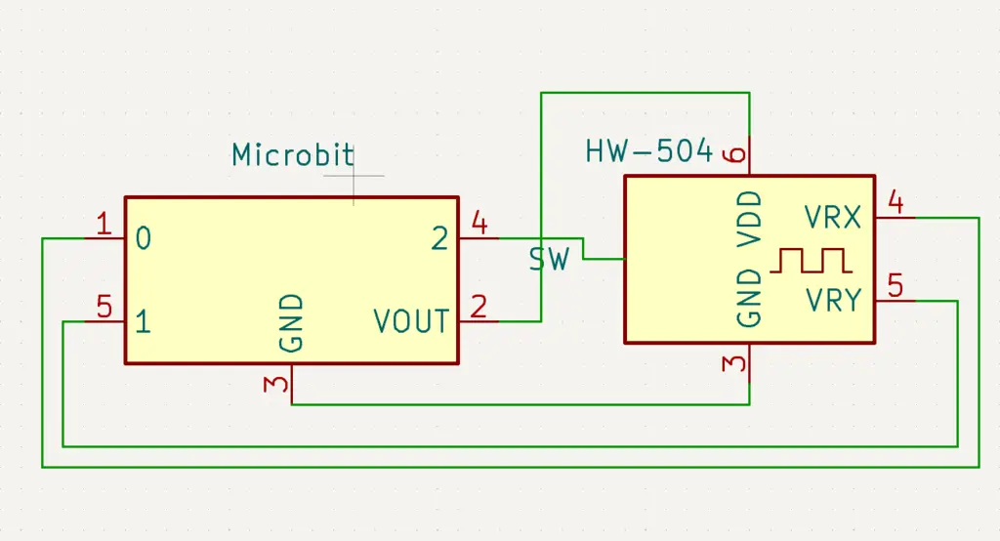
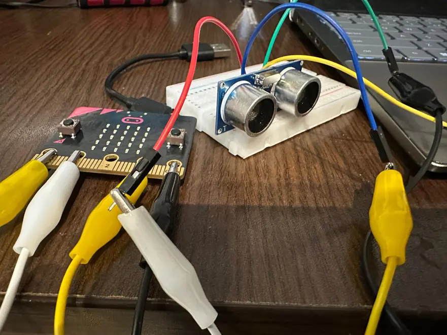
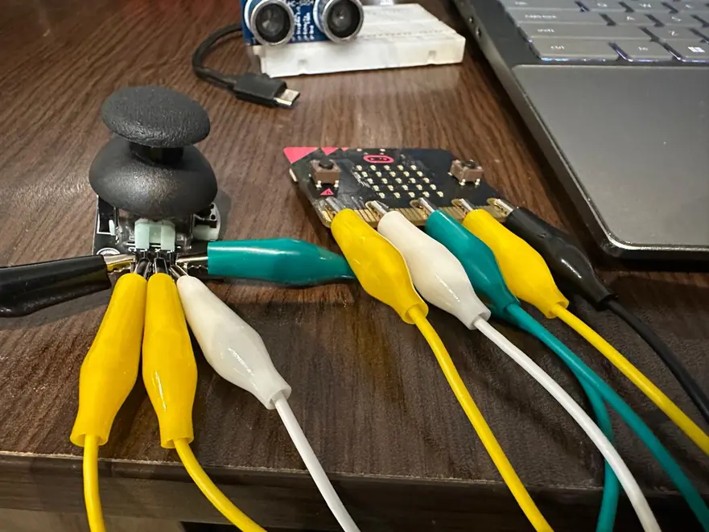

# Project Name
Microbit mini-console.

:::info 

**Author**: Theodhoraq Mihallari \
**GitHub Project Link**: [link_to_github](https://github.com/UPB-PMRust-Students/proiect-todi-mih)

:::

## Description

A mini-console for small games that two or more people can play.The games are:
1) Rocket and meteor 
The player moves the rocket using the microbit's buttons left and right
to avoid collision with the meteor coming from above.
2) Guess the distance
The microbit gives a random distance and players must put an object as close to
a ultrasonic sensor (HCSR) as possible,who's nearest wins.
3) Repeat the pattern
The microbit outputs in a random pattern moves of 4 types (UP,DOWN,LEFT,RIGHT).
The player,through a joystick,must repeat that pattern.If wrong,the game restarts.
The speed and difficulty increase with time.

## Motivation

I couldn't think of anything meaningfull to do,given our situation and resources
so i picked this project because of how versatile it can be,i can implement multiple
ideas with different hardware,and turn it into something fun.Also given how compact 
the microbit is,and with build in screen and buttons it would be a big help.
(Since I'll be using a breadboard connecting screens and buttons would just make 
the product messy)

## Architecture 

Given the limited number of inputs on the microbit,we have to connect the components 
for each game (it's also cleaner that way)

Components:
Microbit (with buttons and screen)
Joystick - HW-504
Ultrasonic sensor - HC-SR04

## Log

<!-- write your progress here every week -->

### Week 5 - 11 May

Hardware assembly,planification

### Week 12 - 18 May

Microbit-Rust research,getting to know things and what to use to
make them work

### Week 19 - 25 May
19 - first commit of software with the first 2 games,the second needs 
a bit more work

## Hardware

Micro:bit
Purpose: Main microcontroller unit
Function: Controls the entire system logic, reads sensor input, drives the display, and handles button presses. 

HC-SR04 (Ultrasonic Sensor)
Purpose: Measures distance to nearby objects
Function: Emits ultrasonic waves and calculates distance based on echo return time. The Micro:bit reads these measurements to detect proximity or obstacles.

HW-504 (Joystick Module)
Purpose: Provides directional input
Function: Acts as a 2-axis analog input device. 

Breadboard + jumper wires
Purpose: Prototyping without soldering and electrical connections between components
Function: Connect all the components

### Schematics

### Bill of Materials

| Device                                                                                       | Usage                  | Price                                                                                                                                                                                                                                   |
|----------------------------------------------------------------------------------------------|------------------------|-----------------------------------------------------------------------------------------------------------------------------------------------------------------------------------------------------------------------------------------|
| [Microbit](https://microbit.org/get-started/what-is-the-microbit/)                          | Microcontroller        | [75 RON](https://microbit.org/buy/bbc-microbit-go/)                                                                                                                                                                                    |
| [HC-SR04](https://sites.google.com/site/arduinoelectronicasiprogramare/arduino-si-senzori/1) | Ultrasonic sensor      | [8 RON](https://www.optimusdigital.ro/ro/senzori-senzori-de-distanta/8150-senzor-de-distana-ultrasonic-hc-sr04p-3-55-v.html)                                                                                                           |
| [HW-504](https://docs.cirkitdesigner.com/component/fa55a084-79fb-4baa-914f-2151a791a6b0/joystick-module) | Joystick               | [6 RON](https://ardushop.ro/ro/electronica/1627-modul-joystick-6427854024459.html)                                                                                                              |
| [Breadboard](https://magpi.raspberrypi.com/articles/breadboard-tutorial)                     | Connect all components | [10 RON](https://ardushop.ro/ro/electronica/84-breadboard-400-6427854020949.html)                                                                                                               |

## Software

| **Library**         | **Description**                                              | **Usage**                                                |
|---------------------|--------------------------------------------------------------|-----------------------------------------------------------|
| `defmt`             | Lightweight logging framework                                | Efficient debug output (e.g., over RTT for microcontrollers) |
| `defmt-rtt`         | RTT (Real-Time Transfer) backend for `defmt`                 | Sends log messages to host over debug interface          |
| `panic-halt`        | Minimal panic handler                                        | Halts MCU on panic (no backtrace)                        |
| `cortex-m`          | Low-level Cortex-M functionality                             | Access to interrupts, critical sections, etc.            |
| `cortex-m-rt`       | Runtime for Cortex-M                                         | Defines the `#[entry]` point for bare-metal apps         |
| `embedded-hal`      | Hardware Abstraction Layer (HAL) traits                     | Traits for GPIO, Delay, RNG, etc.                        |
| `microbit`          | HAL and board support crate for BBC micro:bit                | Access to board pins, peripherals, display, etc.         |

## Links

<!-- Add a few links that inspired you and that you think you will use for your project -->
I used this repo as a starting point and as a scheleton for my project

https://github.com/nrf-rs/microbit

Big thanks to the microbit-Rust community!

Also usefull

https://docs.rs/microbit/latest/microbit/

https://docs.rust-embedded.org/discovery/microbit/

...
