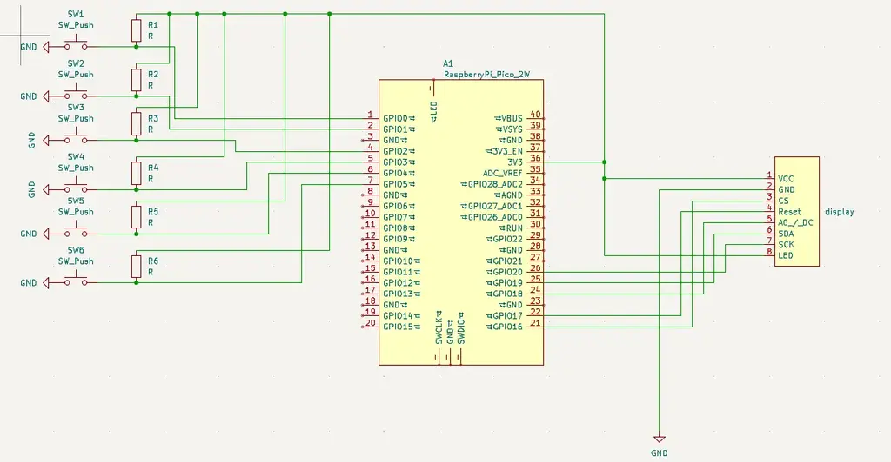

#Minesweeper
Minesweeper implementat in rust.

:::info
**Author**: Cretu Tudor-Andrei \
**GitHub Project Link**: https://github.com/UPB-PMRust-Students/proiect-TudorKsan

:::

## Description

The project is a portable minesweeper implementation in rust, using a raspberry pi pico microcontroller. The game has multiple dificulty levels and is designed 

## Motivation

I decided to implement this game as I was always fascinated by it. While browser versions are available, the game is very hard to play without a mouse, and even harder on a portable devide like a phone. This small portable game aims to solve the problem, using 6 buttons to control the game and a small display to be able to see game.

## Arhitecture

## Log

### Week 28 April - 4 May

Bought the pieces, drawn the KiCad diagram and finished the implementation

### Week 5 - 11 May

First iteration of the build using a breadboard to connect all the components \
Initial testing of the components

### Week 12 - 18 May

Final hardware design \
First iteration of the software part

### Week 19 - 25 May

Final version of the software, finished game

## Hardware

As the main hardware part I used the Raspberry Pi Pico 2W to create the game. For displaying the game I chose a 1.8" SPI LCD, which should be enough to see the game in both dificulties. 6 buttons are used for gameplay, with 4 of them being used for the 4 movement directions, 1 used for placing the flag on the mines, and the last one is used for checking the slots for mines. 

### Schematics

### Bill of materials
| Device | Usage | Price |
|--------|-------|-------|
| [Raspberry Pi Pico 2W](https://www.raspberrypi.com/documentation/microcontrollers/pico-series.html) | The basis of the project | [40 ron](https://www.optimusdigital.ro/ro/placi-raspberry-pi/13327-raspberry-pi-pico-2-w.html)|
| Lcd SPI 128x160 | LCD for displaying the game | [44 RON](https://ardushop.ro/ro/display-uri-si-led-uri/1349-modul-lcd-spi-128x160-6427854019561.html) |
| Cables | Used for connecting the buttons to the controller | [6 RON](https://www.optimusdigital.ro/ro/fire-fire-mufate/93-fire-colorate-tata-tata-20cm.html) |
| Breadboard 400 points | Used for ease of connection | [5 RON](https://www.optimusdigital.ro/ro/prototipare-breadboard-uri/44-breadboard-400-points.html) |
| Butoane | 6 buttons for controlling the game | [2 RON](https://www.optimusdigital.ro/ro/butoane-i-comutatoare/1119-buton-6x6x6.html) |
| Rezistente | 6 rezistors for the 6 buttons | [1 RON](https://www.optimusdigital.ro/ro/componente-electronice-rezistoare/1088-rezistor-025w-100k.html?search_query=rezistor&results=110) |

## Software

| Library | Description | Usage |
|---------|-------------|-------|
| [embassy-rs](https://github.com/embassy-rs/embassy) | Rust framework | Used for writing the software |
| [st7789](https://github.com/almindor/st7789) | Display driver | Used to connect the display |
| [embedded-graphics](https://github.com/embedded-graphics/embedded-graphics) | 2D graphics library | Used to generate the images for the display |

## Links
1. [Minesweeper in browser](https://minesweeperonline.com/)
