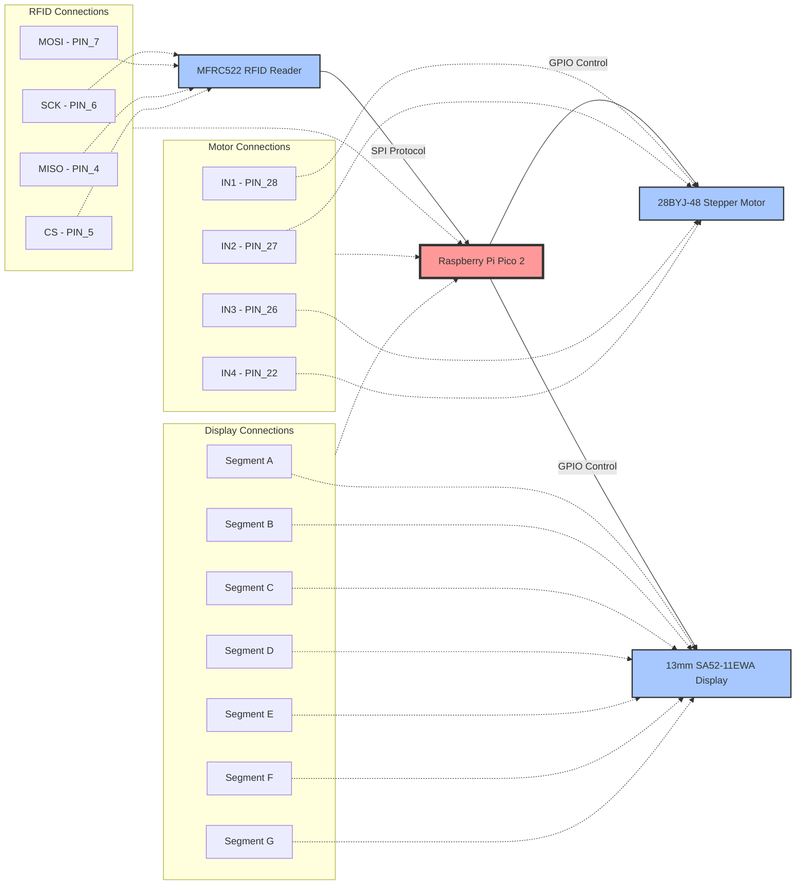

# RFID-Controlled Corporate Elevator System
A corporate elevator system that uses RFID cards for floor access control, built with Raspberry Pi Pico 2 and stepper motor technology.

:::info 

**Author**: Vicentiu Duta \
**GitHub Project Link**: https://github.com/UPB-PMRust-Students/proiect-VicentiuDuta

:::

## Description

This project implements a miniature elevator system featuring access control through RFID technology. The system operates on a Raspberry Pi Pico 2 microcontroller and utilizes stepper motor control for precise vertical movement. The core functionality allows users to present specific RFID cards, which automatically direct the elevator to the associated floor. The system employs a 28BYJ-48 stepper motor for smooth and controlled movement between floors, with precise positioning achieved through programmatic control of step sequences. The RFID reader, based on the MFRC522 module, communicates via SPI protocol to identify and authenticate access cards. The system features a 13mm SA52-11EWA 7-segment display that provides real-time feedback about the elevator's current floor position. This visual indicator ensures users can monitor the elevator's location and verify their access status. This design showcases practical integration of embedded systems programming in Rust with mechanical control systems to create an automated, access-controlled transportation system.

## Motivation

This project was chosen to explore the practical implementation of access control systems in automated environments. Building an RFID-controlled elevator system provides an opportunity to work with multiple interconnected technologies: digital identification systems, motor control, and embedded programming. The motivation behind this project stems from:

1. **Real-world Application**: Access control is fundamental in modern buildings, and implementing a miniature version offers insights into security systems used in corporate environments.

2. **Learning Rust in Embedded Systems**: This project provides hands-on experience with Rust programming in embedded contexts, allowing exploration of low-level hardware control while maintaining code safety.

3. **System Integration**: The project demands understanding of multiple protocols (SPI for RFID communication) and hardware components working in harmony, developing valuable skills in embedded systems design.

4. **User Experience Enhancement**: The implementation of a 7-segment display adds a crucial user interface element that provides immediate visual feedback. This feature improves the user experience by showing current floor position and operation status, making the system more professional and user-friendly.

The miniature nature of the project makes it manageable for implementation while still showcasing the essential concepts of automated access control systems.

## Architecture 

### System Architecture Diagram



### Main Components:
1. **Authentication Module** - Validates RFID cards and maps them to floors
2. **Motor Controller** - Manages stepper motor sequences and timing
3. **Display Controller** - Updates 7-segment display with current floor
4. **Microcontroller** - Coordinates system flow and error handling

### Component Connections:
The Authentication Module receives RFID data via SPI and outputs authorized floor commands to the Motor Controller. The Motor Controller generates step patterns through GPIO to drive the stepper motor. Both Authentication and Motor Controller send status updates to the Display Controller for visual feedback. The Microcontroller orchestrates all modules, ensuring sequential operation and proper state transitions.
## Log

<!-- write your progress here every week -->

### Week 5 - 11 May
TODO
### Week 12 - 18 May
TODO
### Week 19 - 25 May
TODO
## Hardware

The system consists of a Raspberry Pi Pico 2 microcontroller interfacing with three main components: an MFRC522 RFID reader for contactless card authentication via SPI protocol, a 28BYJ-48 stepper motor with ULN2003 driver for precise elevator movement control, and a 13mm SA52-11EWA 7-segment display for real-time floor indication. All modules connect directly through GPIO pins, creating a compact, integrated access control system.

### Schematics

### Bill of Materials

<!-- Fill out this table with all the hardware components that you might need.

The format is 
```
| [Device](link://to/device) | This is used ... | [price](link://to/store) |

```

-->

| Device | Usage | Price |
|--------|--------|-------|
| [2x Raspberry Pi Pico 2W](https://www.raspberrypi.com/documentation/microcontrollers/pico-series.html) | The microcontroller | [39,66 RON x 2](https://www.optimusdigital.ro/en/raspberry-pi-boards/13327-raspberry-pi-pico-2-w.html?search_query=raspberry+pi+pico+2&results=36) |
| [MFRC522 RFID Module](https://www.nxp.com/docs/en/data-sheet/MFRC522.pdf) | RFID authentication | [9,99 RON](https://www.optimusdigital.ro/en/wireless-rfid/67-mfrc522-rfid-module.html?search_query=rfid&results=30) |
| [28BYJ-48 Stepper Motor](https://components101.com/motors/28byj-48-stepper-motor) | Elevator vertical movement control | [16,97 RON](https://www.optimusdigital.ro/ro/motoare-motoare-pas-cu-pas/101-driver-uln2003-motor-pas-cu-pas-de-5-v-.html?search_query=motor+pas+cu+pas&results=117) |
| [SA52-11EWA Display](https://www.kingbrightusa.com/images/catalog/SPEC/SA52-11EWA.pdf) | Current floor indicator | [8,99 RON](https://www.optimusdigital.ro/en/led-displays/7463-13-mm-sa52-11ewa-display.html) |
| 7x 220Ω Resistors | Current limiting for 7-segment display segments | [0,10 RON x 7](https://www.optimusdigital.ro/en/resistors/10958-05w-220-resistor.html?search_query=220+&results=607) |
| Consumables | Jumper wires, breadboard, pins, 3d printing, etc. | TBD |

## Software

| Library | Description | Usage |
|---------|-------------|-------|
| [embassy-rs](https://embassy.dev/) | Async embedded framework | Task scheduling and hardware abstraction |
| [mfrc522](https://docs.rs/mfrc522/latest/mfrc522/) | RFID module driver | RFID card detection and authentication |
| [embedded-hal](https://docs.rs/embedded-hal/latest/embedded_hal/) | Hardware abstraction layer | GPIO and SPI interface |
| [defmt](https://defmt.ferrous-systems.com/) | Debug formatting | System logging and debugging |

## Links

<!-- Add a few links that inspired you and that you think you will use for your project -->

1. [link](https://example.com)
2. [link](https://example3.com)
...
