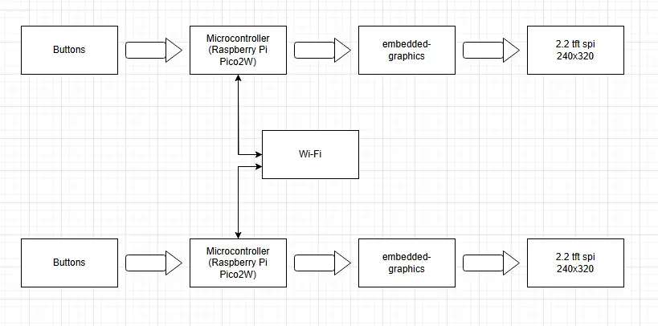
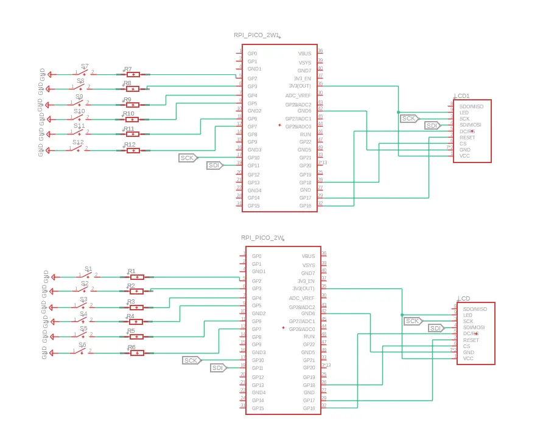

# Pico-checkers
A game in rust that resembles the classic Checkers Game.

:::info 

**Author**: Preda Victor-Andrei \
**GitHub Project Link**: [link_to_github](https://github.com/UPB-PMRust-Students/proiect-victorandrei03)

:::

##  Project Description  
This project resembles the traditional game of checkers, implemented as an online multiplayer experience. Players can move their pieces freely in all four diagonal directions (up-right, up-left, down-right, down-left) from the very first turn, adding strategic depth to every match.
- **6-button control system** per player:  
  - 4 directional buttons for movement  
  - 2 selection buttons to highlight valid pieces  
- **Dedicated LCD displays** showing the real-time game board  
- **Online multiplayer** support for competitive play 

## Motivation
As a fan of old-school strategy games, I’ve always loved the elegance of checkers—its simple rules hiding deep tactical possibilities. This project merges nostalgic gameplay with modern technology, which motivated my development approach.

## Architecture

1. **Raspberry Pi Pico 2W** (x2)  
   - Interconnected  with all components 

2. **Buttons** (x6 per player)  
   - Connected to each Pico, acting as input (move piece/selection) 

3. **2.2" 240x320 px SPI LCD** (x1 per player)  
   - Connected through embedded-graphics at the microcontroller

4. **Wi-Fi**
   - Microcontrollers communicate with each other through it
   - Player 0 acts as the server; Player 1 acts as a client

5. **Embedded-Graphics**
   - Library that a microcontroller is using in order to display the game
   - Connects the microcontroller with the LCD

## Log

### Week 5 - 11 May
1. **Upload first state of documentation**

## Hardware

1. **Raspberry Pi Pico 2W** (x2)  
   - Acts as the main controller for each player's unit  
   - Connects all components and handles Wi-Fi communication  

2. **Buttons** (x6 per player)  
   - Connected to GPIO pins:  
     - GP2   
     - GP3 
     - GP4  
     - GP5  
     - GP6  
     - GP7

3. **2.2" 240x320 px SPI LCD** (x1 per player)  
   - Connections:  
     - VCC → 3.3V  
     - GND → GND  
     - CS → GP18  
     - RESET → GP17  
     - DC/RS → GP16  
     - SDI/MOSI → GP11  
     - SCK → GP10  
     - LED → 3.3V  
     - SDO/MISO → N/C
   - Display table and pieces for each player 

4. **Resistors** (22kΩ, x6 per player)  
   - Connected between buttons and GPIO pins to ensure clean digital input signals

### Schematics

### Bill of materials

| Product                          | Quantity | Unit Price |
|----------------------------------|----------|------------|
| Raspberry Pi Pico W              | 2        | 39.66 RON  |
| LCD SPI 2.2" 240x320px           | 2        | 59.99 RON  |
| 40-pin Header (2.54mm)           | 2        | 0.99 RON   |
| Breadboard Jumper Wire Set        | 1        | 7.99 RON   |
| Large Breadboard (830 points)     | 2        | 9.98 RON   |
| Male-to-Female Jumper Wires (40p) | 1        | 7.99 RON   |
| Male-to-Male Jumper Wires (40p)   | 1        | 7.99 RON   |
| Round Tactile Buttons             | 12       | 1.99 RON   |
| Resistors 22kΩ            | 12       | 0.2 RON   |

## Software

| Library              | Description                              | Usage in Project                          |
|----------------------|------------------------------------------|-------------------------------------------|
| **`embedded-graphics`** | 2D drawing framework for embedded systems | Renders checkers board, pieces, and UI on LCD displays |
| **`rp2040-hal`**       | Raspberry Pi Pico hardware support       | Manages GPIO buttons (GP2-GP7) and SPI LCD control |
| **`embassy`**          | Async embedded runtime                   | Handles Wi-Fi multiplayer synchronization |
| **`embedded-hal`**     | Hardware abstraction layer               | Standardizes hardware interactions        |
| **`embedded-time`**    | Timing utilities                        | Controls game loop and move timing        |

## Links

1. [LCD connection](https://www.youtube.com/watch?v=RtQqXMeYpqI&t=90s&ab_channel=educ8s.tv)