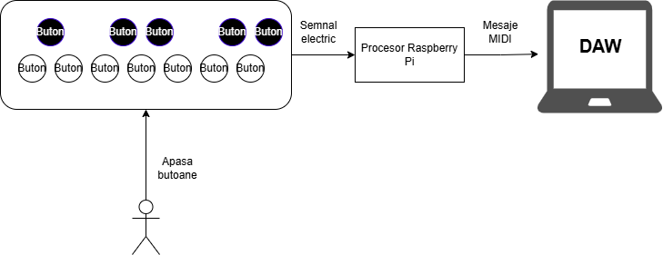
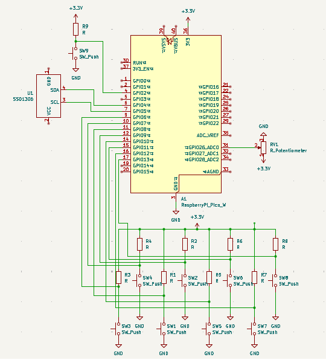

# MIDI Controller
DIY USB MIDI Controller

:::info

**Author**: Gheorghita Vlad-Gabriel \
**GitHub Project Link**: [link](https://github.com/UPB-PMRust-Students/proiect-GheorghitaVlad)

:::

## Description

A custom USB MIDI controller built using a Raspberry Pi Pico 2W and tactile switches to detect and transmit MIDI signals (Note On/Off + Velocity) to a DAW using the USB MIDI protocol.

## Motivation

As someone passionate about composing music and making beats, I've always been curious about how physical MIDI instruments work under the hood. Instead of buying an off-the-shelf MIDI controller, I decided to build one myself to combine my love for music with my skills in electronics and programming. This project allows me to deepen my understanding of how musical interfaces communicate with digital audio workstations and explore creative, cost-effective solutions for real-world problems.

## Architecture 

## Log

### Week 5 - 11 May

### Week 12 - 18 May

### Week 19 - 25 May

## Hardware

The DIY MIDI controller is built around the Raspberry Pi Pico 2W.

Each of the 12 keys has 2 separate tactile switches (one for each of the elevated buttons), resulting in a total of 24 pins required to interface the buttons with the microcontroller. The elevation for each key is achieved using a female header, creating staggered button heights, so that one button is pressed before the other. The timing difference between the button presses is used to determine the velocity of the note.

The Raspberry Pi Pico 2W processes the signals and builds MIDI packets, which are then sent via USB to the DAW.

The controller also includes a potentiometer for filter control and a button to control octave switching and filter selection through a carousel-like menu. This menu is displayed on an integrated screen, allowing users to navigate settings with short and long presses.

### Schematics

### Bill of Materials

| Device | Usage | Price |
|--------|-------|-------|
| [Raspberry Pi Pico 2W](https://www.raspberrypi.com/documentation/microcontrollers/raspberry-pi-pico.html) | Main and debug microcontroller | [79.32 RON](https://www.optimusdigital.ro/en/raspberry-pi-boards/12394-raspberry-pi-pico-w.html) |
| Breadboard Kit HQ 830p | Prototyping and testing | [22.00 RON](https://www.optimusdigital.ro) |
| [6 x 6 x 6 Push Button](https://www.optimusdigital.ro/ro/butoane-tactile/1708-butone-tactile.html) | Dual-switch per key for velocity detection | [10.80 RON](https://www.optimusdigital.ro/ro/butoane-tactile/1708-butone-tactile.html) |
| [100k Mono Potentiometer](https://www.optimusdigital.ro/ro/potentiometre/10862-potentiometru-mono-100k.html) | Optional control knob for filter adjustments | [1.49 RON](https://www.optimusdigital.ro/ro/potentiometre/10862-potentiometru-mono-100k.html) |
| [Universal PCB Prototype Board 8x12cm](https://www.optimusdigital.ro/ro/placi-prototip/84118-placa-prototip-universala-8x12cm.html) | Soldering base for final PCB | [7.98 RON](https://www.optimusdigital.ro/ro/placi-prototip/84118-placa-prototip-universala-8x12cm.html) |
| [Colored 40p 2.54 mm Pitch Male Pin Header](https://www.optimusdigital.ro/ro/headeri/2966-header-barbati-40p.html) | Wiring headers for connections | [1.98 RON](https://www.optimusdigital.ro/ro/headeri/2966-header-barbati-40p.html) |
| [20p Female Pin Header 2.54 mm](https://www.optimusdigital.ro/ro/headeri/35094-header-femei-20p.html) | Wiring headers for connections | [12.27 RON](https://www.optimusdigital.ro/ro/headeri/35094-header-femei-20p.html) |
| [4p Female Pin Header 2.54 mm](https://www.optimusdigital.ro/ro/headeri/35018-header-femei-4p.html) | Wiring headers for connections | [0.98 RON](https://www.optimusdigital.ro/ro/headeri/35018-header-femei-4p.html) |
| [Screen] | For showing filter and octave menu | [TBD] |
| Total | - | 136,82 RON + screen price |

## Software

| Library                                                  | Description                                      | Usage                                                                                |
| -------------------------------------------------------- | ------------------------------------------------ | ------------------------------------------------------------------------------------ |
| [embassy-rp](https://embassy.dev/)                       | Rust + async embedded                            | Framework for embedded applications using async features on the Raspberry Pi Pico 2W |
| [lcd1602-rs](https://crates.io/crates/lcd1602-rs)        | Driver for 1602 LCD via embedded-hal             | Display menu for filter and octave selection                                         |
| [micromath](https://crates.io/crates/micromath)          | Embedded-friendly math library                   | Handle fast floating-point math for MIDI velocity calculations                       |
| [arrayvec](https://crates.io/crates/arrayvec)            | A vector with fixed capacity, backed by an array | Store MIDI data or signal samples efficiently in memory                              |
| [fixed](https://crates.io/crates/fixed)                  | Fixed-point numbers                              | Optimize arithmetic for embedded systems                                             |
| [biquad](https://crates.io/crates/biquad)                | Library for second-order IIR filters             | Apply signal processing for audio filters                                            |
| [usbd-midi](https://docs.rs/usbd-midi/latest/usbd_midi/) | USB MIDI device class for `usb-device`           | Handle MIDI communication over USB between the Pico and DAW                          |
| [midi-parser](https://crates.io/crates/midi-parser)      | MIDI message parser                              | Parse incoming MIDI messages if needed for MIDI control                              |

## Links

1. [USB MIDI Specification](https://www.usb.org/sites/default/files/midi10.pdf)
2. [embassy-rp: Rust + async for embedded](https://embassy.dev/)
3. [lcd1602-rs: LCD1602 Driver for Pico](https://crates.io/crates/lcd1602-rs)
4. [micromath: Embedded-friendly math library](https://crates.io/crates/micromath)
5. [arrayvec: A vector with fixed capacity](https://crates.io/crates/arrayvec)
6. [fixed: Fixed-point numbers library](https://crates.io/crates/fixed)
7. [biquad: Digital second-order IIR filters](https://crates.io/crates/biquad)
8. [MIDI Protocol Reference](https://www.midi.org/specifications-old/item/table-1-summary-of-midi-message)
9. [usbd-midi](https://docs.rs/usbd-midi/latest/usbd_midi/)
10. [Example project 1](https://www.youtube.com/watch?v=wY1SRehZ9hM)
11. [Example project 2](https://www.youtube.com/watch?v=tmxgmR8Rzr4)
