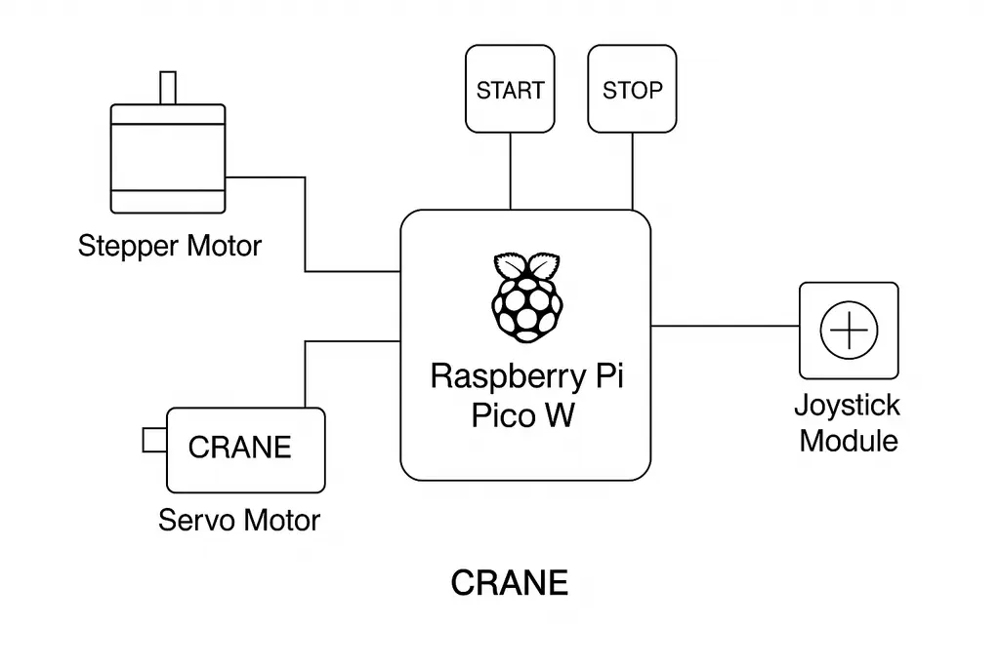
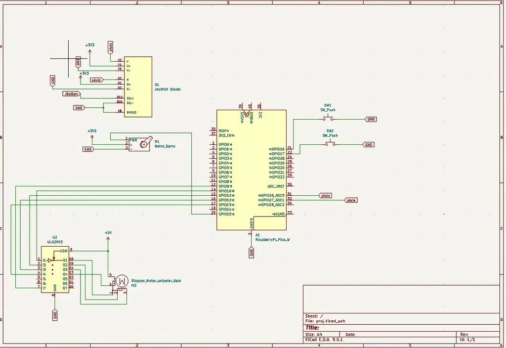

# Crane Controller

Mini crane system using Raspberry Pi Pico 2W.
:::info

**Author**: Stanciu Vlad-Mihai \
**GitHub Project Link**: https://github.com/UPB-PMRust-Students/proiect-StanciuVlad1

:::

---

## Description

The project consists of a **mini crane** built using a **Raspberry Pi Pico 2W**, capable of:

- Rotating the crane arm **left and right** using a **servo motor (SG90)** controlled by a **joystick**.
- Raising and lowering the load using a **stepper motor (28BYJ-48 + ULN2003 driver)**.
- Managing multiple motors **asynchronously** using **Rust** and **Embassy**.
- Controlling the **servo motor** via a **biaxial joystick** for precise horizontal and vertical movements.
- Being powered independently by **external 9V batteries** to avoid overloading the controller.

This setup simulates the mechanical behavior of a real crane, combining both rotation and lifting functionalities.

---

## Motivation

I wanted to build a mechanical system that combines precise motion control and hardware interaction through an embedded controller.  
The project allows practice with PWM signals, motor driving, and simple automation using Rust on the Raspberry Pi Pico.

---

## Architecture

The **Raspberry Pi Pico 2W** acts as the brain of the system:

- **Joystick**: Controls the **servo motor** that rotates the crane arm horizontally (left/right).
- **SG90 Servo Motor**: Moves the crane arm based on joystick input.
- **28BYJ-48 Stepper Motor + ULN2003 Driver**: Raises or lowers the load by winding a string or cable.
- **External 9V Batteries**: Supply power to motors to protect the Pico board.
- **Header Pins**: Simplify wiring connections.

Data flow:

- The joystick sends analog signals, with one axis controlling the **left/right** rotation and the other adjusting the **vertical lifting**.
- Based on joystick direction, Pico adjusts the servo’s PWM signal to rotate the arm or control the lifting mechanism.
- Up/down commands trigger sequences sent to the stepper motor driver.

---

### Block Scheme

## Log

### Week 5 – 11 May

TO DO

### Week 12 – 18 May

TO DO

### Week 19 – 25 May

TO DO

## Components

| Component                                   | Purpose              | Details                               |
| ------------------------------------------- | -------------------- | ------------------------------------- |
| **Raspberry Pi Pico 2W**                    | Main controller      | Runs firmware and manages motors      |
| **Micro Servomotor SG90**                   | Arm rotation         | Controlled horizontally with joystick |
| **28BYJ-48 Stepper Motor + ULN2003 Driver** | Load lifting         | Raises or lowers the crane's load     |
| **9V Battery Holders**                      | External motor power | Separate power source for motors      |
| **Header Pins (2x40p)**                     | Wiring               | Clean motor and sensor connections    |

---

## Hardware Overview

- The **joystick** is connected to analog input pins of the **Pico**.
- Based on joystick movement, the **Pico** sends PWM commands to the **SG90 servo** for **left/right** rotation.
- The **stepper motor** is controlled through step sequences sent to the **ULN2003 driver board**.
- Motors draw their power from **external batteries** to ensure safe operation.
- **Header pins** make the prototyping easier and cleaner.

---

## Schematics

## Bill of Materials

| Product Code     | Device                                                                                                                                                     | Usage                                 | Price                   |
| ---------------- | ---------------------------------------------------------------------------------------------------------------------------------------------------------- | ------------------------------------- | ----------------------- |
| 5056561803975    | [Raspberry Pi Pico 2W](https://www.optimusdigital.ro/ro/raspberry-pi-placi/13327-raspberry-pi-pico-2w.html)                                                | Main controller                       | 39,66 lei               |
| 0104110000022578 | [Micro Servomotor SG90 180°](https://www.optimusdigital.ro/ro/servomotoare/1165-micro-servomotor-9g-sg90.html)                                             | Arm rotation (controlled by joystick) | 11,99 lei               |
| 0104110000008091 | [Set Motor Pas cu Pas 28BYJ-48 + Driver ULN2003](https://www.optimusdigital.ro/ro/motoare-pas-cu-pas/779-motor-pas-cu-pas-5v-28byj-48-driver-uln2003.html) | Load lift system                      | 16,97 lei               |
| 0104210000013344 | [9V Battery Holder](https://www.optimusdigital.ro/ro/surse-de-alimentare/1168-suport-1x-baterie-9v.html)                                                   | Motor power supply                    | 1,29 lei                |
| 0104210000035186 | [Header de Pini Mamă 2x40p 2.54 mm](https://www.optimusdigital.ro/ro/conectori-si-adaptoare/1303-header-mama-2x40p-254-mm.html)                            | Wiring connections                    | 2,99 lei × 2 = 5,98 lei |

---

## Software

| Library                                                                                           | Description          | Usage                                                        |
| ------------------------------------------------------------------------------------------------- | -------------------- | ------------------------------------------------------------ |
| [embassy-rp](https://github.com/embassy-rs/embassy)                                               | RP2040 HAL           | Async GPIO, PWM (servo), timers                              |
| [embedded-hal-async](https://github.com/rust-embedded/embedded-hal)                               | HAL Traits (async)   | Abstracție pentru GPIO, PWM, input polling                   |
| [embedded-hal](https://github.com/rust-embedded/embedded-hal)                                     | HAL Traits (sync)    | Control basic devices like stepper, joystick, buttons        |
| [stepper](https://crates.io/crates/stepper)                                                       | Stepper motor driver | Control of stepper motor movement                            |
| [servo-pwm](https://crates.io/crates/servo-pwm) _(sau direct PWM din embassy)_                    | Servo motor control  | Generare semnal PWM pentru controlul poziției servomotorului |
| [defmt](https://github.com/knurling-rs/defmt) + [defmt-rtt](https://github.com/knurling-rs/defmt) | Logging Framework    | Real-time embedded debugging over RTT                        |
| [panic-probe](https://github.com/knurling-rs/panic-probe)                                         | Panic Handler        | Diagnostic panic messages compatibile cu `defmt`             |
