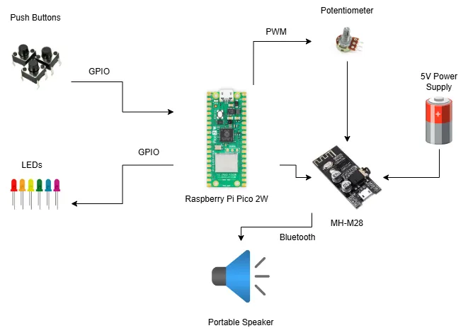

# Raspberry PI-ANO
A compact digital piano with physical keys, wireless audio output via Bluetooth, and interactive sound modes, built on a Raspberry Pi Pico 2W.

:::info 

**Author**: Dragomir Alexandru \
**GitHub Project Link**: https://github.com/UPB-PMRust-Students/project-Alexdr04

:::

## Description

This project is built using a Raspberry Pi Pico 2W, seven push buttons for musical notes, a potentiometer for volume control, and a Bluetooth audio module for wireless sound output. It features a loop mode for recording and repeating note sequences, a distortion toggle for creative audio effects, and status LEDs to indicate the current mode.

## Motivation

I’ve always enjoyed music and wanted to combine that interest with what I’ve learned about embedded systems. This project gives me a fun, hands-on way to explore PWM audio, GPIO input, and Bluetooth output while building something creative and interactive.

## Architecture 



**Controller**:  
  Raspberry Pi Pico 2W — handles all logic, reads button inputs, and generates audio output via PWM.

**Input System**:  
  A set of 7 push buttons for the musical notes and 2 buttons for toggling loop and distortion modes. Connected to the Pico via GPIO.

**Audio Processing Unit**:  
  PWM signal from the Pico is passed through a potentiometer for volume control before reaching the Bluetooth module.

**Output System**:  
  MH-M28 Bluetooth audio module receives the analog signal and transmits it wirelessly to a portable speaker.

**Visual Feedback**:  
  3 LEDs indicate the current playback mode (normal, loop, or distortion). Controlled via GPIO.

**Power Supply**:  
  A 5V external power source powers the MH-M28 module separately from the Pico, ensuring stable Bluetooth audio output.

## Log

<!-- write your progress here every week -->

### Week 5 - 11 May

After my project was approved, I finalized the component list, ordered everything, and began assembling the hardware. I tested the debugger connection with the Raspberry Pi Pico 2W to ensure proper flashing and communication. I also experimented with basic GPIO inputs and outputs to validate button and LED functionality. Additionally, I started drafting the system schematic in KiCad and planned out the initial wiring layout on the breadboard.

### Week 12 - 18 May

### Week 19 - 25 May

## Hardware

The hardware includes a Raspberry Pi Pico 2W as the central controller, connected to seven push buttons for triggering musical notes and two additional buttons: one for enabling loop functionality and one for toggling a distortion effect. A potentiometer adjusts the volume of the PWM audio signal, which is then sent to an MH-M28 Bluetooth module for wireless audio output. Three LEDs indicate the current system status (normal, loop, or distortion). All components are powered via USB and a separate 5V source for the Bluetooth module. The entire system is built on a breadboard for prototyping.

### Schematics


### Bill of Materials

<!-- Fill out this table with all the hardware components that you might need.

The format is 
```
| [Device](link://to/device) | This is used ... | [price](link://to/store) |

```

-->

| Device | Usage | Price |
|--------|--------|-------|
| [Raspberry Pi Pico 2W ×2](https://www.raspberrypi.com/documentation/microcontrollers/raspberry-pi-pico.html) | Microcontroller | [39,66 RON ×2](https://www.optimusdigital.ro/ro/placi-raspberry-pi/13327-raspberry-pi-pico-2-w.html?search_query=raspberry+pi+pico+2w&results=26) |
| [Breadboard 830 points ×2](https://learn.sparkfun.com/tutorials/how-to-use-a-breadboard/all) | Prototyping | [9,98 RON ×2](https://www.optimusdigital.ro/ro/prototipare-breadboard-uri/8-breadboard-830-points.html) |
| [MH-M28 Bluetooth Module](https://sigmanortec.ro/en/bluetooth-42-ble-audio-module-stereo-mh-m28) | Audio output | [13,29 RON](https://www.optimusdigital.ro/ro/wireless-bluetooth/8124-modul-pentru-transmisie-audio-fara-fir-ble-stereo-mh-m28.html?search_query=mh-m28&results=14) |
| [Rotary Potentiometer 10kΩ](https://docs.sunfounder.com/projects/kepler-kit/en/latest/component/component_potentiometer.html#potentiometer) | Volume control | [1,99 RON](https://www.optimusdigital.ro/ro/componente-electronice-potentiometre/1886-potentiometru-stereo-10k.html?search_query=potentiometru&results=172) |
| [Tactile Button 6x6x6 ×9](https://docs.sunfounder.com/projects/kepler-kit/en/latest/component/component_button.html#button) | User input | [0,36 RON ×9](https://www.optimusdigital.ro/ro/butoane-i-comutatoare/1119-buton-6x6x6.html?search_query=butoane+6x6x6&results=1) |
| [White LED 5mm](https://www.electronics-tutorials.ws/diode/diode_8.html) | Mode indicator | [0,49 RON](https://www.optimusdigital.ro/ro/optoelectronice-led-uri/930-led-alb-de-3-mm-cu-lentile-transparente.html?search_query=led+alb&results=175) |
| [Red LED 5mm](https://www.electronics-tutorials.ws/diode/diode_8.html) | Mode indicator | [0,39 RON](https://www.optimusdigital.ro/ro/optoelectronice-led-uri/29-led-set-3-culori-x-10-pcs-fiecare.html?search_query=led+rosu&results=166) |
| [Green LED 5mm](https://www.electronics-tutorials.ws/diode/diode_8.html) | Mode indicator | [0,29 RON](https://www.optimusdigital.ro/ro/optoelectronice-led-uri/931-led-verde-de-3-mm-cu-lentile-transparente.html?search_query=led+verde&results=90) |
| [Resistor 220Ω ×3](https://docs.sunfounder.com/projects/kepler-kit/en/latest/component/component_resistor.html) | LED limiter | [0,10 RON ×3](https://www.optimusdigital.ro/ro/componente-electronice-rezistoare/1097-rezistor-025w-220.html?search_query=rezistor+220&results=22) |
| [Male-to-Male Jumper Wires](https://www.circuitbasics.com/how-to-use-breadboard-jumper-wires/) | Connections | [7,98 RON](https://www.optimusdigital.ro/ro/fire-fire-mufate/890-set-fire-tata-tata-40p-30-cm.html?search_query=tata+tata&results=693) |
| [Male-to-Female Jumper Wires](https://www.circuitbasics.com/how-to-use-breadboard-jumper-wires/) | Connections | [3,99 RON](https://www.optimusdigital.ro/ro/toate-produsele/876-set-fire-mama-tata-10p-15-cm.html?search_query=jumper&results=70) |
| [5V Breadboard Power Supply Module](https://howtomechatronics.com/tutorials/electronics/breadboard-power-supply-module/) | Power supply | [4,69 RON](https://www.optimusdigital.ro/ro/electronica-de-putere-stabilizatoare-liniare/61-sursa-de-alimentare-pentru-breadboard.html) |


## Software

| Library | Description | Usage |
|---------|-------------|-------|
| [embassy](https://github.com/embassy-rs/embassy) | Asynchronous framework for embedded development in Rust | Used to handle GPIO events and multitasking |
| [rp2040-hal](https://github.com/rp-rs/rp-hal) | Hardware Abstraction Layer for Raspberry Pi RP2040 microcontrollers | Provides access to GPIO, ADC, PWM, and other peripherals |
| [embedded-hal](https://github.com/rust-embedded/embedded-hal) | Generic traits for embedded hardware abstraction | Interfaces with drivers like LEDs and buttons |
| [defmt](https://github.com/knurling-rs/defmt) | Lightweight logging crate for embedded systems | Debugging and formatted logging |
| [probe-rs](https://github.com/probe-rs/probe-rs) | Debug probe support for Rust-embedded development | Used to flash firmware and debug via the second Pico |
| [heapless](https://github.com/japaric/heapless) | Data structures without dynamic memory allocation | Used for storing note sequences in loop mode |


## Links

<!-- Add a few links that inspired you and that you think you will use for your project -->

1. [inspiration](https://gurgleapps.com/learn/projects/diy-raspberrypi-pico-piano-project)


