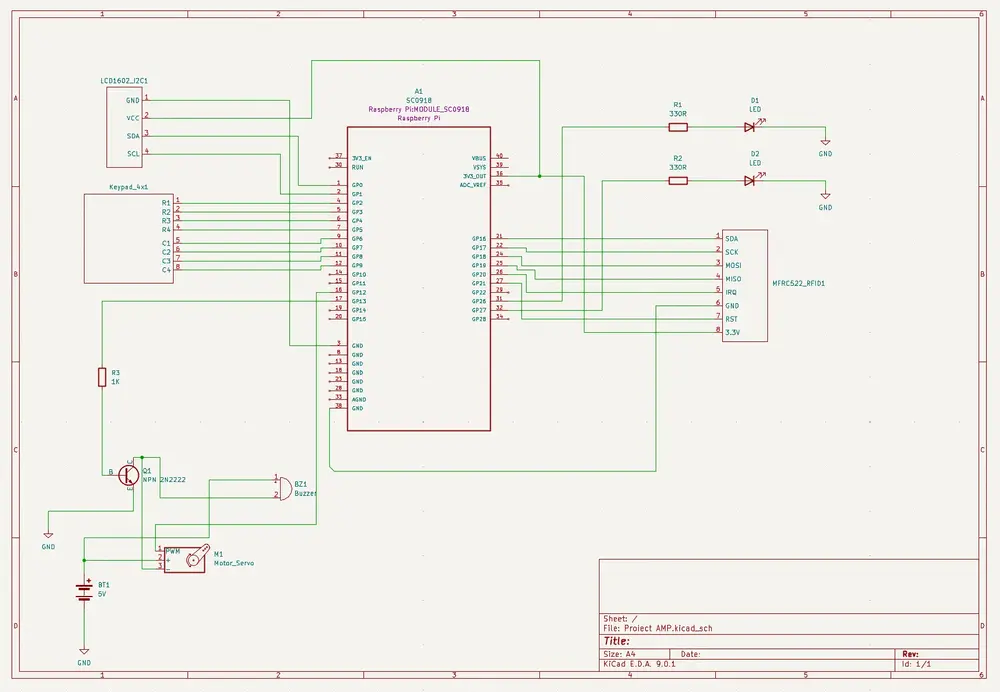

# Dual-Mode Access Control System

Dual-Mode Access Control System with RFID and Keypad using Raspberry Pi Pico 2W

:::info 

**Author**: BÎTLAN Adrian-Gabriel \
**GitHub Project Link**:  https://github.com/UPB-PMRust-Students/project-Bitlee1407

:::

## Description

This project implements a smart, dual-mode access control system using the Raspberry Pi Pico 2W. It allows entry through either RFID authentication or a PIN code entered via a keypad. A successful authentication unlocks a servo motor simulating door access, lights up a green LED, and plays a confirmation beep. Unsuccessful attempts trigger a red LED and a warning tone. The system is built entirely in Rust using the Embassy asynchronous framework, ensuring efficient multitasking and responsive hardware control.

## Motivation

In an increasingly connected world, secure and flexible access control solutions are essential. Traditional keys are inconvenient and often insecure. RFID and PIN-based systems offer better control, and combining both in one embedded system offers even greater flexibility and security. By using the Rust programming language and the Embassy async framework, this project demonstrates modern embedded development with safe concurrency, targeting real-world problems. The use of both keypad and RFID readers adds redundancy and versatility, making the system ideal for shared workspaces, maker labs, or educational facilities.


## Architecture 

he heart of the system is the **Raspberry Pi Pico 2W**, which acts as the main controller, coordinating all connected components via its GPIO, I2C, SPI, and PWM interfaces.

The **LCD1602 display** with an I2C interface is responsible for showing status messages and prompts. It is connected to **GPIO0** (SDA, Pin 1) and **GPIO1** (SCL, Pin 2), powered by the Pico's **3.3V (Pin 36)** and grounded at **GND (Pin 38)**.

User input is captured through a **4x4 Matrix Keypad**, which uses 8 GPIOs for scanning: **GPIO2 to GPIO9** (Pins 4 to 11). The keypad is powered from the **3.3V** rail and shares ground with the Pico.

The **RC522 RFID Reader** communicates via SPI. It connects as follows: **SDA to GPIO16 (CS, Pin 21)**, **SCK to GPIO18 (Pin 24)**, **MOSI to GPIO19 (Pin 25)**, **MISO to GPIO20 (Pin 26)**, **RST to GPIO17 (Pin 22)**, and **IRQ to GPIO22 (Pin 29)**. It draws power from the **3.3V (Pin 36)** and is grounded to **GND (Pin 38)**.

Two LEDs are used to visually indicate access status. The **Green LED** is connected to **GPIO26 (Pin 31)**, and the **Red LED** is connected to **GPIO27 (Pin 32)**, both with current-limiting resistors to ground.

A **Servo Motor** is responsible for physically simulating door lock movement. Its PWM signal is controlled via **GPIO28 (Pin 34)**. The motor is powered directly from an **external 5V battery** through a shared **NPN transistor switch**, ensuring it doesn't overload the Pico.

A **Buzzer** is used for audio feedback and shares the same control transistor as the servo motor. The transistor's **base** is connected through a resistor to **GPIO15 (Pin 20)**, its **collector** to the GND side of the motor and buzzer, and its **emitter** to **GND**. The positive side of the buzzer and servo is wired to the **5V external battery’s V+**.

The **external 5V battery** is connected with its **V+** feeding the servo and buzzer, and its **GND** tied to the Pico’s **GND (Pin 38)** to ensure a common reference.

## Log

<!-- write your progress here every week -->

### Week 5 - 11 May

### Week 12 - 18 May

### Week 19 - 25 May

## Hardware

Detail in a few words the hardware used.

### Schematics



### Bill of Materials

<!-- Fill out this table with all the hardware components that you might need.

The format is 
```
| [Device](link://to/device) | This is used ... | [price](link://to/store) |

```

-->

| Device | Usage | Price |
|--------|--------|-------|
| [Raspberry Pi Pico 2 W](https://www.raspberrypi.com/documentation/microcontrollers/pico-series.html#pico-2-family) | The main board | [40 LEI](https://www.optimusdigital.ro/ro/placi-raspberry-pi/13327-raspberry-pi-pico-2-w.html) |
| [MFRC522 RFID Reader](https://www.handsontec.com/dataspecs/RC522.pdf) | Reads RFID tags | [10 LEI](https://www.optimusdigital.ro/ro/wireless-rfid/67-modul-cititor-rfid-mfrc522.html?search_query=Modul+RFID+RC522+%28similar+cu+MFRC522%29&results=1) |
| [LCD1602 with I2C](https://www.handsontec.com/dataspecs/module/I2C_1602_LCD.pdf) | Displays prompts and status | [17 LEI](https://www.optimusdigital.ro/ro/optoelectronice-lcd-uri/2894-lcd-cu-interfata-i2c-si-backlight-albastru.html?search_query=0104110000003584&results=1) |
| [4x4 Matrix Keypad](https://cdn.sparkfun.com/assets/f/f/a/5/0/DS-16038.pdf) | PIN input method | [7 LEI](https://www.optimusdigital.ro/ro/senzori-senzori-de-atingere/470-tastatura-matriceala-4x4-cu-conector-pin-de-tip-mama.html?search_query=0104110000002747&results=1) |
| [SG90 Servo Motor](http://www.ee.ic.ac.uk/pcheung/teaching/DE1_EE/stores/sg90_datasheet.pdf) | Used to move the barrier | [12 LEI](https://www.optimusdigital.ro/ro/motoare-servomotoare/2261-micro-servo-motor-sg90-180.html) |
| [Buzzer Pasiv](https://www.handsontec.com/dataspecs/module/passive%20buzzer.pdf) | Emits sound feedback | [2 LEI](https://www.optimusdigital.ro/ro/audio-buzzere/634-buzzer-pasiv-de-5-v.html?search_query=0104210000007343&results=1) |
| [NPN Transistor (2N2222)](https://datasheet4u.com/pdf-down/2/N/2/2N2222-SEMTECH.pdf) | Controls servo & buzzer | [0.20 LEI](https://www.optimusdigital.ro/ro/componente-electronice-tranzistoare/935-tranzistor-s9013-npn-50-pcs-set.html?search_query=Tranzistor+NPN+2n2222+TO-92&results=9) |
| [GREEN Led](https://www.farnell.com/datasheets/1498852.pdf) | Indicates "Access Permitted." | [0.40 LEI](https://www.optimusdigital.ro/en/leds/38-5-mm-green-led-with-difused-lens.html?search_query=led&results=2049) |
| [RED Led](https://www.farnell.com/datasheets/1498852.pdf) | Indicates "Access Denied." | [0.40 LEI](https://www.optimusdigital.ro/en/leds/29-5-mm-red-led-with-difused-lens.html?search_query=led&results=2179)    |
| [Breadboard](https://www.optimusdigital.ro/ro/prototipare-breadboard-uri/8-breadboard-830-points.html) | Put components on it | [30 LEI](https://www.optimusdigital.ro/ro/prototipare-breadboard-uri/8-breadboard-830-points.html) |
| [Female-to-Male Wires](https://www.optimusdigital.ro/ro/fire-fire-mufate/650-fire-colorate-mama-tata-10p.html?search_query=0104210000003871&results=1) | For wiring | [3 LEI](https://www.optimusdigital.ro/ro/fire-fire-mufate/650-fire-colorate-mama-tata-10p.html?search_query=0104210000003871&results=1) |
| [Male-to-Male Wires](https://www.optimusdigital.ro/ro/fire-fire-mufate/885-set-fire-tata-tata-10p-10-cm.html?search_query=0104210000009040&results=1) | For wiring | [30 LEI](https://www.optimusdigital.ro/ro/fire-fire-mufate/885-set-fire-tata-tata-10p-10-cm.html?search_query=0104210000009040&results=1) |

## Software

| Library | Description | Usage |
|---------|-------------|-------|
| [embassy-executor](https://docs.embassy.dev/embassy-executor/git/cortex-m/index.html) | Async task executor for embedded systems | Runs concurrent tasks like keypad scanning, RFID polling, and feedback control |
| [embassy-rp](https://docs.embassy.dev/embassy-rp/git/rp235xb/index.html) | Hardware abstraction layer for the RP2040 | Interfaces with peripherals like SPI (RFID), I2C (LCD), GPIO (LEDs), and PWM (Servo) |
| [embassy-time](https://docs.embassy.dev/embassy-time/git/default/index.html) | Timers and delays for async code | Implements non-blocking delays and timeout logic |
| [embassy-sync](https://docs.embassy.dev/embassy-sync/git/default/index.html) | Async synchronization primitives | Coordinates shared access to peripherals across tasks |
| [embedded-hal](https://docs.rs/embedded-hal/latest/embedded_hal/) | Unified hardware interface traits | Defines abstract traits for embedded drivers |
| [embedded-hal-async](https://docs.rs/embedded-hal-async/latest/embedded_hal_async/) | Async traits for embedded-hal | Enables async I2C, SPI, and GPIO interfaces for peripheral drivers |
| [defmt](https://docs.rs/defmt/latest/defmt/) | Lightweight logging for embedded systems | Used to debug the system without printing over serial |
| [defmt-rtt](https://docs.rs/defmt-rtt/latest/defmt_rtt/) | Logging backend via RTT | 	Sends logs through debug probes to the host for analysis |

## Links

<!-- Add a few links that inspired you and that you think you will use for your project -->

1. [link](https://example.com)
2. [link](https://example3.com)
...
