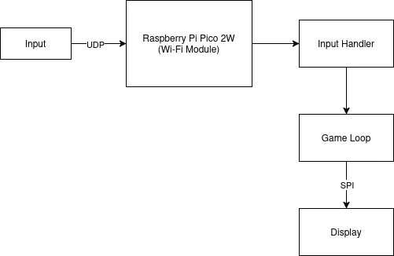
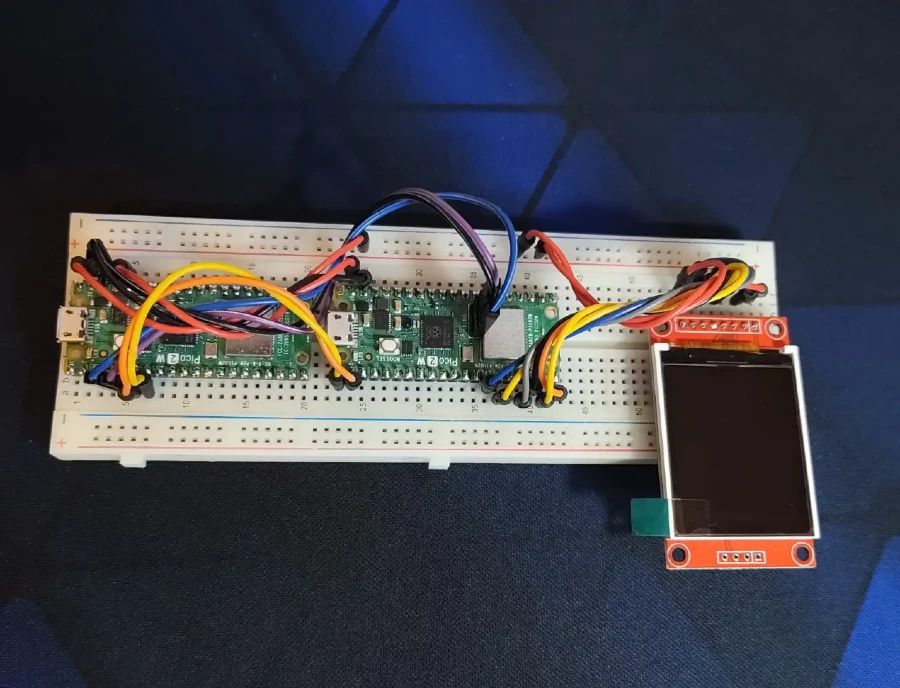
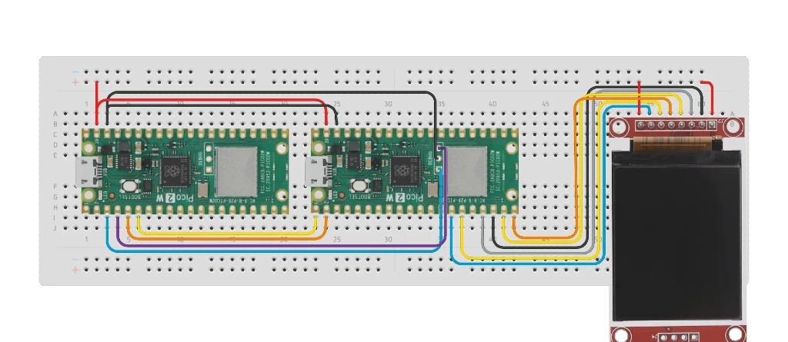

# pico-console
A retro games console supporting multiplayer.

:::info 

**Author**: Lungu Adrian-Costin \
**GitHub Project Link**: https://github.com/UPB-PMRust-Students/project-addrian-77

:::

## Description

The **pico-console** is a compact, embedded retro game console built using Rust and the Raspberry Pi Pico 2W microcontroller. It receives player inputs through WIFI using UDP, simplifying the hardware design.

## Motivation

I've always been passionate about video games, from playing to observing how they work, experimenting with settings and game modifications. Building a game console felt like a natural decision, helping me better understand embedded systems and low-level programming in Rust.

## Architecture 
#### Schematic diagram


**Raspberry Pi Pico 2W**
 - **Role:** Processing user inputs, updating and sending frames
 - **Connections:** LCD Display

**LCD Display**
 - **Interface:** SPI
 - **Connections:** 
    - **SCK** (Serial clock) to GPIO 10
    - **SDA** (Serial data) to GPIO 11
    - **RST** (Reset) to GPIO 14 
    - **CS** (Chip Select) to GPIO 13
    - **DC** (Data/Command) to GPIO 15
## Log

<!-- write every week your progress here -->

### Week 7 - 13 April
Tested the display, made the controller webserver in Rust.
### Week 14 - 20 April
Implemented the UDP socket on the RP Pico, drawing received data on the screen.
### Week 28 April - 4 May
Created a menu interface with working inputs and a working 2-player snake game.
### Week 5 - 11 May

### Week 12 - 18 May

### Week 19 - 25 May

## Hardware

Due to the inputs being handled through Wi-Fi, the hardware is very simple, consisting of 2 **Raspberry Pi Pico 2W** microcontrollers and a **ST7735** LCD 128x160 display.



### Schematics

##### Wiring diagram



### Bill of Materials

<!-- Fill out this table with all the hardware components that you might need.

The format is 
```
| [Device](link://to/device) | This is used ... | [price](link://to/store) |

```

-->

| Device | Usage | Price |
|--------|--------|-------|
| 2 x [Raspberry Pi Pico 2W](https://datasheets.raspberrypi.com/picow/pico-2-w-datasheet.pdf) | The microcontroller | [79.32 RON (2 x 39.66 RON)](https://www.optimusdigital.ro/ro/placi-raspberry-pi/13327-raspberry-pi-pico-2-w.html) |
| [ST7735 LCD Display](https://www.displayfuture.com/Display/datasheet/controller/ST7735.pdf) | The display | [28.99 RON](https://www.optimusdigital.ro/en/lcds/1311-modul-lcd-spi-de-18-128x160.html) |
| [Breadboard](https://www.optimusdigital.ro/en/breadboards/8-breadboard-hq-830-points.html) | Base for components | [9.98 RON](https://www.optimusdigital.ro/en/breadboards/8-breadboard-hq-830-points.html) |
| [Wires (male-male)](https://www.optimusdigital.ro/en/wires-with-connectors/12-breadboard-jumper-wire-set.html) | Connecting components | [7.99 RON](https://www.optimusdigital.ro/en/wires-with-connectors/12-breadboard-jumper-wire-set.html) |
| [Wires (male-female)](https://www.optimusdigital.ro/en/all-products/876-15-cm-male-female-wires-10p.html) | Connecting components | [4.45 RON](https://www.optimusdigital.ro/en/all-products/876-15-cm-male-female-wires-10p.html) |

## Software

| Library | Description | Usage |
|---------|-------------|-------|
| [cyw43](https://docs.rs/cyw43) | Internet driver for RP Pico | Setting up the Wi-Fi chip |
| [embassy-rp](https://crates.io/crates/embassy-rp) | Hardware Abstraction Layer for RP2350 | Setting up SPI and GPIO |
| [embassy_net](https://crates.io/crates/embassy-net) | Network stack for embedded systems | Setting up the UDP Socket |
| [embassy_time](https://crates.io/crates/embassy-time) | Provides timekeeping, delays | Managing game loop times |
| [embassy_sync](https://crates.io/crates/embassy-sync) | Offers synchronization primitives and data structures with async support | Sending data between tasks |
| [mipidsi](https://crates.io/crates/mipidsi) | Generic driver for TFT displays | Rendering graphics using the ST7735 |
| [embedded-graphics](https://crates.io/crates/embedded-graphics) | 2D graphics library with primitives, text and images | Rendering visuals, UI elements and text |
| [heapless](https://crates.io/crates/heapless) | Data structures that don't require dynamic memory allocation, suitable for no-std | Storing game data in vectors and queues |
| [rand](https://crates.io/crates/rand) | Random number generation | Randomizing game events |
| [defmt](https://crates.io/crates/defmt) | Highly efficient logging framework for microcontrollers | Logging debugging information during development and testing |


## Links

<!-- Add a few links that inspired you and that you think you will use for your project -->

1. [embassy examples for RP](https://github.com/embassy-rs/embassy/tree/main/examples)
