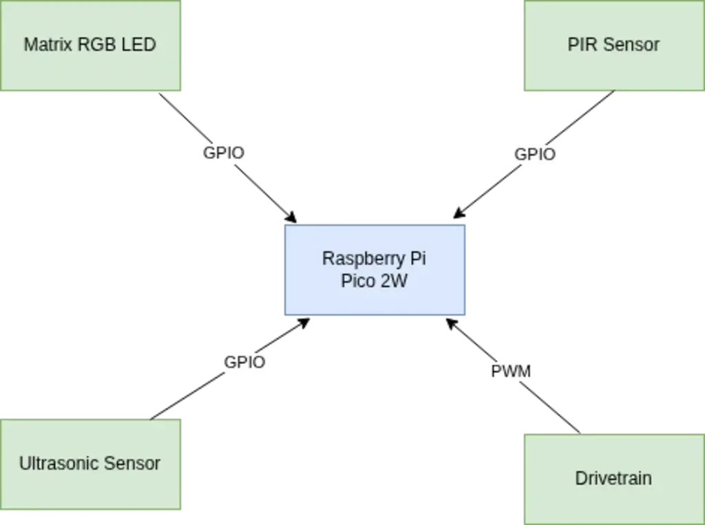
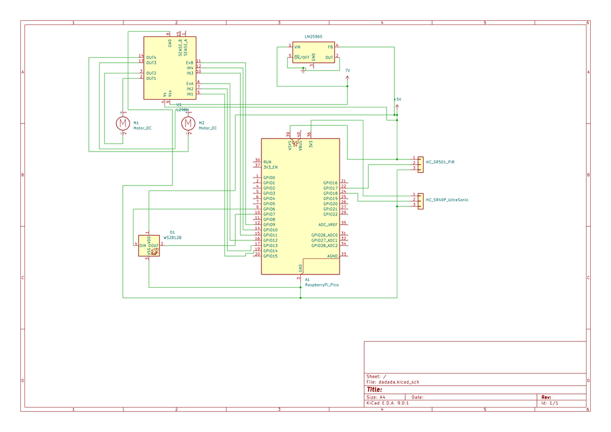

# Security-Robot
Security robot that detects motion, avoids obstacles, displays facial expressions and sends real-time Telegram alerts.
:::info

**Author**: Alexandru-Costin Dumitrache\
**GitHub Project Link**:https://github.com/UPB-PMRust-Students/project-qnight99

::::
## Description
This project uses a Raspberry Pi Pico W as the brain of security robot. The robot is equipped with motion and ultrasonic sensors for intruder detection and obstacle avoidance, DC motors for movement, and a facial display made of an RGB LED matrix. The LED face changes expression depending on its environment-green (happy) when safe, and red (angry) when detecting motion or obstacles. It connects to Wi-Fi to send alerts to a Telegram bot, allowing real-time monitoring.
## Motivation
The inspiration for this project came from two sources. First, I saw a robot dog on TikTok that could move autonomously and respond to its environment. It looked alive and expressive, which sparked the idea of building something similar—simple, fun, and reactive—but using only the components I had access to. Second, as a fan of the game Rust, I liked how the game alerts you in real-time if someone invades your base. I thought it would be interesting to bring that concept into the real world by making a small robot that can guard an area, detect movement, and notify you instantly through Telegram. 
## Architecture 

### Schematic Diagram

**Raspberry Pi Pico 2W**
- **Role**: Acts as the brain of the robot-handling sensor input, controlling motors, facial expressions and Wi-Fi communication.
- **Connections**: GGPIO pins for motor control, sensor data,SPI/I2C for RGB Matrix,ADC for ultrasonic sensor,UART/Wi-Fi libraries for Telegram

**PIR Motion Sensor**
- **Interface**: GPIO
- **Role**: Detects motion from potential "intruders".

**Ultrasonic Sensor - HC-SR04**
- **Interface**: TRIG and ECHO pins connected to GPIO
- **Role**: Obstacle detection for navigation

**RGB LED Matrix**
- **Interface**: GPIO
- **Role**:  Shows a “face” that reacts to environment (happy/angry).
- **Expression Logic**: Green when safe(no motion,no obstacle) and Red when motion is detected.

 **2x DC Motors and L298N Motor Driver Module**
  - **Interface**: GPIO, PWM
  - **Role**: Movement

 **LM2596S Step-Down**
  - **Role**: Voltage reduction from ~7V to 5V

  
  
## Log
### Week 6-7
After the project was approved, I gathered most of the necessary parts for the project.

### Week 8-9
I also began designing a 3D model for the chassis of the robot, but I haven't decided yet about the final product. I started the hardware assembly and made the sensors and the alerts on telegram work except the movement part because I don't have the chassis yet, nor the wheels.

## Hardware
The core of the project is the Raspberry Pi Pico 2W, which controls all the peripherals and handles logic, sensing, and communication. For motion detection, a PIR sensor is used to detect any presence or movement in the area being monitored. An ultrasonic sensor is mounted at the front of the robot to detect obstacles and prevent collisions during navigation.
For movement, the robot uses two DC motors connected to a motor driver module, allowing it to drive forward, backward, and turn left or right.
The robot has a RGB LED matrix mounted on the front, representing a face. It displays different expressions: green and smiling when the environment is safe, and red and angry when danger is detected (motion is sensed).

### Schematics

### Bill of Materials
| Device                                                  | Usage                        | Price                           |
|---------------------------------------------------------|------------------------------|---------------------------------|
| [Raspberry Pi Pico 2W](https://www.raspberrypi.com/documentation/microcontrollers/pico-series.html) | The microcontroller | [40 RON](https://www.optimusdigital.ro/en/raspberry-pi-boards/13327-raspberry-pi-pico-2-w.html?srsltid=AfmBOoo5CQdoi14-RbmA_YJJrNUG1hPBzlSKgPdCOYv9U2PgJdK3bPwM) |
[PIR Sensor](https://www.mpja.com/download/31227sc.pdf) | Motion-detection  | [6 RON](https://www.optimusdigital.ro/ro/senzori-senzori-pir/106-modul-senzor-pir-hc-sr501.html?search_query=pir&results=292) |
[Ultrasonic Sensor](https://cdn.sparkfun.com/datasheets/Sensors/Proximity/HCSR04.pdf) | To avoid obstacles | [6.49 RON](https://www.optimusdigital.ro/ro/senzori-senzori-ultrasonici/9-senzor-ultrasonic-hc-sr04-.html?search_query=ultra+sonic&results=47) |
[L298N Dual H-Bridge Motor Driver](https://www.st.com/resource/en/datasheet/l298.pdf) | Controls two DC Motors | [11 RON](https://www.optimusdigital.ro/ro/drivere-de-motoare-cu-perii/145-driver-de-motoare-dual-l298n.html?search_query=L298N&results=4) |
[2xDC Motors](https://ardushop.ro/en/electronics/833-1152-micro-motor-with-reduction-gears.html#/390-rpm-500) | Movement | [59.40 RON](hhttps://ardushop.ro/en/electronics/833-1152-micro-motor-with-reduction-gears.html#/390-rpm-500) |
[Matrix Led](https://www.optimusdigital.ro/en/led-matrices/5663-5x8-matrix-with-ws2812b-addressable-rgb-leds.html) | For the "face" | [79 RON](https://www.optimusdigital.ro/en/led-matrices/5663-5x8-matrix-with-ws2812b-addressable-rgb-leds.html) |
[LM2596S](https://www.optimusdigital.ro/en/adjustable-step-down-power-supplies/150-lm2596-adj-power-supply-module.html) | Voltage reduction | [5.21 RON](https://www.optimusdigital.ro/en/adjustable-step-down-power-supplies/150-lm2596-adj-power-supply-module.html) |

## Software

| Crate | Description | Documentation |
|-------|-------------|----------------|
| [`embassy-rp`](https://crates.io/crates/embassy-rp) | Hardware support package for Raspberry Pi Pico using the Embassy framework | [Docs.rs](https://docs.rs/embassy-rp) |
| [`embassy-executor`](https://crates.io/crates/embassy-executor) | Async/await executor for embedded devices | [Docs.rs](https://docs.rs/embassy-executor) |
| [`embassy-time`](https://crates.io/crates/embassy-time) | Timing utilities (delays, timeouts, clocks) for embedded async Rust | [Docs.rs](https://docs.rs/embassy-time) |
| [`embassy-sync`](https://crates.io/crates/embassy-sync) | Async-aware synchronization primitives (Mutex, Channel, Signal) | [Docs.rs](https://docs.rs/embassy-sync) |
| [`embedded-hal-async`](https://crates.io/crates/embedded-hal-async) | Asynchronous embedded Hardware Abstraction Layer | [Docs.rs](https://docs.rs/embedded-hal-async) |
| [`ili9341`](https://crates.io/crates/ili9341) | Driver for ILI9341 TFT displays over SPI | [Docs.rs](https://docs.rs/ili9341) |
| [`embedded-graphics`](https://crates.io/crates/embedded-graphics) | 2D graphics library for drawing text and shapes on embedded displays | [Docs.rs](https://docs.rs/embedded-graphics) |
| [`gpio`](https://crates.io/crates/gpio) | GPIO abstraction for embedded systems (depending on usage, may be HAL-specific) | [Docs.rs](https://docs.rs/gpio) |
| [`adc`](https://crates.io/crates/adc) | Analog-to-Digital Converter interface (might be included via `embassy-rp`) | [Docs.rs](https://docs.rs/adc) |
| [`pwm`](https://crates.io/crates/pwm) | Pulse Width Modulation abstraction (included in HAL or platform crate) | [Docs.rs](https://docs.rs/pwm) |
| [`reqwest`](https://crates.io/crates/reqwest) *(Optional)* | Used for sending Telegram messages over HTTP (only available on std, not embedded) | [Docs.rs](https://docs.rs/reqwest) |

## Links
1. https://www.youtube.com/watch?v=ioDFU68lt2E
2. https://www.youtube.com/watch?v=-l2QIIpeXSs

