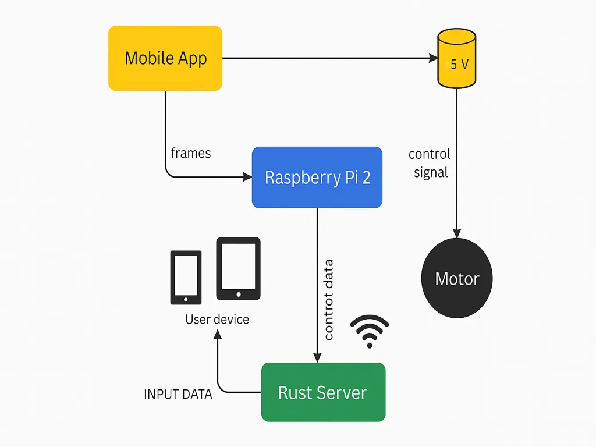
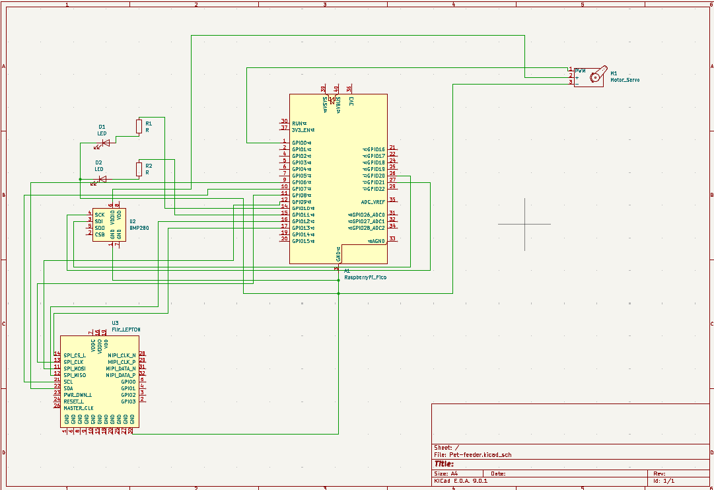

# Pet feeder
A simple solution for feeding your pet when you are away from home.

:::info

**Author**: Alexandra Negut \
**GitHub Project Link**: [link_to_github](https://github.com/UPB-PMRust-Students/project-NegutAlexandra)

:::

## Description

Growing up, I was always surrounded by pets and animals at home. One recurring problem we faced as a family was the difficulty of traveling, since we always had to find someone to feed our pets while we were away. This inspired me to create the Pet Feeder — a simple and effective solution that ensures your pet is fed, even when you're on vacation. You just need to fill the feeder with food, and the automated system will take care of feeding your pet at the right time, giving you peace of mind and freedom to enjoy your holidays.

## Motivation

I choose this project because i have a pet and sometimes i have the same problem with feeding him when i am away from home. And I also wanted a project with a complex hardware that would help me in my daily life.

## Architecture 

The main components for my project are:
- Raspberry Pico: Serves as the core controller, running the software logic and handling GPIO control for the motor and Wi-Fi communication.
- Servo Motor: Dispenses a user-defined quantity of pet food (20 grams) by rotating a mechanism for a set time or number of steps
- Wi-Fi Module: Enables the Raspberry Pi to communicate with a mobile or web app, allowing remote control of the feeding process.
- Power Supply (5V): Powers the Raspberry Pi and motor
- Load Cell HX711: Measures weight of the food in grams

Connection Overview:
- mobile app (connected with wi-fi to my hardware project)
- network module (logical layer that helps my app communicate with the raspberry pi)
- controller (it receives commands from the network module, validates the command and activates the command)
- feeding mechanism controller (a software module that sends signals to a motor or servo motor to release grains)
- status feedback module (send feedback back to the app)

Here is the logic of how they connect:

From the MOBILE APP using WI-FI we connect with the NETWORK MODULE, after connecting with CONTROLLER then delivering the information to feeding mechanism controller using the motor via GPIO or to STATUS FEEDBACK MODULE sending the final information back to the MOBILE APP.

Let's take an actual situation:

The user selects the amount of food (20 grams) in the MOBILE APP, which sends the command to the Raspberry Pi over Wi-Fi using HTTP or MQTT. A NETWORK MODULE on the Pi receives the request and passes it to the controller logic. THE CONTROLLER calculates how long the FEEDING MECHANISM CONTROLLER should run to dispense the requested amount and activates the motor via GPIO pins. Once the feeding is complete the system sends a status update back to the MOBILE APP, confirming that the food was dispensed successfully.

## Log

### Week 28 April - 4 May

I started to work on the theoretical part of the project. And also bought some of the hardware parts. Mounted PICO on the bread board. 

### Week 5 - 11 May

### Week 12 - 18 May

### Week 19 - 25 May

## Hardware

- Pico Raspberry Pi 2 - central processing unit of the Pet Feeder
- Servo Motor - dispenses food
- Load cell - measures weight
- Ultrasonic sensor HX711 - amplifies and converts the load cell's analog signalsto digital
- Power supply - standard 5V supply
- 3D printed - for a better looking project

### Schematics

### Bill of Materials

| Device              | Usage                                   | Price       |
|------------------------|-----------------------------------------|-------------|
| [Raspberry Pi Pico W](https://www.raspberrypi.com/documentation/microcontrollers/raspberry-pi-pico.html)  | The microcontroller                     |[34.50 RON](https://www.optimusdigital.ro/ro/placi-raspberry-pi/12394-raspberry-pi-pico-w.html?search_query=raspberry+pico+pi&results=26)|
| [Servo Motor](https://towerpro.com.tw/product/sg90-7/)         | Dispenses pet food                      |[13.99 RON](https://www.optimusdigital.ro/ro/motoare-servomotoare/26-micro-servomotor-sg90.html?search_query=servo+motor&results=145)             |
| [Load Cell + HX711](https://www.alldatasheet.com/datasheet-pdf/pdf/1132222/AVIA/HX711.html)      | Measures food weight in grams           |[5.99 RON](https://www.optimusdigital.ro/ro/senzori-altele/130-modul-de-intrumentatie-hx711.html?search_query=load+cell&results=6)             |
| [Power Supply (5V)+ battery](https://www.optimusdigital.ro/ro/electronica-de-putere-stabilizatoare-liniare/61-sursa-de-alimentare-pentru-breadboard.html?srsltid=AfmBOoqgCHzO-wSMsJHQoUB-mpnJBmy0lsqQM51_HEq80k7U6v0_kYeJ)      | Powers the system                       |[4.69 RON](https://www.optimusdigital.ro/ro/electronica-de-putere-stabilizatoare-liniare/61-sursa-de-alimentare-pentru-breadboard.html?gad_source=1&gad_campaignid=19615979487&gbraid=0AAAAADv-p3AfplsCNHBzjgzLSoZOCd7e7&gclid=Cj0KCQjwoNzABhDbARIsALfY8VMgIxIt7sxVsb6orfH-sYjIn5ZedrOHvsIzoqp3dzuzE9GST2tNXd8aAoMDEALw_wcB)             |
| [Debug probe](https://www.raspberrypi.com/documentation/microcontrollers/debug-probe.html)  | Debugs the program | [62.62 RON](https://www.tme.eu/ro/details/sc0889/raspberry-pi-accesorii/raspberry-pi/debug-probe/?brutto=1&currency=RON&utm_source=google&utm_medium=cpc&utm_campaign=RUMUNIA%20%5BPLA%5D%20CSS&gad_source=1&gad_campaignid=10591401989&gbraid=0AAAAADyylhLIalzdikROUJ5OaesMylBGh&gclid=Cj0KCQjwoNzABhDbARIsALfY8VPhRLmm3ZYvX88qYYSuwuyljeRuP47NEkTOQakHe_OXlYOwL8TLZfQaAmRzEALw_wcB)|
| [15 cm 10p Male-Female Wires](https://www.optimusdigital.ro/en/all-products/876-15-cm-male-female-wires-10p.html?search_query=male-male&results=808) | Male-Female Wires | [4.45 RON](https://www.optimusdigital.ro/en/all-products/876-15-cm-male-female-wires-10p.html?search_query=male-male&results=808) |
| [10 cm 40p Male-Female Wires](https://www.optimusdigital.ro/en/wires-with-connectors/653-10-cm-40p-male-to-female-wire.html?search_query=male-male&results=808) | Male-Male Wires | [5.99 RON](https://www.optimusdigital.ro/en/wires-with-connectors/653-10-cm-40p-male-to-female-wire.html?search_query=male-male&results=808) |
| [Breadboard](https://www.optimusdigital.ro/ro/prototipare-breadboard-uri/13244-breadboard-175-x-67-x-9-mm.html?search_query=bread+board&results=129) | Motherboard | [11.99 RON](https://www.optimusdigital.ro/ro/prototipare-breadboard-uri/13244-breadboard-175-x-67-x-9-mm.html?search_query=bread+board&results=129) |

## Software

| Library | Description | Usage |
|---------|-------------|--------|
| [pwm](https://docs.rs/pwm-pca9685/latest/pwm_pca9685/) | Pulse-Width modulation| Traits for the RP2040 microcontroller used for controlling the servo motor |
| [embassy-rp](https://docs.embassy.dev/embassy-rp/git/rp235xb/index.html) | Access to the pheripherals | Initializing and interacting with peripherals |
| [embassy-executor](https://docs.embassy.dev/embassy-executor/git/cortex-m/index.html) | An async executor designed for embedded usage | Used for asynchronous programming |
| [embassy-time](https://docs.embassy.dev/embassy-time/git/default/index.html) | Timekeeping, delays and timeouts | Used for any delays |
| [embassy-sync](https://docs.embassy.dev/embassy-sync/git/default/index.html) | Synchronization primitives and data structures with async support | Used for providing channels, mutexes, signals |
| [defmt](https://docs.rs/defmt/latest/defmt/) | A highly efficient logging framework that targets resource-constrained devices, like microcontrollers | Used for log messages with very small binary size and debugging embedded systems |
| [defmt rtt](https://docs.rs/defmt-rtt/latest/defmt_rtt/) | A very highly efficient logging framework because of rtt | Diagnose crashes or panics with clear, compressed messages |
| [cyw43](https://docs.embassy.dev/cyw43/git/default/index.html) | It enables wireless communication, allowing your embedded Rust code to connect to Wi-Fi networks | Adding Wi-Fi capability to your Pico W for remote control, cloud communication, or app integration |
| [cyw43-pio](https://docs.embassy.dev/cyw43-pio/git/default/index.html) | It's essential for connecting the Pico W to Wi-Fi in no_std Rust environments | Enabling Wi-Fi on the Pico W using Rust also supports embedded Rust projects that need networking |
| [embassy-net](https://docs.embassy.dev/embassy-net/git/default/index.html) |  It enables TCP/IP networking on microcontrollers | Creating non-blocking, async network applications on microcontrollers and also pairs with cyw43-pio for Wi-Fi-enabled embedded apps on the Pico W |

## Links

1. [link](https://www.theneverendingprojectslist.com/raspberrypiprojects/automaticpetfeeder/)
2. [link](https://www.youtube.com/watch?v=vKdQXICO-r0)
3. [link](https://www.youtube.com/watch?v=lT4AZAJdtAs)
4. [link](https://www.youtube.com/watch?v=bvon9nxhqHk&t=300s)
