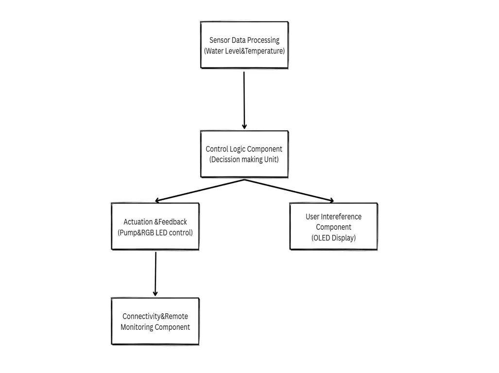

# Smart Pet Water Dispenser

A smart device that automatically refills a pet's water bowl and monitors water temperature, providing convenience for pet owners.

:::info

**Author**: Cosac Alexia \
**GitHub Project Link**: https://github.com/UPB-PMRust-Students/project-alexiacosac

:::

## Description

The Smart Pet Water Dispenser is an automated system designed to keep pets hydrated by refilling their water bowl whenever the level drops too low. Powered by a Raspberry Pi Pico W, it uses a water level sensor and a water pump to maintain consistent water levels without constant human intervention.

To ensure safety and usability, the system also monitors water temperature via a sensor and displays it on an LCD screen, while an RGB LED provides status indicators (green for normal, red for errors). It also features remote connectivity for monitoring and controlling the system through a simple web interface.

## Motivation

I chose to work on this project because ensuring pets have constant access to clean water is a common challenge for many pet owners, especially during busy schedules or when away from home. As a cat owner, I have personally faced the difficulty of maintaining a reliable water supply for my pet, which motivated me to develop the Smart Pet Water Dispenser.

## Architecture

The architecture components of the Smart Pet Water Dispenser:

  - Sensor Data Processing Component – Responsible for receiving and processing input from the water level and temperature sensors. It continuously monitors the state of the system to provide relevant data to the control unit.

  -  Control Logic Component – The central decision-making unit that evaluates sensor data to trigger appropriate actions. Based on the water level and temperature readings, it decides whether to activate the water pump or signal an alert via the RGB LED.

  - Actuation and Feedback Component – Manages the response of the system to control signals. It operates the water pump to refill the bowl and uses the RGB LED to provide feedback about the system’s health (e.g., red for errors, green for normal operation).

  -  User Interface Component – Displays real-time data, such as water temperature and system status, to the user via an OLED display. It ensures visibility into the system's current state.

  - Connectivity and Remote Monitoring Component – Allows the user to monitor and control the dispenser remotely via a web interface. This module communicates with the Raspberry Pi Pico over a network to offer access to system data and control over actions such as refilling the water remotely.
  
  
## Log

<!-- write your progress here every week -->

### Week 5 - 11 May

### Week 12 - 18 May

### Week 19 - 25 May

### Week 26 - 2 June

## Hardware

The hardware components include:
- Raspberry Pi Pico

    Controls the entire system and interfaces with sensors and actuators.

- ESP8266 or ESP32 (Wi-Fi Module)

    Provides Wi-Fi connectivity for remote monitoring and control.

- Water Level Sensor

    Detects when the water level drops and triggers the pump.

- Temperature Sensor (DS18B20)

    Monitors the water temperature and displays it on the OLED screen.

- Electric Water Pump (5V)

    Pumps water into the bowl when the level is low.

- Relay or MOSFET

    Switches power to the water pump safely.

- Diode

    Protects the circuit from back EMF generated by the pump.

- RGB LED

    Shows system status (green for normal, red for errors).

- OLED Display

    Displays water temperature and system status.

- 5V Power Supply

    Powers all system components.

- Breadboard and Jumper Wires

    For prototyping and connecting components.

- Tubing and Water Reservoir

    Stores and transports water to the pump.

- Resistors

    Limits current to protect components.

### Schematics

Place your KiCAD schematics here.

### Bill of Materials

| Device | Usage | Price (RON) | Link |
|--------|-------|-------------|------|
| [Raspberry Pi Pico W](https://www.robofun.ro/platforme-de-dezvoltare/placa-dezvoltare-raspberry-pi-pico-w.html) | Main microcontroller with Wi-Fi | 39.97 | [Robofun](https://www.robofun.ro/platforme-de-dezvoltare/placa-dezvoltare-raspberry-pi-pico-w.html) |
| [ESP8266 Wi-Fi Module](https://www.robofun.ro/wireless/esp8266-wifi.html) | Provides Wi-Fi connectivity | 19.00 | [Robofun](https://www.robofun.ro/wireless/esp8266-wifi.html) |
| [Water Level Sensor](https://www.emag.ro/senzor-nivel-apa-cu-switch-ai508/pd/D7JWR7MBM/) | Detects low water level | 33 | [eMag](https://www.emag.ro/senzor-nivel-apa-cu-switch-ai508/pd/D7JWR7MBM/) |
| [DS18B20 Temperature Sensor](https://www.robofun.ro/senzori/senzor-de-temperatura-waterproof-ds18b20.html) | Monitors water temperature | 9.62 | [Robofun](https://www.robofun.ro/senzori/senzor-de-temperatura-waterproof-ds18b20.html) |
| [Electric Water Pump 5V](https://www.emag.ro/pompa-centrifugala-submersibila-mini-pentru-fantani-acvarii-80l-h-5v-6w-negru-e420/pd/DMMKP3YBM/?utm_source=chatgpt.com) | Pumps water into the bowl | 13.49 | [eMAG](https://www.emag.ro/pompa-centrifugala-submersibila-mini-pentru-fantani-acvarii-80l-h-5v-6w-negru-e420/pd/DMMKP3YBM/?utm_source=chatgpt.com) |
| [Relay Module 5V](https://www.robofun.ro/module/placa-2-relee-spdt-5v.html) | Controls power to the water pump | 12.00 | [Robofun](https://www.robofun.ro/module/placa-2-relee-spdt-5v.html) |
| [1N4007 Diode](https://vendigo.ro/p97916193-1n4007-dioda-redresoare.html?utm_source=chatgpt.com) | Protects circuit from back EMF | 0.25 | [Vendigo](https://vendigo.ro/p97916193-1n4007-dioda-redresoare.html?utm_source=chatgpt.com) |
| [RGB LED](https://www.robofun.ro/componente/led-rgb.html) | Status indication (green, red) | 11.4 | [Robofun](https://www.robofun.ro/componente/led-rgb.html) |
| [OLED Display 0.96"](https://www.emag.ro/afisaj-oled-alb-0-96-inch-rezolutie-128x64-pixeli-i2c-spi-tensiune-3-5v-controler-ssd1306-compatibil-cu-arduino-stm32-msp430-dimensiuni-27x27x4mm-lizibilitate-excelenta-c3/pd/D767C1YBM/?utm_source=chatgpt.com) | Displays water temperature and system status | 35 | [eMag](https://www.emag.ro/afisaj-oled-alb-0-96-inch-rezolutie-128x64-pixeli-i2c-spi-tensiune-3-5v-controler-ssd1306-compatibil-cu-arduino-stm32-msp430-dimensiuni-27x27x4mm-lizibilitate-excelenta-c3/pd/D767C1YBM/?utm_source=chatgpt.com) |
| [5V Power Supply](https://www.robofun.ro/surse-de-alimentare/breadboard-power-supply-stick-5v-3-3v.html) | Powers the entire system | 12.00 | [Robofun](https://www.robofun.ro/surse-de-alimentare/breadboard-power-supply-stick-5v-3-3v.html) |
| [Jumper Wires](https://www.robofun.ro/fire-conexiune-mama-mama-10-bucati-20cm.html?gad_source=1&gclid=Cj0KCQjwoNzABhDbARIsALfY8VPghE_-c__oG-YLRYPOXqY5rJdor_G8FxSymOq-p2cTHfeAKZWy9ZsaAuKqEALw_wcB) | Connecting components on breadboard | 2.6 | [Robofun](https://www.robofun.ro/fire-conexiune-mama-mama-10-bucati-20cm.html?gad_source=1&gclid=Cj0KCQjwoNzABhDbARIsALfY8VPghE_-c__oG-YLRYPOXqY5rJdor_G8FxSymOq-p2cTHfeAKZWy9ZsaAuKqEALw_wcB) |
| [Silicone Tubing 1m](https://iazuri-acvarii.ro/products/furtun-de-silicon-100-1m-o-47-mm?variant=44860128788778&country=RO&currency=RON&utm_source=chatgpt.com) | Transports water from reservoir to bowl | 9.00 | [Iazuri Acvarii](https://iazuri-acvarii.ro/products/furtun-de-silicon-100-1m-o-47-mm?variant=44860128788778&country=RO&currency=RON&utm_source=chatgpt.com) |

## Software

| Library | Description | Usage |
|---------|-------------|-------|
| [rp2040-hal](https://github.com/raspberrypi/rp2040-hal) | Controls GPIOs, timers, and PWM | Used for controlling sensors and the water pump |
| [embedded-hal](https://github.com/embedded-hal) | Standard interface for external devices | Used for hardware abstraction |
| [panic-halt](https://crates.io/crates/panic-halt) | Stops the program on critical errors | Used for error handling |
| [embassy](https://github.com/embassy-rs/embassy) | Manages asynchronous tasks | Used for task management |
| [ds18b20](https://github.com/dbrgn/thermometer) | Reads temperature from DS18B20 | Used for reading water temperature |
| [ssd1306](https://github.com/dbrgn/rust-ssd1306) | Displays information on OLED screen | Used for displaying water temperature |
| [smart-leds](https://github.com/jamwaffles/smart-leds) | Controls the RGB LED indicator | Used for visual status indication |
| [pwm](https://docs.rs/pwm) | Controls the power level of the water pump | Used for controlling water pump speed |
| [wifi](https://github.com/esp-rs/esp8266) | Manages Wi-Fi connectivity | Used for connecting to the network for remote control and monitoring |
| [hyper](https://github.com/hyperium/hyper) | HTTP library | Used for building the web interface to monitor and control the dispenser remotely |

## Links

<!-- Add a few links that inspired you and that you think you will use for your project -->

[How to run a web server with Raspberry Pi Pico](https://www.raspberrypi.com/news/how-to-run-a-webserver-on-raspberry-pi-pico-w/)

