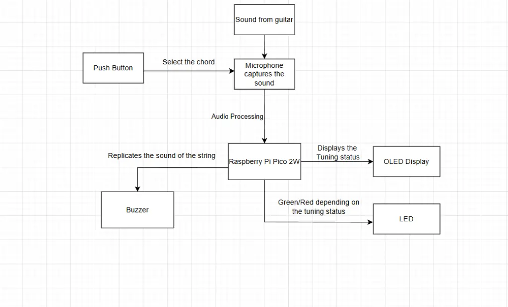
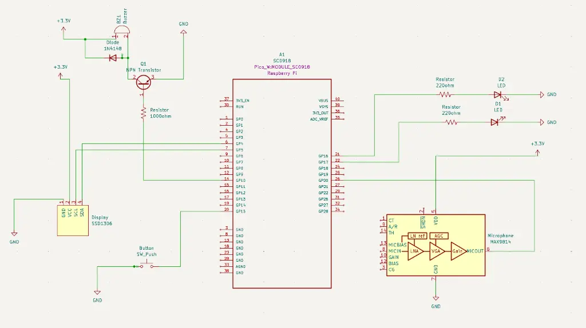

# Guitar Tuner
Used to tune your guitar

:::info
Author: Magureanu Alin \
GitHub Project Link : https://github.com/UPB-PMRust-Students/project-Alin1502
:::

## Description
The project consists of a guitar tuner that helps the user to accurately tune each guitar string without the need for external devices or application. 
Firstly, the sound is captured by the MAX9814 microphone and is sent to the microcontroller. The Raspberry Pi Pico analyzes the signal using Fast Fourier Transform in order to determine the dominant frequency. The obtained frequency is compared to the standard tuning values and identifies the closest musical note. After all the computations, the obtained note is shown on the OLED Display and the buzzer replicates the sound of the chord. For simplicity of the user interface, the user can select which string he is currently tuning using a push button.

## Motivation
As someone who started to play guitar recently, I found it frustrating that my guitar was getting out of tune frequently. While there are mobile apps available for tuning, I disliked the idea of always depending on a phone and internet access to perform this. By researching how to detect sound frequencies, process them and display them in real time, I was able to create my own, fully functional device for tuning the guitar.

## Architecture

1. Raspberry Pi Pico: used for handling the logic of the project. It receives analog audio input from the microphone, makes it digital using ADC and performs signal processing to detect the frequency
2. Microphone Module: captures the sound of the guitar being plucked, which is then sent to the microcontroller
3. OLED Display: displays when the chord is in tune and the current string selected
4. Push Button: prompts the user to select between the 6 chords ( E, A, D, G, B, E) to select what to tune.
5. LED: blinks red when guitar is out of tune, green when it is in tune
6. Buzzer: replicates the sound of the respective chord after it gets in tune

## Log 

### Week 28 April - 4 May
I started working on the documentation for the project. I bought every necessary component and i started to connect them on the breadboard, in order to be able to make the schematics and understand how they interact with eachother.
### Week 5-11 May

### Week 12-18 May 

### Week 19-25 May 

## Hardware

### Schematics

### Bill of Materials
| Device | Usage | Price |
|--------|--------|-------|
| [Raspberry Pi Pico 2W](https://www.raspberrypi.com/documentation/microcontrollers/pico-series.html) | The microcontroller | [40 RON](https://www.optimusdigital.ro/en/raspberry-pi-boards/13327-raspberry-pi-pico-2-w.html?search_query=raspberry+pi+pico+2w&results=36) |
| [MAX9814](https://www.analog.com/media/en/technical-documentation/data-sheets/max9814.pdf) | Microphone Module| [60 RON](https://www.optimusdigital.ro/en/others/1194-electret-microphone-amplifier-max9814-with-auto-gain-control.html?search_query=max9814&results=2) |
| Push Button | Select Button | [0.36 RON](https://www.optimusdigital.ro/en/buttons-and-switches/1119-6x6x6-push-button.html?search_query=button&results=491) |
| [OLED Display](https://cdn-shop.adafruit.com/datasheets/SSD1306.pdf) | The Display | [30 RON](https://www.emag.ro/afisaj-oled-ssd1306-oled-i2c-compatibil-arduino-si-raspberry-pi-27x27x4-mm-albastru-c9/pd/D3C7C1YBM/?utm_medium=ios&utm_source=mobile%20app&utm_campaign=share%20product) |
| LED | Blink LED | [0.4 RON](https://www.optimusdigital.ro/en/leds/38-5-mm-green-led-with-difused-lens.html?search_query=led&results=2049) |
| Buzzer | Replicates Sound | [1.4 RON](https://www.optimusdigital.ro/en/buzzers/634-5v-passive-buzzer.html?srsltid=AfmBOop6YS3xvQqrdw4Is5j7eh74mKUJTBTt8pieBJUydFhvGemBlCR0) |
## Software

| Library | Description | Usage |
|---------|-------------|-------|
| [ssd1306](https://docs.rs/ssd1306/latest/ssd1306/) | Display Library | Used for I2C OLED Display |
| [embassy-rp](https://docs.embassy.dev/embassy-rp/git/rp2040/index.html) | Pico Peripherals | Used for accessing the peripherals|
| [num-complex](https://docs.rs/num-complex/latest/num_complex/) | Complex Numbers Library | Used to compute complex part of fourier |
| [microfft](https://docs.rs/microfft/latest/microfft/) | Fourier Transform Library | Used to compute frequency with fourier  |
| [embassy-time](https://docs.rs/embassy-time/latest/embassy_time/) | Time management library  |Used for time-based operations such as delays |
| [libm](https://docs.rs/libm/latest/libm/) | Math library | Used for calculations |

## Links

