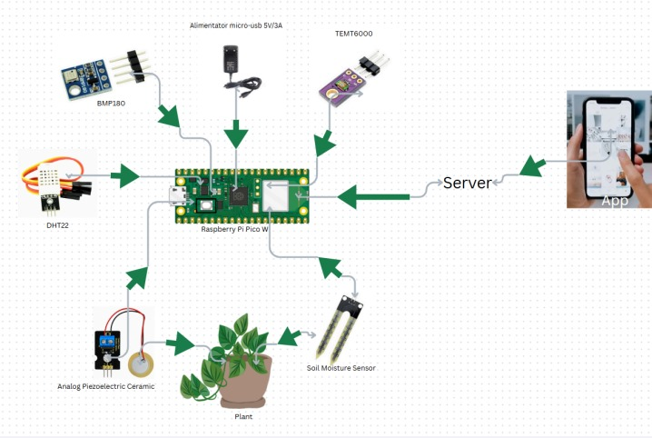
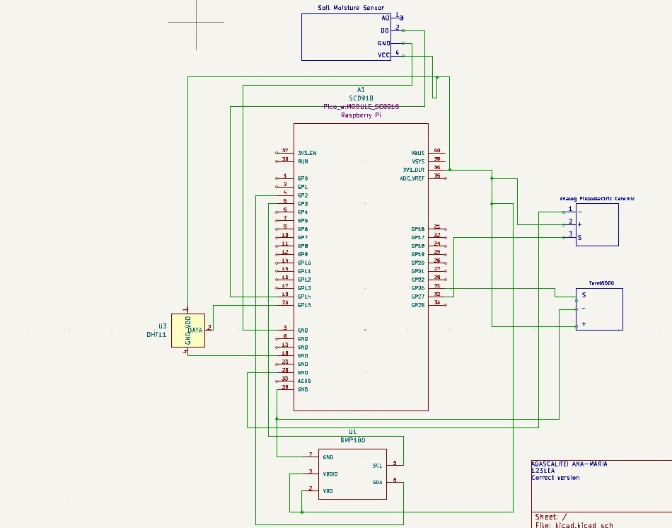

# PlantaSoteria
A smart plant monitoring system

:::info 

**Author**: Ana-Maria Adascalitei \
**GitHub Project Link**: https://github.com/UPB-PMRust-Students/project-AnaAdascalitei

:::

## Description

PlantaSoteria(is a mix of latin-greek language and it means “Plant Salvation”).
My project is designed to simplify and optimize plant care. The system continuously
monitors key environmental parameters, including soil moisture, pH levels, light
intensity, ambient temperature, and pest activity.Through a user-friendly mobile app, it
provides real-time data and sends notifications when conditions require attention.


## Motivation

This project was inspired by my passion for plants and my goal to simplify their care while efficiently monitoring their requirements. 

## Architecture 

Main components:

Raspberry Pi Pico W - This is the microcontroller I will use for this project. It is responsible for gathering data from the sensors, processing it, and sending it to the server (which will eventually send it to the app).

Server - A component that receives the data from the microcontroller and stores it in a database. It will also send it to the app.

App - A mobile application that receives the data from the servers and informs the user about the plant. It will send alerts in case the plant needs water or if there should be a change in the plant's location.

SOIL MOISTURE SENSOR, HYGROMETER - It measures the soil moisture to determine if the plant needs water.

BMP180 Temperature and Pressure sensor module - This component provides crucial environmental data by measuring both temperature and atmospheric pressure. By monitoring changes in atmospheric pressure, we can detect alterations in weather patterns or room conditions, such as sudden temperature drops or fluctuations in air pressure, which could impact plant health and growth.

Ambient light sensor TEMT6000 - This component will help us realize if there is enough light in the place for the plant during the day. If not, we will change the location.

Analogue Piezoelectric Vibration Sensor - This component detects vibrations. These vibrations will determine whether a bug has entered the plant or if a pet has disturbed the soil.

DHT22 Temperature and Humidity Sensor Module - This will give us the temperature and humidity of the place where the plant is. The temperature is not really needed since we already have BMP180, but the humidity will tell us if the place is humid enough.



## Log

<!-- write your progress here every week -->

### Week 5 - 11 May

In the first week of my PlantaSoteria project, I ordered and gathered all the necessary hardware components to ensure an organized and smooth development process. I began drafting the system architecture and planning the roles of each component. Simultaneously, I started writing documentation and outlining the project structure. I also tested several sensors (including the soil moisture and temperature sensors) to ensure they functioned properly and began sketching the initial KiCad schematic to visualize the hardware layout.

### Week 12 - 18 May

### Week 19 - 25 May

## Hardware

The hardware component of the PlantaSoteria system is designed to monitor various environmental parameters crucial to plant health. At the core of the system is the Raspberry Pi Pico W, which collects data from a range of sensors and transmits it to the backend server for further processing and visualization via a mobile app. Each sensor has been chosen to target a specific need related to plant care:

Soil Moisture Sensor (Hygrometer): Detects soil water levels to inform watering needs.

BMP180 Sensor Module: Measures temperature and air pressure, helping track environmental changes that could affect the plant.

Ambient Light Sensor (TEMT6000): Evaluates light exposure, ensuring the plant gets sufficient sunlight.

DHT22 Sensor: Provides additional temperature and humidity readings, offering redundancy and a broader environmental profile.

Piezoelectric Vibration Sensor: Detects unusual movements or disturbances in the soil, such as pest activity or accidental touches.

Power Supply: A stable 5V/3A micro-USB adapter powers the entire system.

Wiring & Connectors: A set of jumper wires and resistors ensure reliable and organized electrical connections between components.

All sensors connect to the microcontroller via GPIO pins, using interfaces such as I2C and analog input. This setup allows for real-time monitoring and data collection, forming the foundation of the smart monitoring system.

### Schematics



### Bill of Materials

<!-- Fill out this table with all the hardware components that you might need.

The format is 
```
| [Device](link://to/device) | This is used ... | [price](link://to/store) |

```

-->


| Device | Usage | Price |
|--------|--------|-------|
| [Rapspberry Pi Pico W](https://www.raspberrypi.com/documentation/microcontrollers/raspberry-pi-pico.html) | The microcontroller | [34.5 RON](https://www.optimusdigital.ro/en/raspberry-pi-boards/12394-raspberry-pi-pico-w.html) |
| [Alimentator micro-usb 5V/3A](https://www.emag.ro/alimentator-micro-usb-5v-3a-hs0276/pd/DFJ4THMBM/) | The power supply | [29 RON](https://www.emag.ro/alimentator-micro-usb-5v-3a-hs0276/pd/DFJ4THMBM/) |
| [SOIL MOISTURE SENSOR, HYGROMETER](https://lastminuteengineers.com/soil-moisture-sensor-arduino-tutorial/) | Sensor | [7.29 RON](https://www.sigmanortec.ro/Senzor-umiditate-sol-higrometru-p125814620?gad_source=1&gclid=Cj0KCQjwudexBhDKARIsAI-GWYXGicLaV454gukJto0U3L1IDuU7N3dE_WxiYuYbR0pdp2Ox946WPMwaArYfEALw_wcB) |
| [Analogue Piezoelectric Vibration Sensor](https://wiki.keyestudio.com/Ks0272_keyestudio_Analog_Piezoelectric_Ceramic_Vibration_Sensor) | Sensor | [9.39 RON](https://www.optimusdigital.ro/ro/senzori-de-vibraii/8249-senzor-de-vibraii-piezoelectric-analogic.html) |
| [BMP180 Temperature and Pressure sensor module](https://cdn-shop.adafruit.com/datasheets/BST-BMP180-DS000-09.pdf) | Sensor | [6.98 RON](https://www.optimusdigital.ro/ro/senzori-senzori-de-presiune/149-modul-senzor-de-temperatura-si-presiune-bmp180.html?gad_source=1&gclid=Cj0KCQjwudexBhDKARIsAI-GWYXQ68XuanU0Fj4nSUeFhcqsyLRhLE3Z7uuvnoqYVH0o3xS1I89QjH4aAmWdEALw_wcB) |
| [Ambient light sensor TEMT6000](https://www.vishay.com/docs/81579/temt6000.pdf) | Sensor | [9.54 RON](https://ardushop.ro/ro/home/1290-senzor-lumina-ambientala-temt6000.html?gad_source=1&gclid=Cj0KCQjwudexBhDKARIsAI-GWYX15byKNkAdoOsKDJThdU8gESRelgwfZlQcGv04jr3jS9_2ZAtI1_caArzuEALw_wcB) |
| [DHT22 Temperature and Humidity Sensor Module](https://www.waveshare.com/wiki/DHT22_Temperature-Humidity_Sensor) | Sensor | [23.12 RON](https://www.optimusdigital.ro/ro/senzori-senzori-de-temperatura/1449-modul-senzor-de-temperatura-i-umiditate-dht22.html?gad_source=1&gclid=Cj0KCQjwudexBhDKARIsAI-GWYX2l_sgwbYXbCA5XcIhaypPaPie0vliKXPyyUP1BQktOMuGz81nukIaAlatEALw_wcB) |
| [Set of 40 Arduino wire, Male-Male, 30 cm, Multicolor](https://www.circuitrework.com/guides/6-1.html) | Electrical connections | [15.59 RON](https://www.emag.ro/set-40-cabluri-arduino-male-male-30-cm-multicolor-5904162803453/pd/DF8RKLMBM/?cmpid=87002&utm_source=google&utm_medium=cpc&utm_campaign=(RO:Whoop!)_3P-Y_%3e_Jucarii_hobby&utm_content=79559830074&gad_source=1&gclid=Cj0KCQjwudexBhDKARIsAI-GWYWt9SsCZzii9k1LJHTSBMOah2oDdkI7yTfMZakFptJvrMiHOxyWc_waAiHjEALw_wcB) |
| [RESISTORS KIT 30 VALUES, 600 PIECES, 1/4W, 10R-1M](https://workforce.libretexts.org/Bookshelves/Electronics_Technology/Book%3A_Electric_Circuits_I_-_Direct_Current_(Kuphaldt)/02%3A_Ohm's_Law/2.05%3A_Resistors) | The power supply | [22.61 RON](https://www.sigmanortec.ro/kit-rezistori-30-valori-20-bucati?gad_source=1&gclid=Cj0KCQjwudexBhDKARIsAI-GWYXVwR8WoacJF0ZDAr3WXUoq8JFBMFJ1A5L4YkYdOBCkjGcvHLX43U4aAoM9EALw_wcB) |


## Software

| Library                                                       | Description                                      | Usage                                                                           |
| ------------------------------------------------------------- | ------------------------------------------------ | ------------------------------------------------------------------------------- |
| [embedded-hal](https://github.com/rust-embedded/embedded-hal) | Abstraction layer for embedded hardware          | Provides a unified interface to work with embedded hardware like I2C, SPI, etc. |
| [rp2040-hal](https://github.com/rp-rs/rp-hal)                 | Hardware abstraction layer for Raspberry Pi Pico | Offers access to low-level hardware features specific to the RP2040 chip.       |
| [embassy-net](https://github.com/embassy-rs/embassy)          | Networking for embedded systems                  | This library will help me send data from the Raspberry Pi Pico W to the app.    |
| [embassy-rp](https://github.com/embassy-rs/embassy)           | GPIO library for Raspberry Pi Pico               | This will help me access GPIO pins such as SPI, I2C, PWM.                       |
| [dht-sensor](https://github.com/michaelbeaumont/dht-sensor)   | Library for DHT sensor                           | Rust library designed for interfacing with DHT sensors like DHT22.              |
| [bmp180](https://github.com/eldruin/bmp180-rs)                | Library for BMP180 sensor                        | Enables communication with the BMP180 temperature and pressure sensor over I2C. |
| [cortex-m-rt](https://github.com/rust-embedded/cortex-m-rt)   | Real-time runtime for Cortex-M microcontrollers  | Handles low-level startup, interrupt vectors, and memory initialization.        |

## Links

<!-- Add a few links that inspired you and that you think you will use for your project -->

1. [Garduino](https://ocw.cs.pub.ro/courses/pm/prj2023/apredescu/garduino)
2. [lPlant Watcher](https://ocw.cs.pub.ro/courses/pm/prj2023/alexau/plantwatcher)
3. [Sistem Monitorizare Plante](https://ocw.cs.pub.ro/courses/pm/prj2023/gpatru/bogdan.brutaru)
4. [Sistem intretinere plante](https://ocw.cs.pub.ro/courses/pm/prj2022/abirlica/sistem_intretinere_plante)