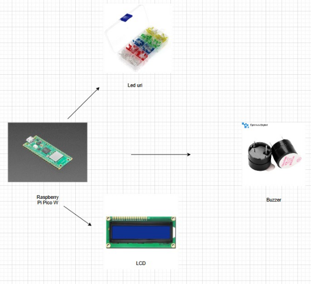

# Blink and recall

Blink & Recall is a fast-paced memory game where players repeat random LED sequences before time runs out.

:::info 

**Author**: BATAGOI Ana-Maria \
**GitHub Project Link**: https://github.com/UPB-PMRust-Students/project-anabat27

:::

## Description

This project is a fun and interactive memory game built using the Raspberry Pi Pico W. The goal is to remember and repeat a sequence of randomly flashing LEDs. If the player correctly presses the corresponding buttons in the right order before time runs out (shown on an LCD screen), they move to the next round. If they make a mistake or time expires, a buzzer sounds and the round restarts.

## Motivation

I chose this project because I wanted to build something fun and interactive that also challenged my hardware and programming skills. I’ve always enjoyed memory games, and creating my own version with real components like LEDs, buttons, and an LCD felt like a great way to combine learning with creativity. It pushes me to improve both my logic and timing control, while also delivering something that others can enjoy.

## Architecture 

Main Components:

**Raspberry Pico**: The central microcontroller of the game, responsible for generating the LED flash sequences, handling button inputs, controlling the LCD display for the timer and instructions, and activating the buzzer when needed.
    
**LEDs**: These LEDs light up in a random order to create the sequence that the player needs to memorize and repeat. Each LED color represents a different position in the sequence.
    
**Buttons**:These buttons are used by the player to input their guesses in the same sequence as the LED flashes. Pressing the correct buttons in the right order advances the player to the next round.
    
**Buzzer**:  If the player makes a mistake or runs out of time, the buzzer sounds to indicate the failure, signaling the player to restart the round.

**LCD**: The timer and game instructions are shown on this screen. It counts down the time allowed to replicate the LED sequence and provides feedback to the player throughout the game.

Connection overview : 

All components (LEDs, buttons, buzzer, and LCD) are connected to the Raspberry Pi Pico W.

   


## Log

<!-- write every week your progress here -->

### Week 5 - 11 May
Project planning, hardware selection, initial tests with LEDs and buttons.

### Week 12- 18 May


### Week 19 - 25 May


## Hardware


### Schematics


### Bill of Materials

<!-- Fill out this table with all the hardware components that you might need.

The format is 
```
| [Device](link://to/device) | This is used ... | [price](link://to/store) |

```

-->

| Device | Usage | Price |
|--------|--------|-------|
| [Rapspberry Pi Pico W](https://www.raspberrypi.com/documentation/microcontrollers/pico-series.html) | The microcontroller | [34.5 RON](https://www.optimusdigital.ro/ro/placi-raspberry-pi/12394-raspberry-pi-pico-w.html?search_query=raspberry+pi+pico+w&results=26) |
| [BLUE Led](https://descargas.cetronic.es/WW05A3SBQ4-N.pdf) | Creates the pattern. | [0.29 RON](https://www.optimusdigital.ro/ro/optoelectronice-led-uri/12237-led-albastru-de-5-mm.html?search_query=LED+albastru&results=64) |
| [RED Led](https://www.farnell.com/datasheets/1498852.pdf) | Creates the pattern.  | [0.39 RON](https://www.optimusdigital.ro/ro/optoelectronice-led-uri/29-led-set-3-culori-x-10-pcs-fiecare.html?search_query=LED+albastru&results=64) |
| [GREEN Led](https://www.farnell.com/datasheets/2724776.pdf) | Creates the pattern.  | [0.39 RON](https://www.optimusdigital.ro/ro/optoelectronice-led-uri/38-led-verde.html?search_query=LED+albastru&results=64) |
| [YELLOW Led](https://www.farnell.com/datasheets/1660999.pdf) | Creates the pattern.  | [0.39 RON](https://www.optimusdigital.ro/ro/optoelectronice-led-uri/37-led-galben.html?search_query=LED+albastru&results=64) |
| [Buttons](https://www.electronicwings.com/components/pushbutton-switch-6-pin/1/datasheet) | The buttons | [1.5 RON](https://www.optimusdigital.ro/ro/butoane-i-comutatoare/1119-buton-6x6x6.html?search_query=BUTOANE&results=190) |
| [Buzzer](https://www.farnell.com/datasheets/2171929.pdf) | The buzzer | [1.4 RON](https://www.optimusdigital.ro/ro/audio-buzzere/633-buzzer-activ-de-5-v.html?search_query=BUzzer&results=61) |
| [LCD](https://www.farnell.com/datasheets/58820.pdf) | | [15 RON](https://www.optimusdigital.ro/ro/optoelectronice-lcd-uri/62-lcd-1602-cu-interfata-i2c-si-backlight-galben-verde.html?search_query=lcd&results=218) |
| [Breadboard](https://components101.com/sites/default/files/component_datasheet/Breadboard%20Datasheet.pdf) | For assembling the prototype | [5 RON](https://www.optimusdigital.ro/ro/prototipare-breadboard-uri/44-breadboard-400-points.html?search_query=BREADBORD&results=4) |
| [Female-to-Male Wires](https://www.tubesandmore.com/sites/default/files/associated_files/s-w604_spec.pdf) | For connections | [8 RON](https://www.optimusdigital.ro/ro/toate-produsele/877-set-fire-mama-tata-40p-15-cm.html?search_query=FIRE&results=429) |
| [Female-to-Female Wires](https://www.tubesandmore.com/sites/default/files/associated_files/s-w604_spec.pdf) | For connections | [7 RON](https://www.optimusdigital.ro/ro/fire-fire-mufate/881-set-fire-mama-mama-40p-15-cm.html?search_query=FIRE&results=429) |
| [Male-to-Male Wires](https://www.tubesandmore.com/sites/default/files/associated_files/s-w604_spec.pdf) | For connections | [6 RON](https://www.optimusdigital.ro/ro/fire-fire-mufate/886-set-fire-tata-tata-40p-15-cm.html?search_query=FIRE&results=429) |
| [Micro USB Cable](https://www.farnell.com/datasheets/2562324.pdf) | For the Raspberry Pi Pico W | [7 RON](https://www.optimusdigital.ro/ro/cabluri-cabluri-usb/497-cablu-micro-usb-1-m-negru.html?srsltid=AfmBOoozeNJX8JF0fHE585r9BX80C-0BVO7Po9wrUMpeRC0OaZvJtul4) |

## Software

| Library | Description | Usage |
|---------|-------------|-------|
|[rp2040-hal](https://github.com/rp-rs/rp-hal)|Hardware Control|Controls RP2040 hardware|
|[embedded-hal](https://github.com/rust-embedded/embedded-hal)|Hardware Abstraction |Common hardware driver traits|
|[hd44780-driver](https://github.com/JohnDoneth/hd44780-driver)|LCD Display |Drives LCD character display|
|[rand](https://github.com/rust-random/rand)|Sequence Randomizer |Generates random number sequences|

## Links

<!-- Add a few links that inspired you and that you think you will use for your project -->

1. [Arduino Memory Game](https://www.youtube.com/watch?v=FZLmSVf_AiY&ab_channel=RGInnovations)
2. [Raspberry Pi Pico W Memory Game](https://www.youtube.com/watch?v=e_GmsmDD8bI&ab_channel=LoriPfahler)
