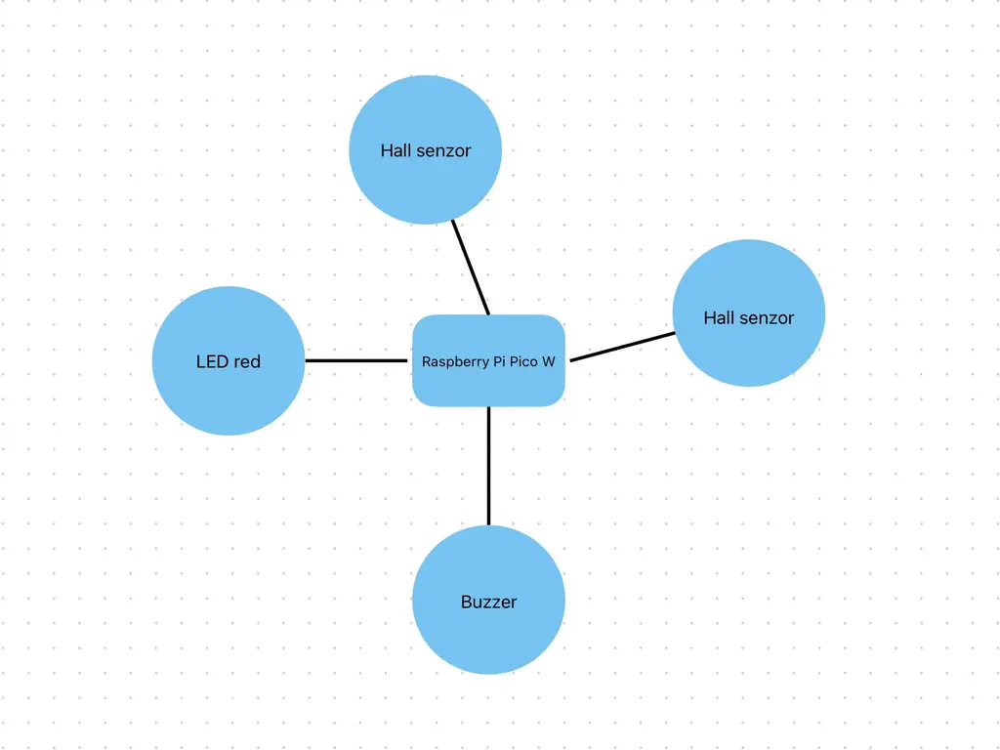
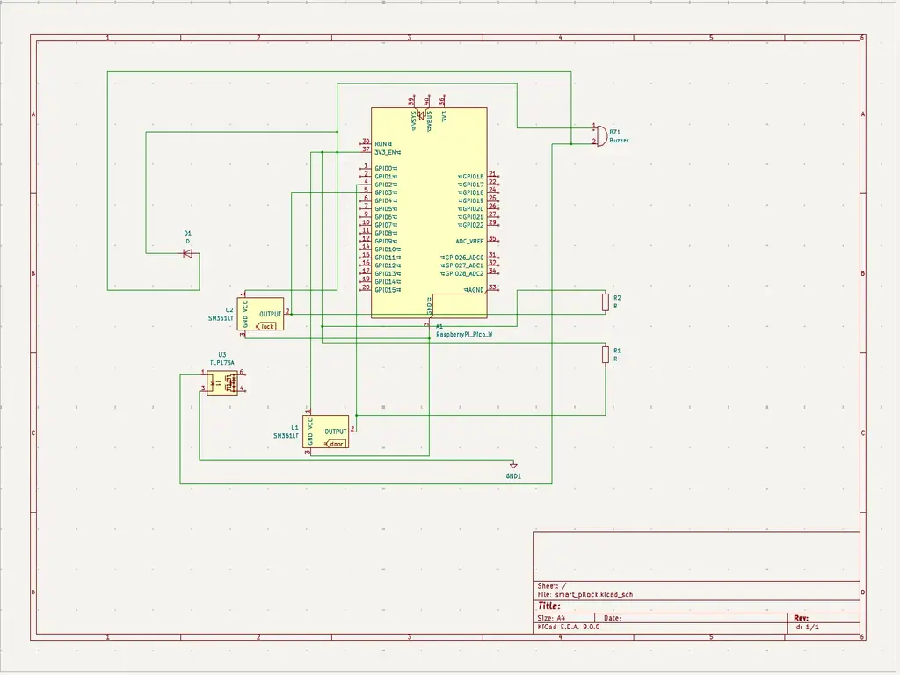

# Smart PiLock
A smart door monitoring system giving real-time updates.

:::info 

**Author**: Cârjilǎ Ana Teodora \
**GitHub Project Link**: https://github.com/UPB-PMRust-Students/project-AnaCarjil

:::

## Description

This project consists of sending the user updates about their door: if it’s closed, if it’s locked and if there are any attempts to break in or force the door. Doing all that and also it will be saving energy.

## Motivation

I choose this ideea because I want to help myself and other people who sometimes forget that they closed the door and they don't need to go back and check again if the door is closed.

## Architecture 

The project architecture includes the following components:
- **Raspberyy Pi Pico 2W**: Main controller unit with Wi-Fi for communication.
- **Two Hall Effect Sensors**: One detects if the door is closed, the other detects if the door is locked.
- **Buzzer**: Audible alert for detected intrusion.  
- **Red LED**: Visual warning signal.  
- **Wi-Fi Module (built-in on Pico 2W)**: Sends updates to the user via internet. 

This is the diagram that illustrates the components and their connections.


## Log

<!-- write your progress here every week -->

### Week 5 - 11 May
- Completed documentation
- Purchased the necessary components

### Week 12 - 18 May

### Week 19 - 25 May

## Hardware

The hardware setup consists of a Raspberry Pi Pico 2W microcontroller as the core unit, interfacing with multiple peripheral components to monitor the door's status and provide alerts.

Two Hall effect sensors are connected to GPIO pins and are responsible for detecting the physical state of the door and whether it is locked. A red LED, connected to a digital output pin, serves as a visual indicator during a potential security breach. Additionally, an active buzzer is driven through a GPIO pin to emit an audible alert when forced entry is detected or the door is left unlocked.

A MOSFET is used to safely drive the buzzer or LED from the Pico's GPIO, ensuring adequate power delivery. All components are connected via jumper wires on a breadboard, allowing flexible prototyping without the need for soldering. Since all sensors and components operate at 3.3V, they are powered directly from the Pico's onboard voltage regulator, eliminating the need for external regulators.

### Schematics

Place your KiCAD schematics here.
Here is a KiCAD schemstics:

### Bill of Materials

<!-- Fill out this table with all the hardware components that you might need.

The format is 
```
| [Device](link://to/device) | This is used ... | [price](link://to/store) |

```

-->

| Device | Usage | Price |
|--------|--------|-------|
| [Raspberry Pi Pico 2W](https://www.raspberrypi.com/documentation/microcontrollers/raspberry-pi-pico.html) | The microcontroller | [ 2 x 40 RON](https://www.optimusdigital.ro/en/raspberry-pi-boards/12394-raspberry-pi-pico-w.html) |
| 2× Hall Effect Sensors (A3144) | Detect door and lock status | 2 × 6.49 RON |
| Active Buzzer | Audible alerts | 1.40 RON |
| Red LED | Visual indicator | 7.24 RON |
| Resistors (10kΩ and 1kΩ) | Circuit design | 25.25 RON |
| Jumper Wires (M-M, F-F, M-F) | Wiring connections | 29.31 RON |
| Breadboard | Prototyping platform | 4.66 RON |
| MOSFET (IRLZ34N) | Signal amplification | 12.78 RON |

## Software

| Library | Description | Usage |
|---------|-------------|-------|
| [rppal](https://docs.rs/rppal/latest/rppal/) | Raspberry Pi Peripheral Access Library | Used to interface with GPIO, I2C, and other peripherals |
| [st7789](https://github.com/almindor/st7789) | Display driver for ST7789 | Used for the display for the Pico Explorer Base |
| [embedded-graphics](https://github.com/embedded-graphics/embedded-graphics) | 2D graphics library | Used for drawing to the display |

## Links

<!-- Add a few links that inspired you and that you think you will use for your project -->

1. [link](https://example.com)
2. [link](https://example3.com)
...
