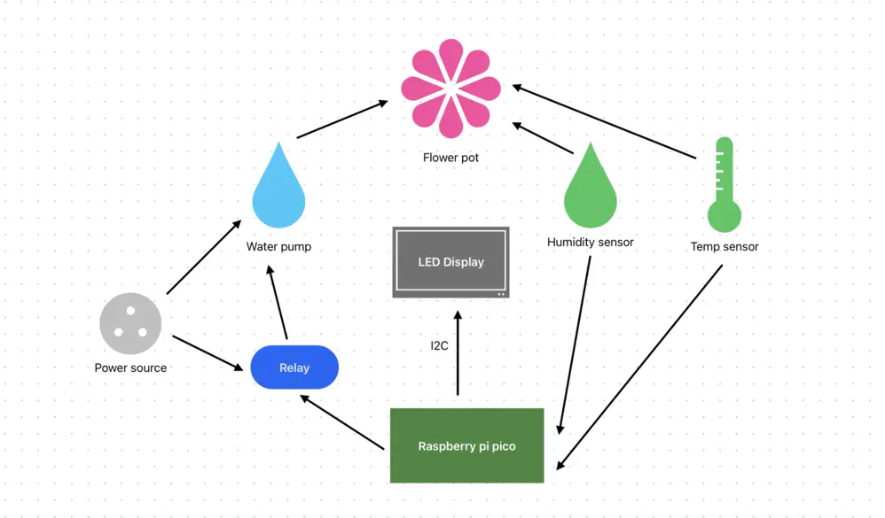

# Ripy the smart flowerpot
a self-watering plant pot with configurable parameters

:::info 

**Author**: Nedelcu Andreea \
**GitHub Project Link**: https://github.com/UPB-PMRust-Students/project-andreea-35

:::

## Description

Ripy is a plant pot add-on that waters your plant regularly! You set a desired humidity level and it adds water accordingly so as to maintain it. The display is where you can view your plant's conditions (current humidity / temperature) or set parameters (desired humidity level / number of times to water the plant per day).

## Motivation

Sometimes you have households where family members are away more often than they are at home. Even those who do spend a lot of time inside might go on vacation or have to be out of town for a couple of days, maybe a week - and not even the least demanding of plants can go unwatered that long! Ripy makes sure any green friend, fussy or not, is maintained happy and hydrated! \
My family has a bunch of plants around the house but some aren't exactly thriving due to us getting busy and forgetting to water them or leaving them unwatered while we're away on vacation. That's what inspired me to take on this project!

## Architecture 

## Log

<!-- write your progress here every week -->

### Week 5 - 11 May

### Week 12 - 18 May

### Week 19 - 25 May

## Hardware

**Raspberry Pi Pico W**	- the brains: reads sensor data, controls the relay module (which switches the pump) and updates the LCD;

**Capacitive Soil Moisture Sensor**	- measures the soil’s moisture level through analog output. The Pico reads this to determine if watering is needed;

**LM35D Analog Temperature Sensor** - measures ambient temperature through analog output; Values are displayed on the LCD;

**5V Relay Module**- acts as a switch for the water pump. Triggered by a GPIO pin from the Pico;

**Water Pump**	- turns on when the relay is triggered to water the plant;

**1602 LCD Display with I2C Adapter** -	shows current humidity, temperature, and user-set parameters. Connects to the Pico via I2C;

**3 × Push Buttons** - provide input for adjusting settings like desired humidity and number of waterings per day. Each button connects to a GPIO pin.

### Schematics

KiCAD schematic TBA

### Bill of Materials

| Device | Usage | Price |
|--------|--------|-------|
| [Raspberry Pi Pico 2W](https://www.raspberrypi.com/documentation/microcontrollers/raspberry-pi-pico.html) | The microcontroller | [39.66 RON](https://www.optimusdigital.ro/en/raspberry-pi-boards/12394-raspberry-pi-pico-w.html) |
| Capacitive Soil Moisture Sensor | The soil moisture sensor | [4.77 RON](https://ardushop.ro/ro/senzori/267-senzor-higrometru-capacitiv-6427854002815.html) |
| LM35D Analog Temperature Sensor (TO-92) | The temperature sensor | [4.99 RON](https://ardushop.ro/ro/senzori/267-senzor-higrometru-capacitiv-6427854002815.html) |
| Water Pump | The water dispenser | [13.49 RON](https://ardushop.ro/ro/senzori/267-senzor-higrometru-capacitiv-6427854002815.html) |
| ø 8mm 1m Transparent Tube | Water transportation from the pump to the pot | [2.92 RON](https://www.emag.ro/furtun-bipy-ker-apa-8-mm-1-m-vt8/pd/DN5CQCYBM/?utm_source=cns_confirmation&utm_medium=email&utm_campaign=cns_confirmation_order&utm_content=cns_product_image&ref_id=1785626640) |
| 1 Channel 5V Relay Module| Water pump activation | [4.99 RON](https://www.optimusdigital.ro/ro/electronica-de-putere-module-cu-releu/13084-modul-releu-cu-un-canal-comandat-cu-5-v.html) |
| 1602 Green LCD Display with I2C adapter | Display for our parameters | [26.83 RON](https://ardushop.ro/ro/senzori/267-senzor-higrometru-capacitiv-6427854002815.html) |
| 3x 6 x 6 x 6 Push Buttons | Interaction with the display | [1.08 RON](https://www.optimusdigital.ro/ro/butoane-i-comutatoare/1119-buton-6x6x6.html?search_query=buton&results=213) |

## Software

| Library | Description | Usage |
|---------|-------------|-------|
| [embedded_hal](https://github.com/embassy-rs/embassy) | Hardware abstraction layer for embedded systems | Used for abstracting hardware interactions |
|[gpio](https://docs.embassy.dev/embassy-stm32/git/stm32c011d6/gpio/index.html)|GPIO manipulation |Used for interacting with GPIO pins |
| [defmt](https://github.com/knurling-rs/defmt) | Efficient logging for embedded systems | Enables detailed logging for system diagnostics and debugging during development |
|[embassy-rp](https://docs.embassy.dev/embassy-rp/git/rp2040/index.html)| Peripheral access library |Used for initializing and interacting with peripherals 
|[embassy-time](https://embassy.dev/book/dev/time_keeping.html)|Time management library  |Used for time-based operations such as delays |
| [heapless](https://docs.rs/heapless/0.8.0/heapless/) | Data structure library | Used for String vectors |

## Links

1. [Build A Plant Watering System 🌱🤖 | With a Pi Pico by VEEB Projects](https://www.youtube.com/watch?v=WVijoh-hqkw&list=TLPQMDQwNTIwMjU_mDmZqmpG4g)
2. [DIY Raspberry Pi Arduino Plant Watering System by Caroline Dunn](https://youtu.be/DOaDnYj3vfI?si=0LPCuMySoOpkZZ3T)
3. [How to create IOT Plant Watering System Using Raspberry Pi Pico W](https://kitflix.com/how-to-create-iot-plant-watering-system-using-raspberry-pi-pico-w/)
4. [Pico Pico - Embedded Programming with Rust](https://pico.implrust.com/index.html)