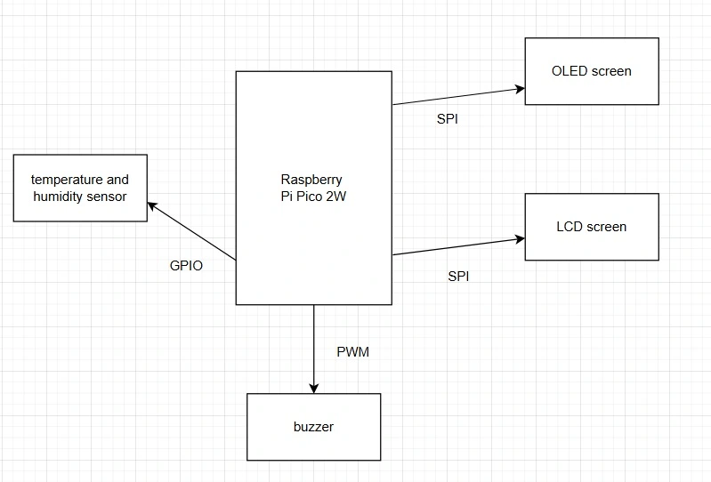
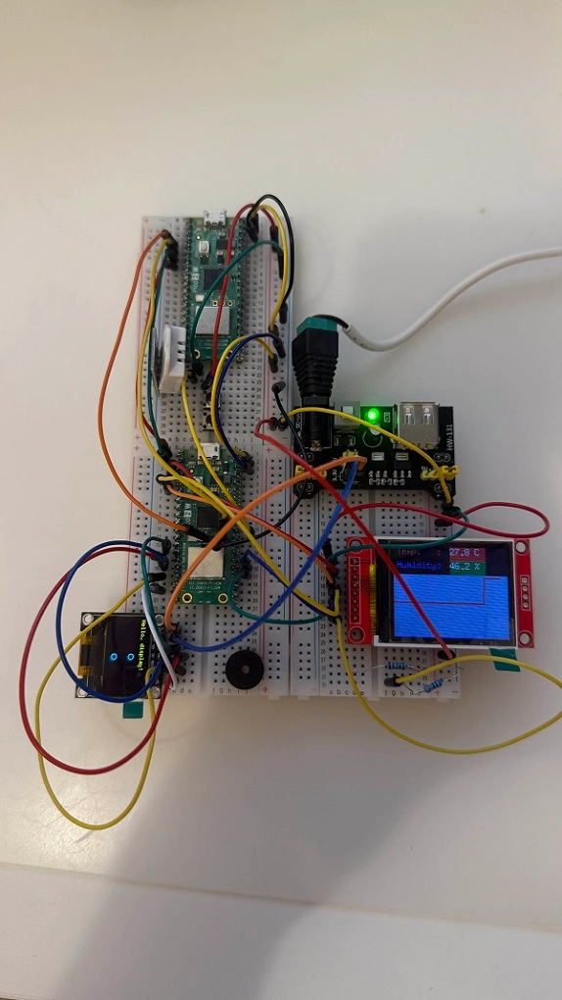
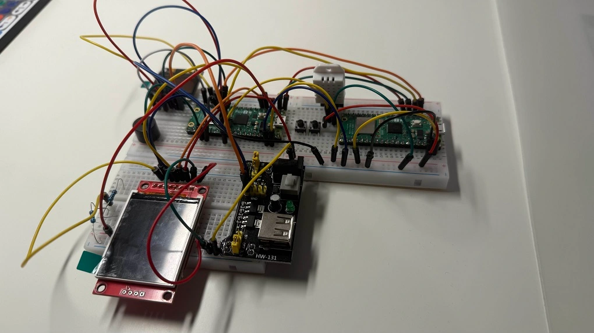
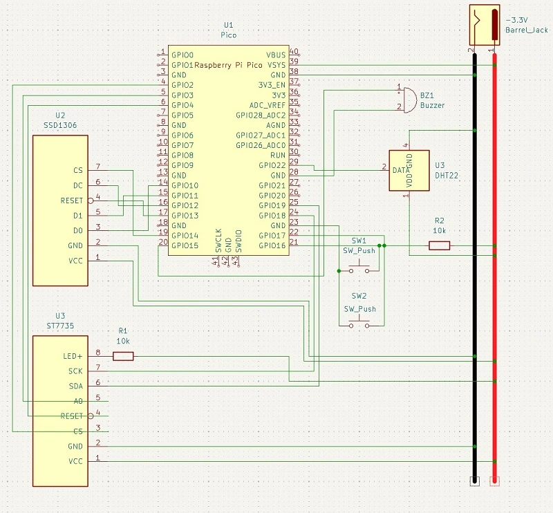

# Smart Clock
A smart clock with an alarm, display, temperature/humidity monitoring and a web interface.

:::info 

**Author**: Dumitrescu Andrei-Bogdan \
**GitHub Project Link**: https://github.com/UPB-PMRust-Students/project-Andreid04

:::

## Description

This project is built using the Raspberry Pi Pico 2W, capable of displaying the current time and date on a small OLED display, and live temperature/humidity data on another small LCD display that also shows a real-time graph of both temperature and humidity. The current temperature and humidity also change color depending on their value. The device fetches accurate time from the internet every 3 to 6 hours, and offers a web interface for setting alarms. Alarms can be heard through a passive buzzer placed on the breadboard.


## Motivation

I always wanted a machine that sits on my desk and keeps track of time and schedule related stuff while also offering information about what is happening in the air of my room(humidity and temperature). I wanted a fully customizable clock that is also "smart" but i could not find anything that i like in a store. So i decided to take this opportunity and create the smart clock that i wanted with full customizability and pleasent looking OLED and LCD displays for a fraction of the price of a similar clock bought from the internet.

## Architecture 

 <!-- include the power supply and a small description on how it works  images:1024x768 -->

### General Schematic



### Components overview

- **Microcontroller**
    - The Raspberry Pi Pico 2W microcontroller handles the data from the sensor and the web interface in order to active an alarm, show and update information on the screens; 
- **Sensor service**
    - polls DHT22 for temperature & humidity every 2 seconds and writes the data to the LCD display, updating the graphs in real time;
- **Clock Service**
    - fetches the exact time from the internet every 6h and keeps local RTC synced;
- **Alarm Handler**
    - creates and triggers the alarm created by the user;
- **Display units**
    - The OLED display shows the clock, alarms and the date; 
    - The LCD display is used for temperature and humidity monitoring and their respective graphs.


## Log

<!-- write your progress here every week -->

### Week 5 - 11 May

- Set up ST7735 lcd and SSD1306 oled displays with embedded-graphics.  
- Drew dynamic temperature/humidity graphs and live colored changes if values are between a known good range.



### Week 12 - 18 May
 
### Week 19 - 25 May

## Hardware

- **2x Raspberry Pi Pico 2W** (one acts as a debugger): The brains of the smart clock. It supports the wi-fi interface for sending and receiving data from an external device;
- **Breadboard + jumper wires**: for connecting the peripherals to the pico and to power; 
- **ST7735 TFT LCD display** (SPI): acts as a colored screen for displaying the temperature and humidity info, their graphs and color mapping if the paramters are healthy or not(green, yellow and red);  
- **SSD1306 OLED** (secondary SPI display): used for displaying the clock, the date and the alarms;
- **DHT22** (temperature + humidity sensor): used for monitoring the temperature and humidity of the air with the help;
- **Passive buzzer + resistor** (GPIO controlled): a buzzer that is controlled through PWM on a PWM capable GPIO pin(15);
- **12V power supply** terminated to a barrel jack feeding the HW131 power supply that outputs regulated 3.3V and 5V DC. (I only use 3.3V for this project).



### Schematics

**KiCAD schematic**




### Bill of Materials

<!-- Fill out this table with all the hardware components that you might need.

The format is 
```
| [Device](link://to/device) | This is used ... | [price](link://to/store) |

```

-->

| Device | Usage | Price |
|--------|--------|-------|
| [Raspberry Pi Pico 2W](https://www.raspberrypi.com/documentation/microcontrollers/raspberry-pi-pico.html) | The microcontroller | [40 RON](https://www.optimusdigital.ro/ro/placi-raspberry-pi/13327-raspberry-pi-pico-2-w.html) |
| [DHT22 Sensor](https://www.optimusdigital.ro/ro/senzori-senzori-de-temperatura/1449-modul-senzor-de-temperatura-i-umiditate-dht22.html)         | Temp & humidity monitoring  | [23 RON](https://www.optimusdigital.ro/ro/senzori-senzori-de-temperatura/1449-modul-senzor-de-temperatura-i-umiditate-dht22.html)  |
| [ST7735 LCD](https://www.optimusdigital.ro/ro/optoelectronice-lcd-uri/1311-modul-lcd-spi-de-18-128x160.html)         | Color display 160x128  1.8'     | [29 RON](https://www.optimusdigital.ro/ro/optoelectronice-lcd-uri/1311-modul-lcd-spi-de-18-128x160.html)  |
| [Passive Buzzer](https://www.optimusdigital.ro/ro/audio-buzzere/634-buzzer-pasiv-de-5-v.html)         | Alarm feedback      | [2 RON](https://www.optimusdigital.ro/ro/audio-buzzere/634-buzzer-pasiv-de-5-v.html)   |
| [Kit Breadboard + wires + HW131 power supply](https://done.land/tools/breadboard/powersupply/hw-131/)   | Prototyping setup and 3.3/5V PSU | [22 RON](https://www.optimusdigital.ro/ro/kituri/2222-kit-breadboard-hq-830-p.html)  |
| [SSD1306 OLED](https://github.com/rickkas7/SSD1306-tutorial)          | Secondary text display for clock and alarms    | [24 RON](https://www.optimusdigital.ro/ro/optoelectronice-lcd-uri/194-oled-096-.html)  |


## Software

| Library | Description | Usage |
|---------|-------------|-------|
|[ssd1306](https://crates.io/crates/ssd1306)| Crate to interface with SSD1306 OLED display | Control the display |
| [st7735](https://github.com/almindor/st7789) | Display driver for ST7735 LCD |Control the display |
| [embedded_graphics](https://github.com/embedded-graphics/embedded-graphics) | 2D graphics library that is minimal in used resources | Used for writing and drawing to the display |
| [embedded_hal](https://github.com/rust-embedded/embedded-hal)        | Abstraction layer for MCU drivers | Interfaces for all peripherals  |
| [embedded_dht_rs](https://github.com/rust-dd/embedded-dht-rs)       | Temperature/humidity sensor crate | For controlling and reading data from the DHT22 sensor |
| [embassy_rp](https://docs.embassy.dev/embassy-rp/git/rp235xb/index.html) | Access to the pheripherals | Initializing and talking to peripherals|
| [embassy_executor](https://docs.embassy.dev/embassy-rp/git/rp235xb/index.html) | Provides an executor for running asynchronous tasks concurrently | Execute asynchronous tasks concurrently |
| [embassy_time](https://docs.rs/embassy-time/latest/embassy_time/) | Timekeeping, delays and timeouts | Schedule tasks to run at specific times |
| [defmt](https://github.com/knurling-rs/defmt) | A highly efficient logging framework that targets resource-constrained devices, like microcontrollers | Prints out messages in the terminal(debugging) |

## Links

<!-- Add a few links that inspired you and that you think you will use for your project -->

1. [SSD 1306 setup with SPI](https://github.com/rickkas7/SSD1306-tutorial)
2. [Pico 2W in kicad](https://github.com/ncarandini/KiCad-RP-Pico)
3. [DHT22 data sheet and crate usage](https://github.com/rust-dd/embedded-dht-rs)
4. [Embedded-graphics examples](https://github.com/embedded-graphics/examples)
5. [Simple rust examples with pico](https://pico.implrust.com/index.html)
