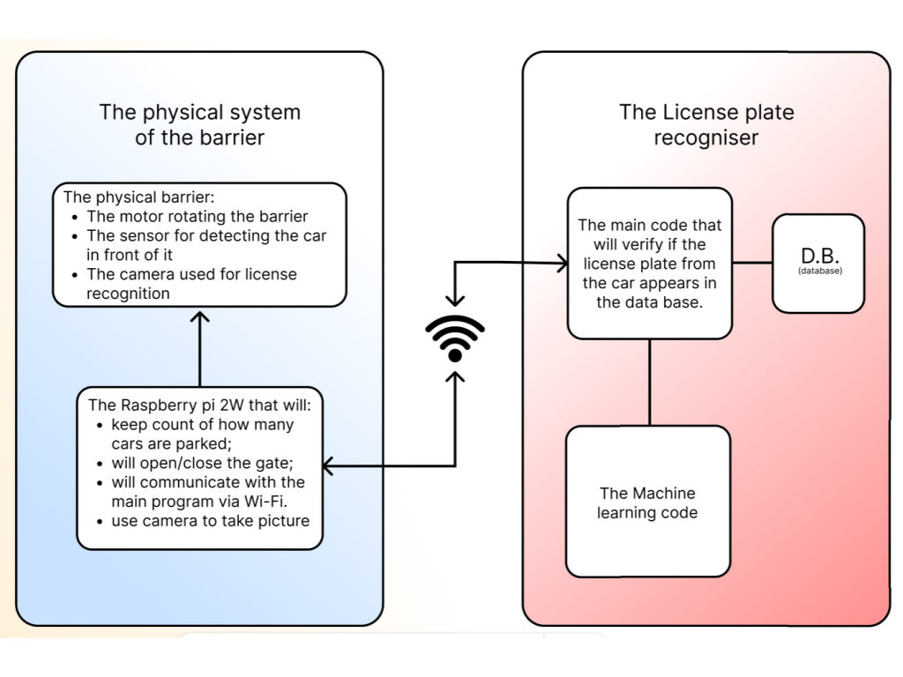
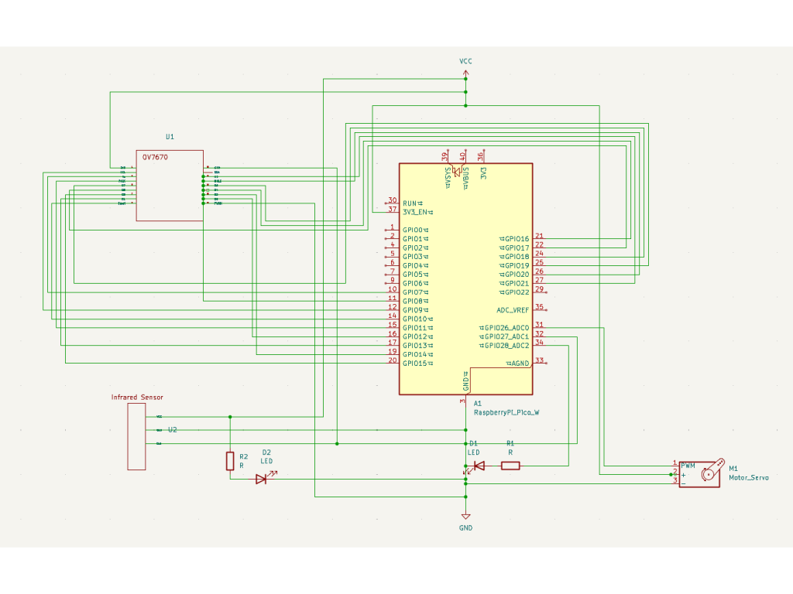

# Barrier with license plate reader
Smart system for security measures 

:::info 

**Author**: Mitran Andrei \
**GitHub Project Link**: [My Github Project](https://github.com/UPB-PMRust-Students/project-SeriouslyAndy)

:::

## Description

A smart barrier system that uses a license plate reader to automatically allow or deny access to vehicles based on a list of authorized plates. The system uses a Raspberry pi pico 2W microcontroller, infrared sensor,a camera (511OVO), LEDs in order to check for input/output and a servo motor to manage the barrier mechanism.

## Motivation

Traditional manual access control systems are slow and inefficient. By automating access with license plate recognition, the system offers faster and more secure access control for private parking lots, company gates etc.

## Architecture 

**Components:**
- **Camera Module 511OVO (or OV7670)** – captures image of license plate.
- **Microcontroller (Raspberry Pi Pico 2W)** – handles decision logic and controls the barrier.
- **Infrared Sensor** – used to detect vehicle (no bikes allowed >:[ )
- **Servo Motor** – opens/closes the barrier.
- **LEDs** - only used to display signal

**Flow:**
1. Vehicle approaches -> sensor detects -> camera captures image.
2. Image matrix sent to PC -> conversion from data to image format -> plate number extracted.
3. Number checked against authorized list.
4. If authorized -> servo lifts barrier + message shown on display (otherwise not approved)

## Log

<!-- write your progress here every week -->

### Week 5 - 11 May
- Project idea defined;
- Initial component list created;
- Started designing on Figma.

### Week 12 - 18 May
- Simple barrier system that opens when sensor is set;
- Fn to allow/deny access also added.

### Week 19 - 25 May
- Connected Camera to Pico.

## Hardware

Detail in a few words the hardware used.

- **Raspberry Pi Pico 2W**: Main microcontroller for running the logic.
- **OV7670 (or 511OVO)**: For capturing license plate images.
- **Servo Motor**: To open/close the barrier.
- **Infrared sensor**: Detect car.
- **Power Supply**: Micro-usb.
- **Basic breadboards, wires, LEDs & resistors**: ... 

### Schematics

### Bill of Materials

| Device | Usage | Price |
|--------|--------|-------|
| [Raspberry Pi Pico](https://www.optimusdigital.ro/ro/placi-raspberry-pi/12394-raspberry-pi-pico-w.html?search_query=raspberry+pi+pico&results=26) | Debugger | [34 RON]
| [Raspberry Pi Pico 2W](https://www.optimusdigital.ro/ro/placi-raspberry-pi/13327-raspberry-pi-pico-2-w.html?search_query=raspberry+pi+pico+2w&results=26) | Microcontroller | [36 RON](https://www.optimusdigital.ro/en/raspberry-pi-boards/12394-raspberry-pi-pico-w.html) |
| [OV7671](https://www.optimusdigital.ro/ro/senzori-senzori-optici/624-modul-camera-ov7670.html?search_query=ov7670&results=2) | Captures license plate images | [17 RON] |
| [SG92r Servo Motor](https://www.optimusdigital.ro/ro/motoare-servomotoare/5706-servomotor-sg92r-9g-25-kgcm-48-v.html?search_query=servomotor&results=116) | Controls the barrier arm | [15 RON] |
| [Senzor Infrarosu](https://www.optimusdigital.ro/ro/senzori-senzori-optici/4514-senzor-infrarosu-de-obstacole.html?search_query=infrared&results=19) | Displays system status | [3 RON] |

