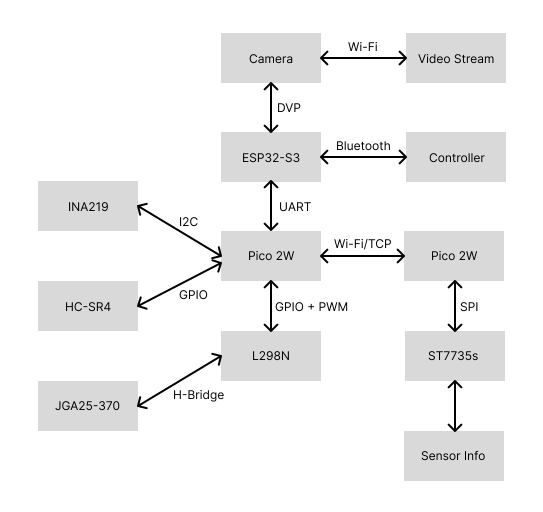

# DriveSight

A mobile robot project with a camera for visual tracking, based on a Raspberry Pi Pico 2W and ESP32-S3. 
 
:::info 

**Author**:  Neagu Andrei-Cristian\
**GitHub Project Link**: https://github.com/UPB-PMRust-Students/project-mohgTheOmen.git

:::

## Description

DriveSight is a manually controlled robotic platform equipped with real-time video streaming. It integrates a camera module for live feed monitoring and a wireless controller interface for direct motor control, providing precise, remote navigation and situational awareness.

## Motivation

I started this project to challenge myself and explore how far I could push the capabilities of embedded hardware, combining real-time control, wireless communication, and camera streaming on constrained systems.

## Architecture 
 
Main Components: 
- Raspberry Pi Pico 2W (Motor Controller): Controls motors, ultrasonic sensors, and receives movement commands via UART.  
- ESP32-S3: Captures a live camera feed and sends control commands from a connected Bluetooth controller.  
- Raspberry Pi Pico 2W (Display Host): Hosts a Wi-Fi access point and receives data from the motor controller to display real-time sensor values or system status on a small screen.

Feedback Mechanisms:  
- Current sensors (INA219): Monitor motor current to help maintain consistent speed across varying surface conditions.  
- Ultrasonic sensors: Provide obstacle detection and distance feedback for navigation and collision avoidance.

User Interface:  
- Web-based interface: Hosted by the ESP32-S3 for viewing the live camera feed.  
- Bluetooth controller: Used for manual driving input.  
- Onboard display: Connected to Pico #2, shows live telemetry from the motor controller over Wi-Fi.

Connections Between Components:  
- UART: Used for communication between the ESP32-S3 and motor controller Pico.  
- Wi-Fi: Motor controller Pico connects to the display host Pico (AP mode) for data transmission.  
- I2C: Used by the motor controller Pico for reading data from INA219 current sensors and ultrasonic sensors.  
- GPIO: Used to control the L298N motor driver from the motor controller Pico.

## Log

<!-- write every week your progress here -->

### Week 21 - 27 April
 - Tested components individually.

### Week 28 April - 4 May
 - Set up the ESP32-S3 to stream the webserver.
 - Assembled the second Pico to display data received through TCP from the first Pico.

### Week 5 - 11 May

### Week 12 - 18 May

### Week 19 - 25 May

## Hardware

- Raspberry Pi Pico 2W: Main controller handling sensors and motor control.  
- ESP32-S3: Provides camera feed for object tracking and sends control commands.  
- Raspberry Pi Pico 2W (Display Unit): Hosts an access point and displays telemetry data.  
- ST7735s: Display the telemetry data.
- L298N Motor Driver: Drives the two DC motors.  
- 2 × DC Motors: Provide movement for the robot.  
- 2 × INA219 Current Sensors: Monitor motor currents to detect stalls or resistance changes.  
- 3 × HC-SR04 Ultrasonic Sensors: Detect obstacles in front of the robot.  
- Power Bank or Li-ion Batteries: Powers the system.  
- Wires, Breadboard, and Connectors: For interconnecting all the components.

### Schematics

(*to be added*)

### Bill of Materials

<!-- Fill out this table with all the hardware components that you might need. -->

| Device | Usage | Price |
|--------|-------|-------|
| 2x [ Raspberry Pi Pico 2W](https://datasheets.raspberrypi.com/picow/pico-2-w-datasheet.pdf) | Main control board | [ 39.66 lei ](https://www.optimusdigital.ro/ro/placi-raspberry-pi/13327-raspberry-pi-pico-2-w.html) |
| [ESP32-S3](https://www.espressif.com/sites/default/files/documentation/esp32-s3_datasheet_en.pdf) | Camera and Wi-Fi | [ 56.71 lei ](https://www.aliexpress.com/item/1005004960637276.html) |
| [L298N Motor Driver](https://www.handsontec.com/dataspecs/L298N%20Motor%20Driver.pdf) | Controls motor power | [ 10.99 lei ](https://www.optimusdigital.ro/ro/drivere-de-motoare-cu-perii/145-driver-de-motoare-dual-l298n.html) |
| [ST7735s Display](https://www.displayfuture.com/Display/datasheet/controller/ST7735.pdf) | Displays sensor data | [ 27.99 lei ](https://www.optimusdigital.ro/ro/optoelectronice-lcd-uri/870-modul-lcd-144.html) |
| 2x [ JGA25-370 Motors](https://media.digikey.com/pdf/Data%20Sheets/Seeed%20Technology/114090046_Web.pdf) | Robot movement | [ 49.00 lei ](https://www.optimusdigital.ro/ro/motoare-motoare-cu-reductor-de-25-mm/350-motor-cu-reductor-jga25-310.html) |
| 2x [ INA219 Current Sensor](https://www.ti.com/lit/ds/symlink/ina219.pdf?ts=1746074360615) | Current monitoring | [ 29.99 lei ](https://www.optimusdigital.ro/ro/senzori-altele/5824-modul-senzor-de-curent-cu-interfaa-i2c-ina219.html) |
| 3x [ HC-SR04 Ultrasonic Sensor](https://cdn.sparkfun.com/datasheets/Sensors/Proximity/HCSR04.pdf) | Obstacle detection | [ 14.99 lei ](https://www.optimusdigital.ro/ro/senzori-senzori-ultrasonici/2328-senzor-ultrasonic-de-distana-hc-sr04-compatibil-33-v-i-5-v.html) |
| Li-ion 3x Battery Holder | Power source | [ 20.13 lei ](https://www.emag.ro/suport-acumulator-liion-format-18650-3-celule-in-serie-18650-3/pd/DF392RYBM/) |
| Wires, Connectors, Breadboard, Resistors | Wiring |  Already had them  |

## Software

### ESP32-S3 (C)

| Library | Description | Usage |
|---------|-------------|-------|
| [ESP-IDF](https://github.com/espressif/esp-idf) | Official Espressif IoT Development Framework | Base SDK for Wi-Fi, networking, etc. |
| [esp_camera](https://github.com/espressif/esp32-camera) | Camera driver for OV3660 | Captures and streams MJPEG frames   |
| [Bluepad32](https://github.com/ricardoquesada/bluepad32) | Bluetooth game controller library | Receives input from Bluetooth controller |

### Raspberry Pi Pico 2W (Rust)

| Library | Description | Usage |
|---------|-------------|-------|
| [embassy](https://crates.io/crates/embassy) | Async embedded runtime for embedded systems | Task scheduling and async infrastructure |
| [embassy-executor](https://crates.io/crates/embassy-executor) | Asynchronous task executor | Schedules and runs tasks in a `no_std` async environment |
| [embassy-rp](https://crates.io/crates/embassy-rp) | RP2040-specific HAL for Embassy | GPIO, SPI, PWM, ADC, and other peripherals |
| [embassy-time](https://crates.io/crates/embassy-time) | Timer and delay handling | Non-blocking frame-rate control, delays, timeouts |
| [embassy-sync](https://crates.io/crates/embassy-sync) | Synchronization primitives | Used for async channels and mutexes |
| [embassy-gpio](https://crates.io/crates/embassy-gpio) | GPIO abstraction for Embassy | Manages input/output pins for buttons, sensors, and motor control |
| [cyw43](https://crates.io/crates/cyw43) | Wi-Fi driver for the CYW43 chip | Connecting the Pico 2W to Wi-FI |
| [cyw43-pio](https://crates.io/crates/cyw43-pio) | PIO-based driver for the CYW43 chip | Enables Wi-Fi using the RP2350's PIO peripheral |
| [embassy-net](https://crates.io/crates/embassy-net) | TCP/IP networking stack | Hosts server or client for sending/receiving data |
| [hcsr04-async](https://crates.io/crates/hcsr04-async) | Async driver for ultrasonic distance sensor (if used) | Obstacle detection |
| [defmt](https://crates.io/crates/defmt) | Lightweight logging framework for embedded systems | Enables efficient, structured logging |
| [defmt-rtt](https://crates.io/crates/defmt-rtt) | RTT (Real-Time Transfer) backend for `defmt` | Outputs logs via RTT for real-time debugging |
| [embedded-graphics](https://crates.io/crates/embedded-graphics) | 2D graphics library for embedded systems | Drawing text, shapes, and UI elements on the display |
| [mipidsi](https://crates.io/crates/mipidsi) | Display driver for MIPI-compatible SPI LCDs | Driving the ST7735s display via SPI |
| [rand](https://crates.io/crates/rand) | Random number generation | Used internally by the TCP stack for port/sequence numbers |

## Links

<!-- Add a few links that inspired you and that you think you will use for your project -->

1. [Personal Project Repo](https://github.com/mohgTheOmen/drivesight)
