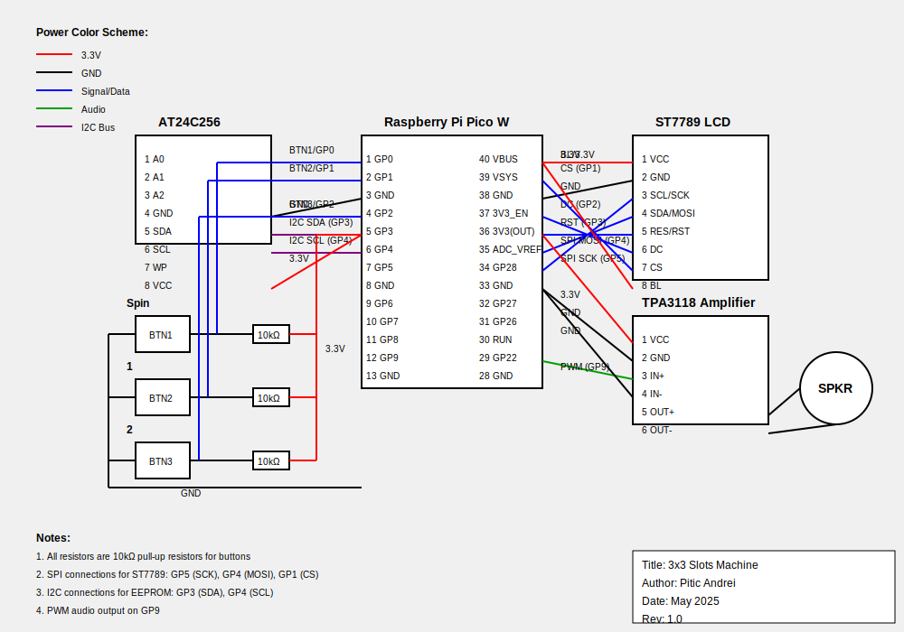

# Project Name  

3x3 SLOTS MACHINE

:::info

**Author**: Pitic Andrei \
**GitHub Project Link**:  https://github.com/UPB-PMRust-Students/project-Pitic888 
:::

## Description

This project implements a classic 3x3 slot machine game using Rust, designed to run on a Raspberry Pi Pico 2W with a connected ST7789 display. The player presses a button to spin the reels, and the system randomly generates and displays symbols on a 3x3 grid. If the player lands matching combinations, they win points or they can risk them in a double or nothing minigame. The project also includes simple animations and sound effects to enhance the experience.

## Motivation

The slot machine is a fun, interactive project that allows me to work with hardware (display, buttons, possibly a buzzer) and learn more about random number generation, graphics rendering, and game design on microcontrollers. It’s also a great opportunity to explore how Rust works in constrained environments.

## Architecture

**Main Components:**

- **Game Logic Module**  
  Handles the core slot machine logic: spinning, random symbol generation, win condition checks, and score tracking.

- **Display Module**  
  Uses the `st7789` and `embedded-graphics` libraries to render the 3x3 grid, symbols, animations, and text.

- **Input Module**  
  Reads button presses from GPIO pins to trigger the spin.

-- **Sound Module**  
  Uses the Arduino TPA3118 audio amplifier to play sound effects for spins, wins, losses, and the minigame.

- **Memory Module**  
  Uses the EEPROM AT24C256 to store high scores and possibly settings.

  

**Flow:**  
Input (button press) → Game Logic → Display Update → (Optional) Sound Output

## Log

### Week 5 - 11 May  
- Set up the Rust development environment for Raspberry Pi Pico 2W  
- Created the project repository and initialized dependencies (`st7789`, `embedded-graphics`)  
- Designed basic slot machine logic (reels, spin, random generation, double or nothing feature )  

### Week 12 - 18 May  

### Week 19 - 25 May  

## Hardware

- Raspberry Pi Pico W as the main controller  
- 2.4-inch Arduino LCD for displaying the slot grid and game information  
- Arduino Audio Mono Amplifier TPA3118 for sound effects through a speaker  
- EEPROM Module AT24C256 for saving high scores or settings  
- Breadboard kit for prototyping the circuit  
- 10 kΩ resistor for pull-ups or signal conditioning  
- Three pushbuttons for user input: spin, reset, and possibly menu navigation

### Schematics

### Bill of Materials

| Device | Usage | Price |
|--------|--------|-------|
| [Raspberry Pi Pico W](https://www.optimusdigital.ro/en/raspberry-pi-boards/12394-raspberry-pi-pico-w.html) | The microcontroller | ~40 RON |
| [2.4-inch Arduino LCD](https://www.optimusdigital.ro) | Display for grid and symbols | ~40 RON |
| [Arduino Audio Mono Amplifier TPA3118](https://www.optimusdigital.ro) | Drives speaker for sound effects | ~20 RON |
| [EEPROM Module AT24C256](https://www.optimusdigital.ro) | Stores high scores or settings | ~9 RON |
| [Breadboard Kit](https://www.optimusdigital.ro) | Prototyping platform | ~22 RON |
| [10 kΩ Resistor](https://www.optimusdigital.ro) | Pull-ups or signal conditioning | ~3 RON |
| [Pushbuttons (x3)](https://www.optimusdigital.ro) | User input for spin, reset, etc. | ~— RON |

## Software

| Library | Description | Usage |
|---------|-------------|-------|
| [st7789](https://github.com/almindor/st7789) | Display driver for ST7789 or compatible LCDs | Used to drive the 2.4-inch Arduino LCD display |
| [embedded-graphics](https://github.com/embedded-graphics/embedded-graphics) | 2D graphics library | Draws the slot grid, symbols, text, and minigame UI |
| [rand](https://docs.rs/rand/latest/rand/) | Random number generation | Generates random spins and randomizes the correct button in the minigame |
| [rp-pico](https://github.com/rp-rs/rp-hal) | Raspberry Pi Pico HAL | Accesses GPIO, SPI, I²C, and other hardware features |
| [at24c256 driver](https://github.com/eldruin/at24c256) | EEPROM driver | Stores high scores or player settings in the AT24C256 EEPROM |
| [PWM or audio library](https://github.com/rp-rs/rp-hal) | Audio output control | Drives the audio amplifier for sound effects |

## Links

1. [ST7789 Rust driver](https://github.com/almindor/st7789)  
2. [embedded-graphics examples](https://github.com/embedded-graphics/examples)  
3. [Rust on Raspberry Pi Pico](https://www.raspberrypi.com/documentation/microcontrollers/rust.html)  
4. [Random Number Generation in Rust](https://docs.rs/rand/latest/rand/)  
5. [AT24C256 EEPROM Rust driver](https://github.com/eldruin/at24c256)  
6. [TPA3118 Audio Amplifier datasheet](https://www.ti.com/product/TPA3118D2)  
7. [Rust embedded HAL](https://docs.rs/embedded-hal/latest/embedded_hal/) — general hardware abstraction library  
8. [KiCAD tutorials](https://www.kicad.org/help/tutorials/) — for making the schematics
